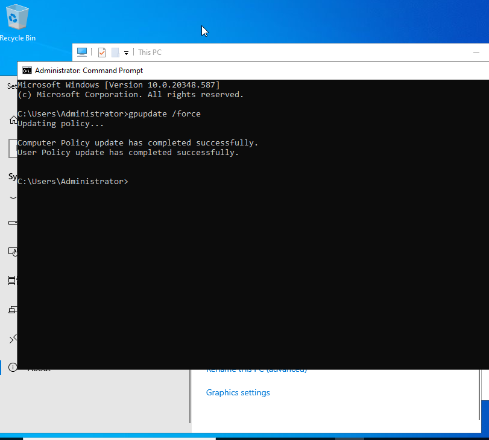

# Activity 1: Password Policy GPO Enforcement

## Objective
To establish an enterprise security baseline by enforcing strict password requirements for the `USA` Organizational Unit (OU) via Group Policy, ensuring all domain identities adhere to corporate security standards.

---

## Technical Tasks & Workflow

### 1. GPO Creation and Linking
* **Console:** Utilized the Group Policy Management Console (GPMC) on Windows Server 2022.
* **Scope:** Created and linked a new GPO named **"Password Policy"** specifically to the `USA` OU to manage regional security requirements.

### 2. Security Policy Configuration
* **Policy Path:** `Computer Configuration > Policies > Windows Settings > Security Settings > Account Policies > Password Policy`
* **Minimum Password Length:** Enforced a **12-character minimum** to increase resistance against brute-force attacks.
* **Complexity Requirements:** Enabled complexity (requiring uppercase, lowercase, numbers, and special characters) to neutralize common dictionary attacks.
* **Maximum Password Age:** Set to **90 days** to ensure regular credential rotation.

---

## Evidence of Configuration

### Password Length Requirement

### Complexity Requirements

### Password Expiration (Max Age)

---

## Verification & Validation

To ensure the policy propagated from the Domain Controller to the client workstations, the following validation steps were performed on the Windows 11 VM:

* **Policy Refresh:** Executed `gpupdate /force` to bypass the background refresh interval.
* **Resultant Set of Policy:** Ran `gpresult /r` to confirm the **Password Policy** was listed under the "Applied Group Policy Objects" for the machine.

**Verification Evidence:**

---

## Key Takeaways
* **Standardization:** Demonstrated the ability to centralize security management, ensuring no user can set a weak password.
* **Verification Skills:** Confirmed that GPO application is a two-step process: configuration on the server and verification on the client.
