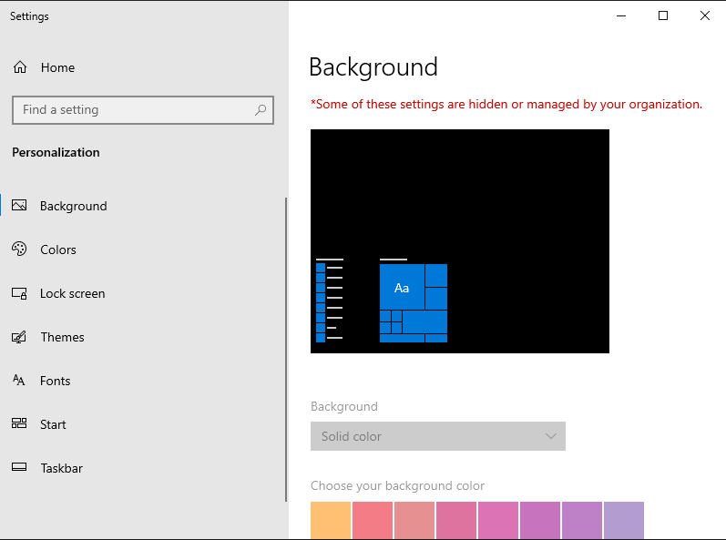

# Activity 3: Desktop Wallpaper Standardization

## Objective
To enforce a standardized corporate desktop environment for the `USA` OU. This ensures consistent branding across all workstations and prevents unauthorized modification of the desktop background by end-users.

---

## Technical Tasks & Workflow

### 1. GPO Configuration
* **Console:** Group Policy Management Console (GPMC).
* **Policy Name:** `Desktop Wallpaper Policy`
* **Path:** `User Configuration > Policies > Administrative Templates > Desktop > Desktop > Desktop Wallpaper`

### 2. Implementation Details
* **Wallpaper Source:** Configured to a local system path (`C:\Windows\Web\Wallpaper\Windows\img0.jpg`) to ensure reliability.
* **Style:** Set to **Center** to maintain image aspect ratio across different monitor resolutions.
* **Enforcement:** Once enabled, this policy prevents users from changing the background via the standard Windows Personalization menu.

---

## Evidence of Configuration

### Policy Settings Window
Detailed view of the Administrative Template configuration.

### GPO Enabled Status
Verification that the policy is active within the Group Policy Management Editor.

---

## Final Validation
On the Windows 11 client machine, the desktop background was automatically updated. The "Personalization" settings menu correctly displays the message: **"Some settings are managed by your organization,"** confirming the GPO is overriding local user preferences.

**Client Verification:**

---

## Key Takeaways
* **Corporate Branding:** Demonstrated the ability to enforce a uniform "Look and Feel" across an entire department.
* **Administrative Templates:** Gained experience navigating the deep hierarchy of ADMX templates to control specific Windows Shell behaviors.
