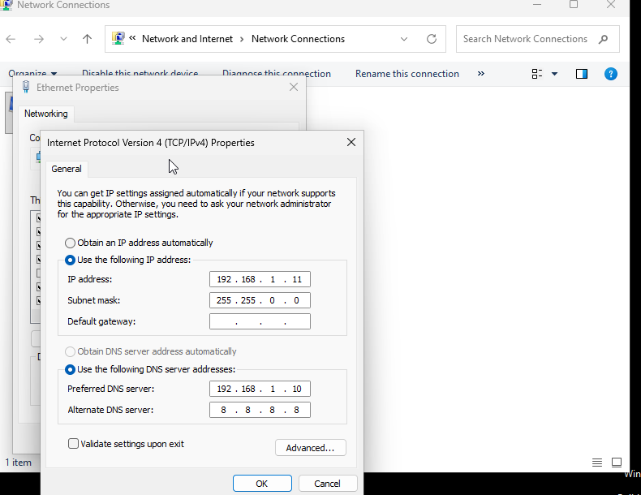
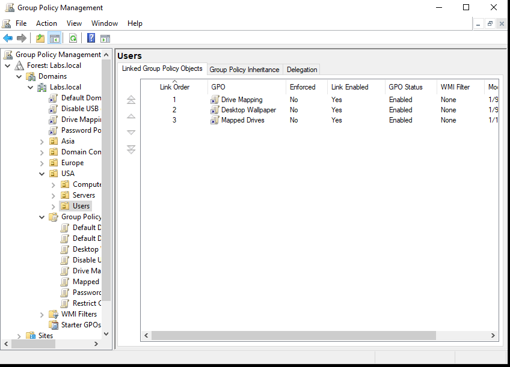
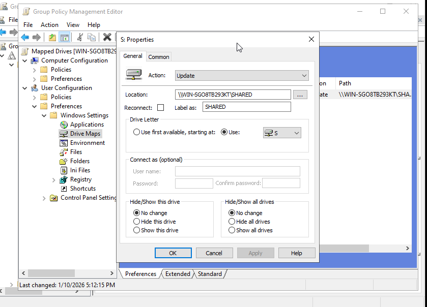
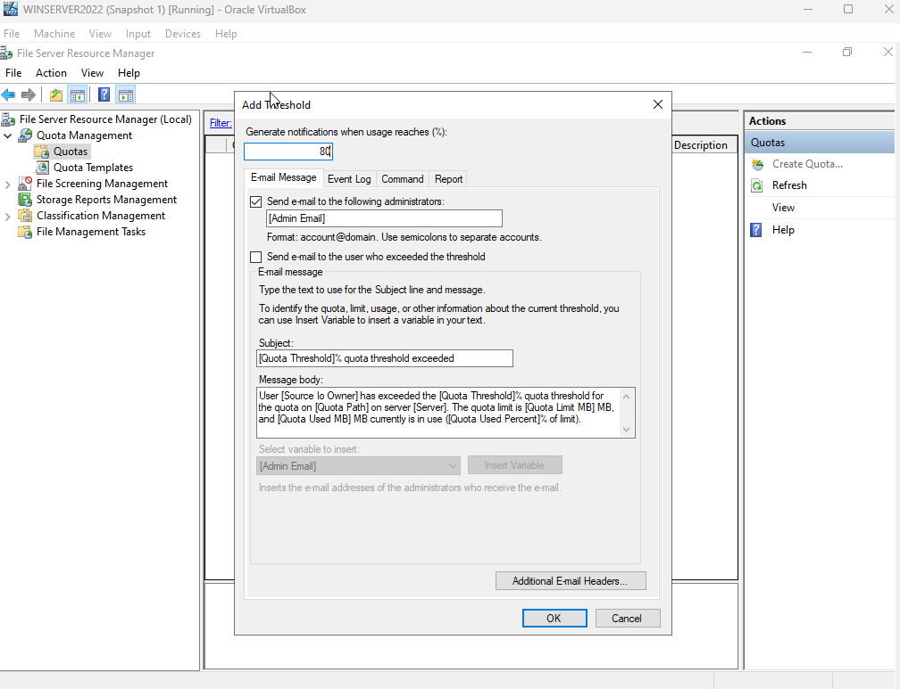
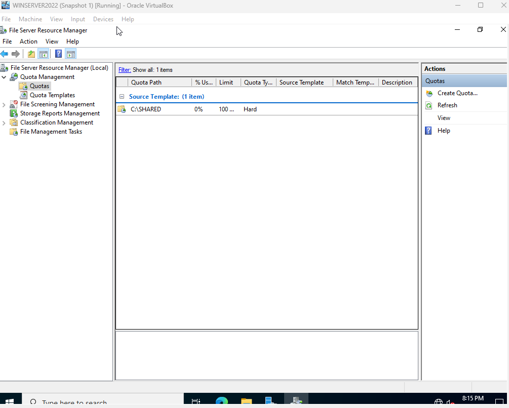
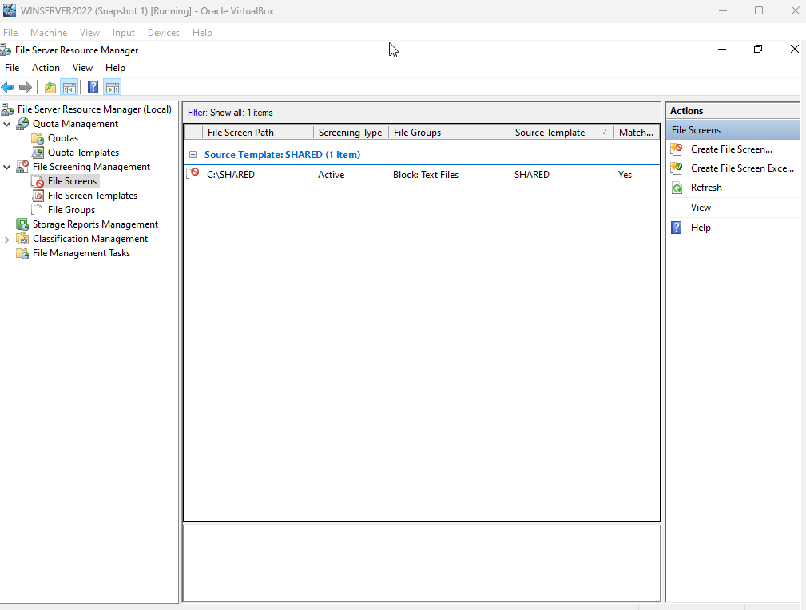
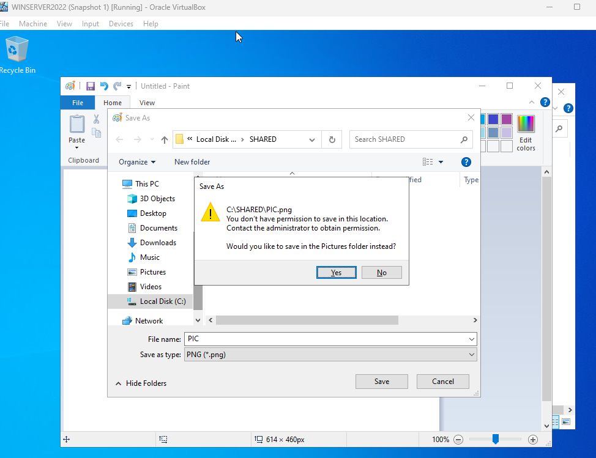
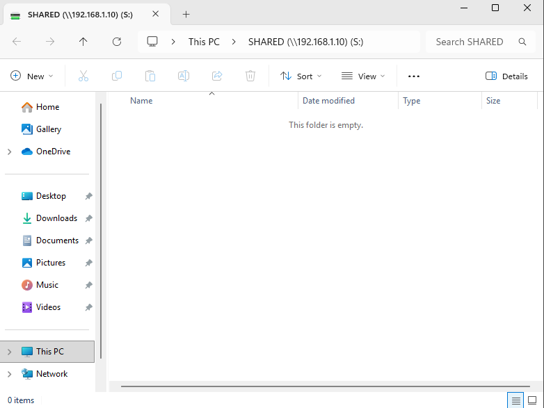
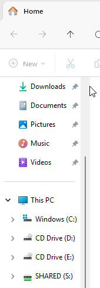

# Activity 7: File Services, GPO Automation, and Storage Governance

## Objective
To provision a centralized network file share, automate resource deployment via Group Policy Preferences (GPP), and implement enterprise storage governance using File Server Resource Manager (FSRM) within the `labs.local` Active Directory environment.

---

## Technical Tasks & Proficiency

### 1. Secure File Share Implementation
* **Directory Provisioning:** Established a centralized storage root (`C:\SHARED`) on the Windows Server 2022 instance.
* **Access Control Model:** Implemented a dual-layer permission strategy to enforce the **Principle of Least Privilege (PoLP)**:
    * **Share Permissions:** Everyone: Full Control.
    * **NTFS Permissions:** Domain Users: Read-only.

**Evidence:**

---

### 2. Troubleshooting Case Study: APIPA & DNS Resolution
* **Issue:** Client VM was unable to join the domain or reach the file share.
* **Diagnosis:** Running `ipconfig` revealed an **APIPA address (169.254.x.x)**, indicating a failure to reach the DHCP server.
* **Resolution:** Transitioned the client to a **Static IPv4 configuration** and manually pointed the Preferred DNS to the Domain Controller. This restored connectivity and allowed the client to process Group Policy.

**Evidence:**

---

### 3. Automation via Group Policy (GPO)
* **Centralized Management:** Engineered a GPO titled **"Mapped Drives"** and linked it to the departmental OU.
* **Deployment:** Leveraged Group Policy Preferences (GPP) to map the **S: Drive** persistently.

**Evidence:**

---

### 4. Storage Management with FSRM
* **Quota Management:** Deployed a directory quota on the **SHARED** folder with a **Hard Limit** and an **80% threshold alert** to prevent volume exhaustion.
* **File Screening:** Configured an active file screen to restrict storage to authorized file types, preventing unauthorized data (Executables/Media) from occupying server space.

**Evidence:**

---

## Final Validation
The success of this deployment was confirmed by the automated appearance of the **S: Drive** in the Windows 11 File Explorer.

**Evidence:**

