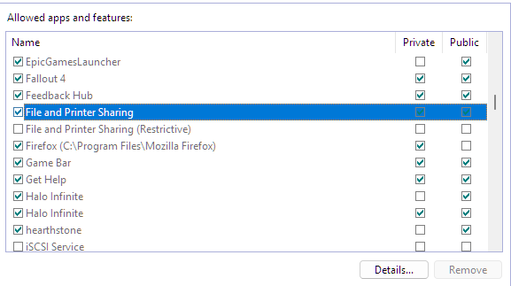

# Workgroup File Share Configuration (KAN-2)

## Ticket Information
- **Ticket ID:** KAN-2
- **Priority:** P3 - Low
- **User:** Sarah Chen (Accounting Department)
- **Contact:** sarah.chen@company.com | ext. 4152
- **Reported:** 9:05 AM (phone call)
- **Started:** 2:00 PM (after P1 and P2 tickets resolved)
- **Resolved:** 3:30 PM
- **Time to Resolution:** 1.5 hours

## Issue Summary
User requested setup of network file sharing between laptop and desktop computers. Currently using USB drives for file transfers, which is inefficient and creates version control issues. User needs streamlined file access for collaborative work.

## Business Impact
- Low priority - user has functional workaround (USB drives)
- Quality of life improvement
- Enhancement request, not blocking work
- Will improve productivity and reduce version control errors

## Solution Implemented
Configured workgroup-based (peer-to-peer) file sharing between two Windows 11 machines on home WiFi network. Created shared folder structure with appropriate permissions, mapped network drive for easy access.

---

## Initial Assessment & Prioritization (9:05 AM)

**Ticket Intake:**
Phone call received from Sarah Chen requesting file sharing setup between her laptop and desktop.

**Priority Assignment Rationale:**
- Set as P3 (Low priority)
- User has working alternative (USB drives)
- Enhancement request, not emergency
- Will be addressed after higher-priority tickets (KAN-3 Critical, KAN-4 Medium)

**User Notification:**
Acknowledged request, explained it would be handled after critical and high-priority tickets were resolved. User agreed timeline was acceptable.

---

## Troubleshooting & Configuration (2:00 PM - 3:30 PM)

### Step 1: Verify Network Connectivity

**Objective:** Ensure both machines can communicate on the network before configuring shares.

**Actions Taken:**
1. Identified computer names:
   - Laptop: [LAPTOP-NAME]
   - Desktop: [DESKTOP-NAME]
2. Opened Command Prompt on Desktop
3. Attempted ping to Laptop by name: `ping [laptop-name]`
4. Attempted ping to Laptop by IP: `ping [laptop-IP]`

**Initial Result:** Ping requests timed out (0% success)

**Issue Identified:** Windows Firewall blocking ICMP packets and File and Printer Sharing

  
*Failed ping attempts showing "Request timed out"*

---

### Step 2: Configure Windows Firewall (Laptop & Desktop)

**Objective:** Enable File and Printer Sharing through Windows Firewall on both machines.

**Actions Taken (on both Laptop and Desktop):**
1. Opened **Control Panel**
2. Navigated to **System and Security** → **Windows Defender Firewall**
3. Clicked **"Allow an app or feature through Windows Defender Firewall"**
4. Clicked **"Change settings"** (requires admin)
5. Located **"File and Printer Sharing"**
6. Checked **Private** network box (left Public unchecked for security)
7. Clicked **OK**

**Security Rationale:**
- Private network = trusted home/office WiFi
- Public network = untrusted (coffee shops, airports)
- Enabled only for Private to maintain security on public networks

  
*Windows Defender Firewall settings showing File and Printer Sharing enabled for Private network*

**Verification:**
- Re-ran ping tests from Desktop to Laptop
- Result: 4 packets sent, 4 received, 0% loss
- Connectivity confirmed in both directions

  
*Successful ping results with 0% packet loss*

---

### Step 3: Configure Network Discovery (Laptop & Desktop)

**Objective:** Enable network discovery so machines can see each other on the network.

**Actions Taken (on both machines):**
1. Opened **Settings** (Win + I)
2. Navigated to **Network & Internet**
3. Clicked **Advanced network settings**
4. Verified/Enabled **Network discovery**: ON
5. Verified/Enabled **File sharing**: ON
6. Returned to **Network & Internet** → clicked WiFi connection
7. Verified **Network profile type** set to **Private** (not Public)

**Why This Matters:**
- Network Discovery allows computers to see each other in File Explorer's "Network" section
- Private profile required for file sharing features
- Public profile disables sharing for security

  
*Advanced network settings showing Network Discovery and File Sharing enabled, Private profile selected*

---

### Step 4: Create Shared Folder with Permissions (Laptop)

**Objective:** Create centralized file share location with proper security permissions.

#### Part A: Folder Structure
**Actions Taken:**
1. Opened File Explorer
2. Navigated to `C:\`
3. Created folder: `LabShare`
4. Inside LabShare, created subfolder: `Accounting`
5. Final path: `C:\LabShare\Accounting`

**Design Decision:**
- Share parent folder (LabShare) rather than subfolder (Accounting)
- Allows future expansion (HR, Finance, IT folders) without reconfiguration
- Subfolders automatically inherit share permissions
- More scalable for growing organizations

#### Part B: Share Permissions
**Actions Taken:**
1. Right-clicked `LabShare` folder → **Properties**
2. **Sharing** tab → **Share** button (simple sharing method)
3. Added **Everyone** with **Read/Write** permissions
4. Clicked **Share** → **Done**
5. Noted network path: `\\[LAPTOP-NAME]\LabShare`

**Permission Level Chosen:**
- Everyone: Read/Write (allows file creation, modification, deletion)
- Not Full Control (prevents permission changes)
- Appropriate for trusted home/small office network

  
*Share permissions window showing Everyone with Read/Write access*

#### Part C: NTFS Permissions (Security Layer)
**Actions Taken:**
1. Right-clicked `LabShare` folder → **Properties**
2. **Security** tab
3. Verified existing permissions:
   - Administrators: Full Control
   - SYSTEM: Full Control
   - Users: Full Control

**Security Assessment:**
- NTFS permissions work in conjunction with Share permissions
- Windows uses most restrictive of the two
- Current configuration appropriate for collaborative environment
- Users group Full Control allows Desktop user to create/modify/delete files

**Defense-in-Depth:**
- Share Permissions = network-level access control
- NTFS Permissions = file system-level access control
- Both layers provide security

  
*Security tab showing NTFS permissions for Users group*

---

### Step 5: Access Share from Desktop

**Objective:** Verify Desktop can successfully connect to and access the shared folder.

**Actions Taken:**
1. On Desktop, opened **File Explorer**
2. Clicked **Network** in left sidebar
3. Located and double-clicked Laptop computer name
4. Successfully viewed shared folder: `LabShare`
5. Navigated into `LabShare\Accounting`
6. Access granted without credential prompt (Everyone permissions)

**Result:** Successfully connected to network share

  
*File Explorer showing successful access to \\[LAPTOP-NAME]\LabShare from Desktop*

---

### Step 6: Map Network Drive

**Objective:** Improve user experience by mapping share as persistent drive letter.

**Actions Taken:**
1. On Desktop, in File Explorer, right-clicked **This PC**
2. Selected **Map network drive...**
3. **Drive letter:** Selected **Z:**
4. **Folder:** Entered `\\[LAPTOP-NAME]\LabShare`
5. Checked: ☑ **"Reconnect at sign-in"** (persists after reboot)
6. Left "Connect using different credentials" unchecked (Everyone access works)
7. Clicked **Finish**

**Result:** Z: drive appears under "This PC" with LabShare content accessible

**User Benefit:**
- Easy access via drive letter (like accessing C: drive)
- No need to browse Network each time
- Automatic reconnection after restart
- Professional user experience

  
*File Explorer showing Z: drive mapped to \\[LAPTOP-NAME]\LabShare*

---

### Step 7: Test Permissions & Functionality

**Objective:** Validate that users can perform all required file operations.

#### Test 1: Create File from Desktop
**Actions Taken:**
1. On Desktop, navigated to `Z:\Accounting`
2. Right-clicked → **New** → **Text Document**
3. Named file: `Test_File.txt`
4. Opened file, typed: "Testing file share from Desktop - [date]"
5. Saved and closed

**Result:** File created successfully

  
*Test file created and visible in Desktop's Z:\Accounting drive*

#### Test 2: Verify from Laptop
**Actions Taken:**
1. On Laptop, opened File Explorer
2. Navigated to `C:\LabShare\Accounting`
3. Confirmed `Test_File.txt` appears
4. Opened file, verified content from Desktop
5. Added line: "Verified from Laptop - file sharing working!"
6. Saved and closed

**Result:** Bidirectional read/write confirmed

  
*Same test file visible from Laptop with modifications - proves bidirectional access*

#### Test 3: Final Verification from Desktop
**Actions Taken:**
1. On Desktop, refreshed File Explorer (F5)
2. Reopened `Test_File.txt`
3. Verified Laptop's added text appears
4. Tested file deletion (successful)

**Permissions Validated:**
- ✅ Create files
- ✅ Read files
- ✅ Modify files
- ✅ Delete files
- ✅ Real-time synchronization

---

## Resolution & User Communication (3:30 PM)

### Jira Ticket Update

**Resolution Notes Added to KAN-2:**

Successfully configured workgroup file sharing between user's laptop and desktop.

**Troubleshooting Steps:**
- Initial connectivity test via ping failed - ICMP blocked by Windows Firewall
- Enabled "File and Printer Sharing" in firewall settings on both machines (Private network only)
- Enabled Network Discovery on both machines
- Verified connectivity restored via successful ping tests

**Configuration Details:**
- Host: [Laptop Name]
- Share name: LabShare
- Share path: \\[laptop-name]\LabShare
- Mapped drive letter: Z:
- Subfolders: Accounting (additional folders can be added as needed)
- Permissions: Everyone - Read/Write (Share level), Users - Full Control (NTFS level)
- Authentication: Existing credentials, no additional accounts required

**Steps Completed:**
1. Verified network connectivity between devices
2. Configured Windows Firewall to allow File and Printer Sharing
3. Enabled network discovery and file sharing on both machines
4. Created shared folder structure (C:\LabShare\Accounting)
5. Configured Share and NTFS permissions for collaborative access
6. Mapped network drive (Z:) on client machine for easy access
7. Tested read/write/delete permissions - working as expected

**User Notification:**
Contacted Sarah Chen at ext. 4152. Demonstrated how to access shared files via Z: drive. Explained folder structure allows for future departmental folders (HR, Finance, etc.) without reconfiguration. User confirmed functionality meets requirements.

**Notes:**
- Share configured at parent level (LabShare) for scalability
- Subfolders inherit permissions automatically
- Mapped drive set to reconnect at sign-in for persistent access

Time spent: 1.5 hours

  
*Jira comment showing detailed resolution documentation*

### Ticket Closure
- **Status:** Done/Closed
- **Resolution:** Completed
- **Time Logged:** 1.5 hours

  
*KAN-2 ticket in closed state with resolution completed*

---

## Skills Demonstrated

### Technical Skills
- Workgroup (peer-to-peer) file sharing configuration
- Windows Firewall configuration and troubleshooting
- Network connectivity diagnostics (ping, ipconfig)
- Share-level permissions management
- NTFS permissions understanding (defense-in-depth security)
- Network discovery configuration
- Network drive mapping
- Scalable folder structure design

### Troubleshooting Methodology
- Systematic approach to connectivity issues
- Root cause identification (firewall blocking)
- Security-conscious configuration (Private vs Public networks)
- Thorough testing and validation
- Real-world problem solving (ping failures)

### Professional Skills
- Ticket prioritization and triage
- Time management (lower priority tickets after critical issues)
- Clear documentation and communication
- User experience optimization (mapped drives)
- Preventive thinking (scalable folder structure)
- User education and support

### Security Awareness
- Principle of least privilege (no Full Control in share permissions)
- Defense-in-depth (Share + NTFS permissions)
- Network profile awareness (Private vs Public)
- Understanding of permission inheritance

---

## Technical Notes

### Workgroup vs Domain
This configuration demonstrates peer-to-peer (workgroup) file sharing, which differs from domain-based environments:
- **Workgroup:** No centralized authentication, local accounts, suitable for small offices
- **Domain:** Active Directory, centralized user management, Group Policy
- Both methods are valuable for entry-level IT professionals to understand

### Why This Configuration is Appropriate
- Small office/home office scenario (2 computers)
- Trusted network environment
- No Active Directory infrastructure available
- Cost-effective solution
- Sufficient for collaborative file access needs

### Scalability Considerations
- Parent folder share allows easy addition of new department folders
- Permission inheritance simplifies management
- Can accommodate growth without reconfiguration
- Easy to transition to dedicated file server if needed

---

## Tools Used
- Command Prompt (`ping`, `ipconfig`)
- Windows Defender Firewall
- File Explorer
- Windows Settings (Network & Internet)
- Jira (ticket management)
