# System Bus Failure Resolution (KAN-3)

## Ticket Information
- **Ticket ID:** KAN-3
- **Priority:** P1 - Critical
- **User:** Lisa Martinez (Marketing Manager)
- **Contact:** lisa.martinez@company.com | ext. 3847
- **Reported:** 9:00 AM
- **Resolved:** 11:30 AM
- **Time to Resolution:** 2 hours 30 minutes

## Issue Summary
Laptop touchpad completely unresponsive and Wi-Fi adapter unable to connect to network. User blocked from accessing email, shared files, and cloud applications. Time-sensitive: client presentation at 2:00 PM requiring network access.

## Business Impact
- User cannot access critical network resources (email, files, cloud apps)
- Client-facing presentation at risk
- Partial workaround: USB mouse for navigation, but no network access

## Root Cause
AMD GPIO Controller driver failed to initialize during Windows boot process due to Fast Startup (hybrid hibernation) preserving corrupted driver state. Cascading failure affected all GPIO-dependent hardware components (touchpad, Wi-Fi adapter).

---

## Troubleshooting Methodology

### 1. Initial Evidence & Triage (9:05 AM)
**Objective:** Verify network adapter state and determine if issue is hardware or software-related.

**Actions Taken:**
- Ran `ipconfig /all` from command prompt
- Analyzed network adapter status

**Findings:**
- Wi-Fi adapter recognized by operating system
- Adapter showing "Media Disconnected" state
- Networks broadcasting and available
- Adapter not acquiring IP address
- Physical hardware detected by OS

**Assessment:** Logical or driver-level issue rather than total hardware failure

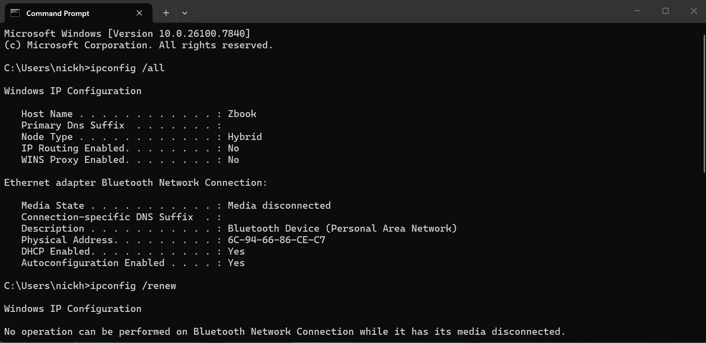  
*Command prompt showing Wi-Fi adapter in "Media Disconnected" state*

---

### 2. Hardware State Analysis - Device Manager (9:20 AM)
**Objective:** Identify which drivers/devices are failing and locate the root cause.

**Actions Taken:**
- Opened Device Manager
- Examined all hardware categories for errors
- Investigated error codes for affected devices

**Findings:**
Multiple yellow exclamation marks indicating systemic failure:
- **Touchpad:** Error Code 51 (driver dependency not loaded)
- **Wi-Fi Adapter:** Error Code 51 (driver dependency not loaded)
- **AMD GPIO Controller:** Error Code 43 (device has reported a problem)

**Root Cause Identified:** AMD GPIO Controller failure preventing dependent devices from functioning. This is a system bus controller issue affecting multiple hardware components simultaneously.

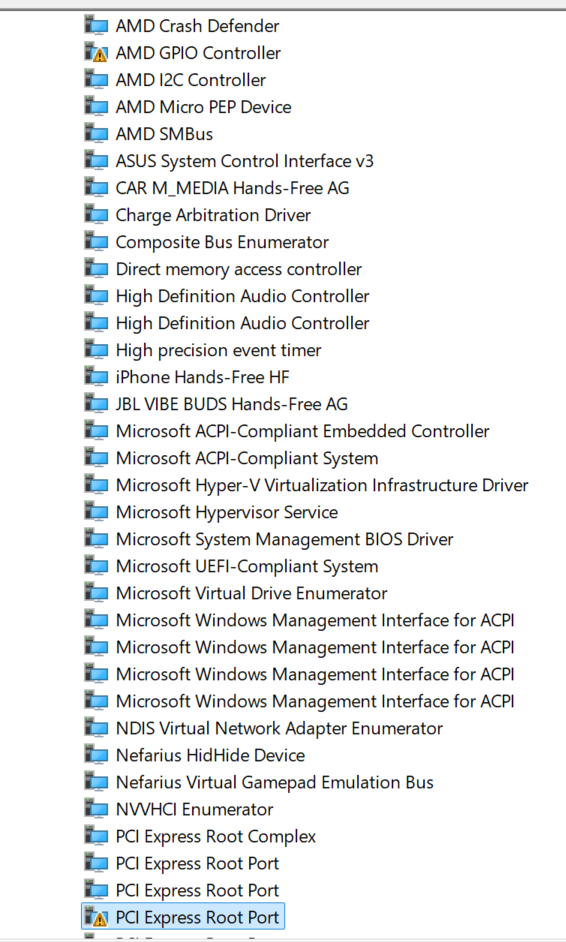  
*Device Manager showing multiple hardware errors (first set)*

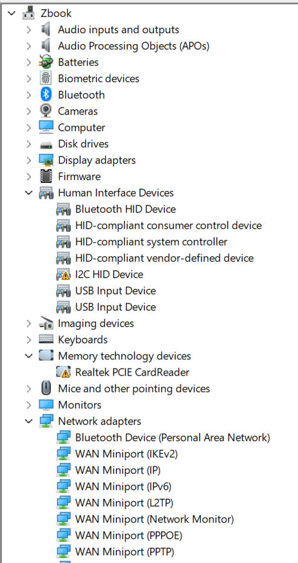  
*Device Manager showing multiple hardware errors (second set)*

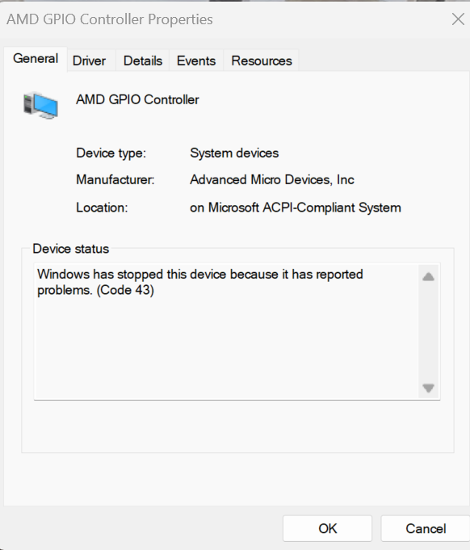  
*AMD GPIO Controller showing Code 43 error detail*

---

### 3. Root Cause Analysis - Event Viewer (9:35 AM)
**Objective:** Determine WHY the GPIO controller failed during boot process.

**Actions Taken:**
- Opened Event Viewer
- Filtered Windows System Logs by relevant sources:
  - Kernel-PnP
  - Kernel-Power
  - netwtw10 (network adapter)
- Analyzed error/warning/critical events
- Traced chronological failure sequence

**Findings:**
Discovered chronological failure chain during boot process:
1. **Event 41 (Kernel-Power):** Unexpected power transition issue
2. **Event 219 (Kernel-PnP):** Driver load failure - kernel unable to load GPIO controller driver
3. **Event 6062 (netwtw10):** Downstream network adapter crash as cascading result

**Diagnosis Confirmed:** GPIO controller driver failed to initialize during Windows boot sequence, preventing kernel from loading drivers for dependent hardware (touchpad, Wi-Fi adapter). This is a boot-time driver initialization failure, not a hardware defect.

**Probable Cause:** Fast Startup (hybrid boot) preserving corrupted driver state from hibernation file.

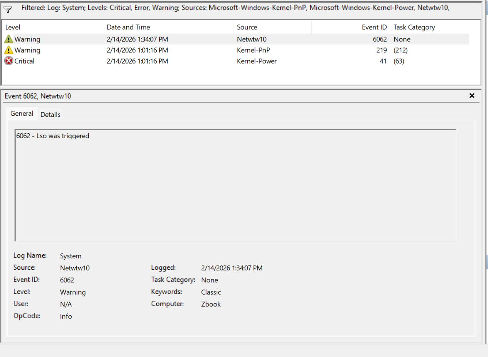  
*Event Viewer filtered by relevant sources showing failure pattern*

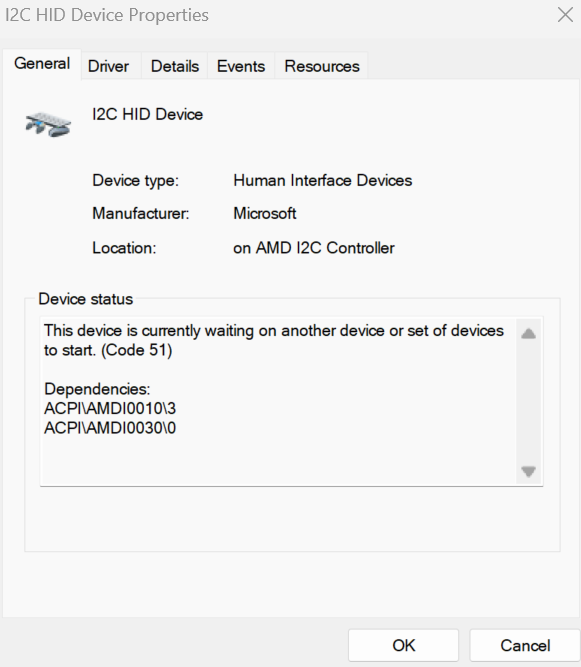  
*Chronological event sequence showing boot-time failures*

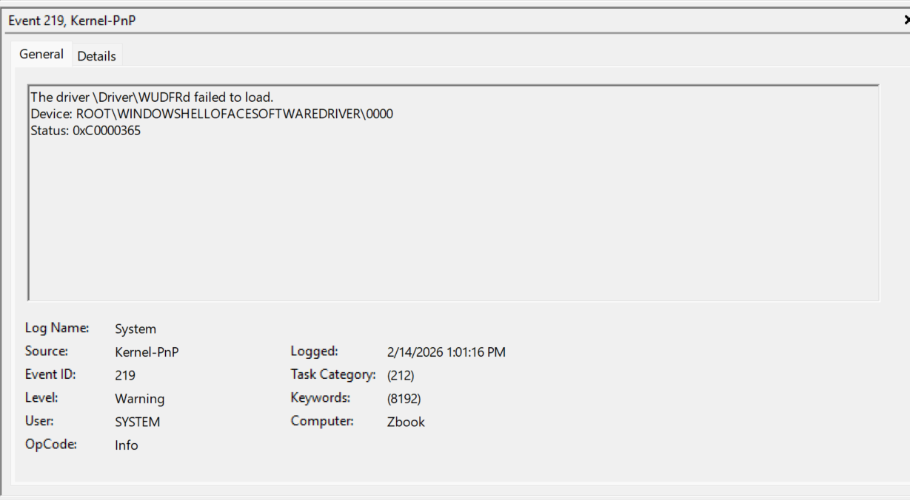  
*Event 219 detail showing kernel driver load failure*

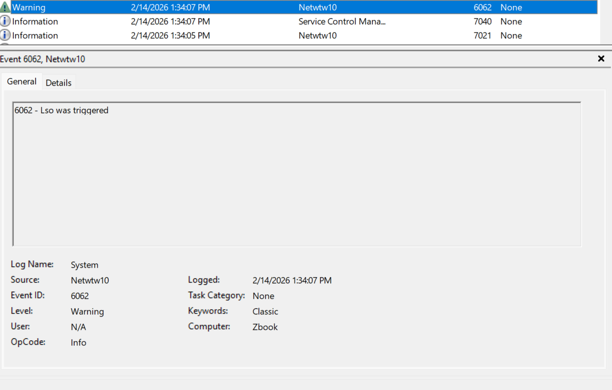  
*Event 6062 showing network adapter crash as cascading result*

---

### 4. Live Remediation - Component Reset (9:50 AM)
**Objective:** Restore functionality without requiring system reboot to meet user's time-sensitive deadline.

**Actions Taken:**
1. Opened Device Manager
2. Located AMD GPIO Controller
3. Right-click → **Disable device**
4. Confirmed disable action (forced driver unload)
5. Right-click → **Enable device**
6. System triggered PnP driver re-enumeration

**Results:**
- Driver stack successfully reloaded
- Both Wi-Fi adapter and touchpad immediately restored to functionality
- All dependent devices now operational

**Verification Testing:**
- ✅ Touchpad responding normally - all gestures functional
- ✅ Wi-Fi connected to corporate network
- ✅ IP address acquired via DHCP (192.168.x.x)
- ✅ Network resources accessible (email, shared drives, cloud apps)
- ✅ User able to navigate system without USB mouse backup
- ✅ User can access presentation materials for 2 PM meeting

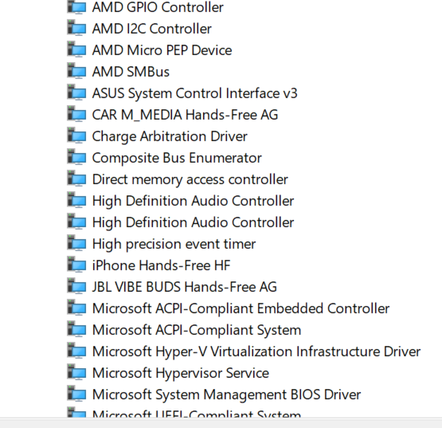  
*Device Manager showing all devices operational after driver reload*

---

### 5. Long-Term Mitigation - Disabling Fast Startup (10:15 AM)
**Objective:** Prevent recurrence by addressing root cause of driver corruption.

**Problem Analysis:**
Windows Fast Startup (hybrid hibernation mode) preserves kernel and driver states in hibernation file (hiberfil.sys) rather than performing full cold boot initialization. When GPIO controller driver state became corrupted, Fast Startup continued restoring the corrupted state on each subsequent "boot."

**Solution Implemented:**
1. Opened **Control Panel** → **Power Options**
2. Selected **"Choose what the power buttons do"**
3. Clicked **"Change settings that are currently unavailable"**
4. **Unchecked:** "Turn on fast startup (recommended)"
5. Saved changes

**Result:**
- System will now perform full kernel initialization on every boot
- Prevents preservation of corrupted driver states
- Ensures clean driver loading from cold state
- Trades ~5-10 seconds longer boot time for enterprise-grade stability

**User Education Provided:**
- Explained what happened and why
- Described prevention measure and its purpose
- Instructed to contact helpdesk immediately if similar symptoms recur
- Confirmed user prepared for 2 PM client presentation

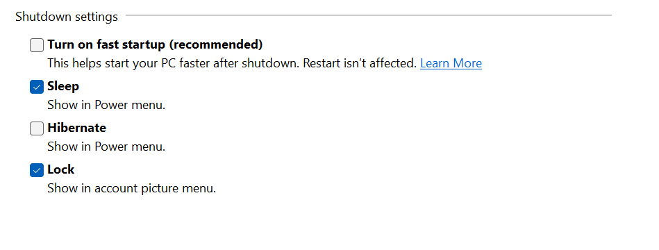  
*Power Options showing Fast Startup disabled as preventive measure*

---

## Final Resolution Summary (11:30 AM)

### Issue
Laptop touchpad non-functional and Wi-Fi adapter unable to connect to network. User blocked from accessing email, files, and cloud applications.

### Root Cause
AMD GPIO Controller driver failed to initialize during Windows boot process due to Fast Startup preserving corrupted driver state. Cascading failure affected all GPIO-dependent hardware (touchpad, Wi-Fi).

### Resolution Steps
1. Network diagnostics (`ipconfig`) - confirmed adapter detected but in disconnected state
2. Device Manager analysis - identified GPIO Controller Code 43 error as primary failure point
3. Event Viewer forensics - traced driver load failure (Event 219) during boot sequence
4. Manual driver re-initialization - disabled/re-enabled GPIO Controller to force reload
5. Immediate functionality restored for both touchpad and Wi-Fi
6. Disabled Fast Startup to prevent recurrence of boot-time driver corruption

### Outcome
- ✅ Touchpad fully functional - all gestures working
- ✅ Wi-Fi connected and stable - network resources accessible
- ✅ User able to work normally and retrieve presentation materials
- ✅ Preventive measure implemented to ensure system stability
- ✅ User successfully presented to client at 2 PM

### Technical Classification
- **Issue Type:** Driver initialization failure (boot-time)
- **Resolution Method:** PnP re-enumeration
- **Prevention:** Fast Startup disabled to ensure clean driver loading

### Metrics
- **Time to Resolution:** 2 hours 30 minutes
- **SLA Status:** Resolved within 2-hour critical SLA
- **User Satisfaction:** Positive - able to complete time-sensitive client presentation
- **Recurrence Prevention:** Implemented

---

## Documentation

### Ticket Management Screenshots

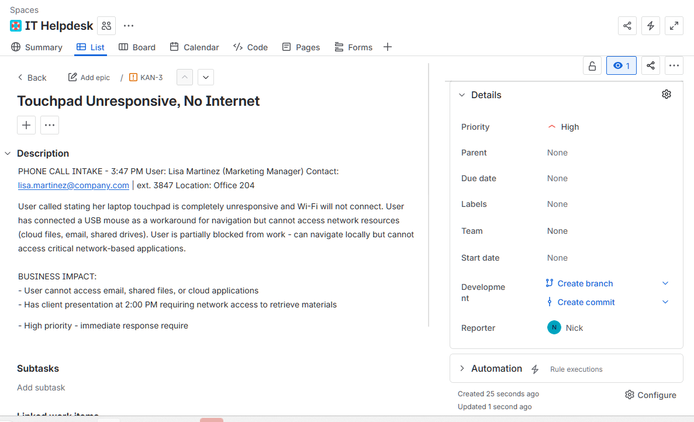  
*Initial ticket creation with Critical priority and full issue description*

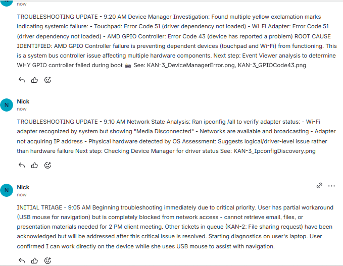  
*Troubleshooting comments showing diagnostic process (Part 1)*

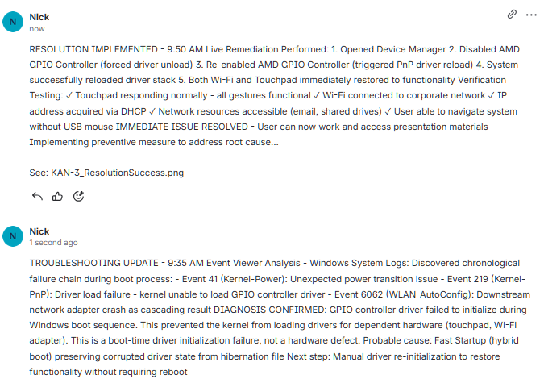  
*Resolution implementation comments (Part 2)*

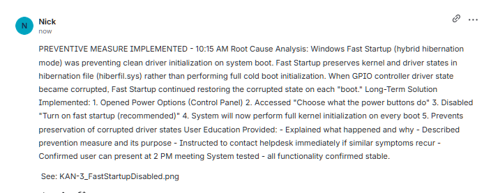  
*Preventive configuration documentation*

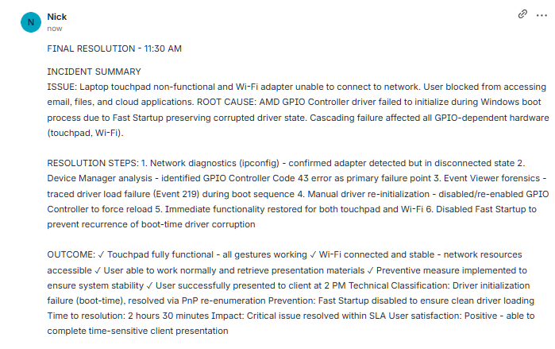  
*Final resolution summary and outcomes*

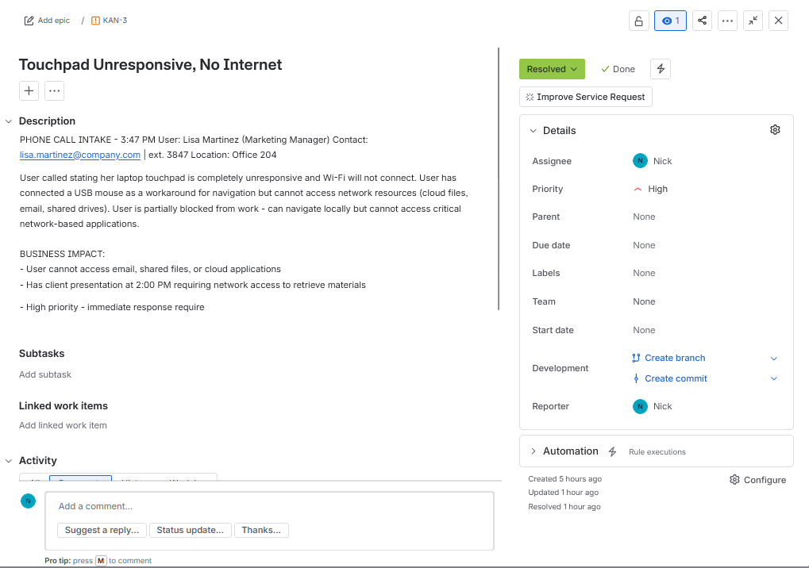  
*Closed ticket showing final status and resolution*

---

## Skills Demonstrated
- System-level diagnostic methodology
- Event log forensics and root cause analysis
- Understanding of Windows boot process and driver initialization
- PnP (Plug and Play) subsystem knowledge
- Driver dependency troubleshooting
- Live remediation without system downtime
- Preventive maintenance and configuration hardening
- User communication during critical incidents
- Time-sensitive issue prioritization
- Documentation of complex technical issues

## Tools Used
- Command Prompt (`ipconfig`)
- Device Manager
- Event Viewer (Windows System Logs)
- Control Panel (Power Options)
