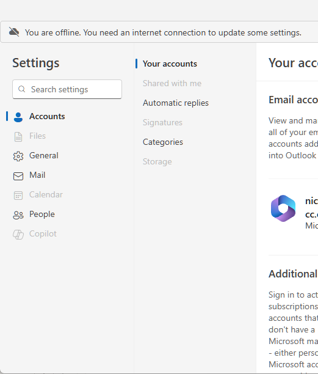
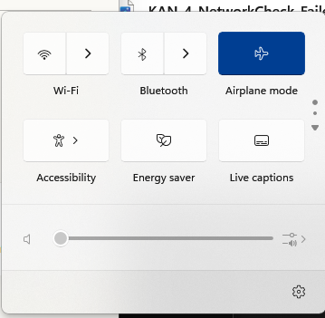
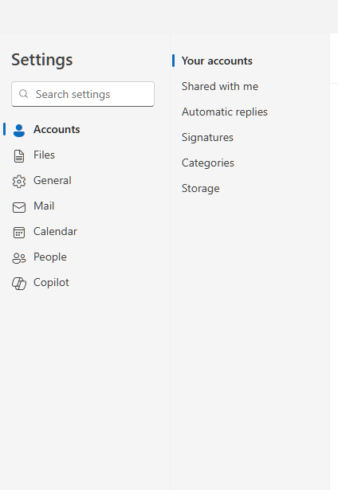
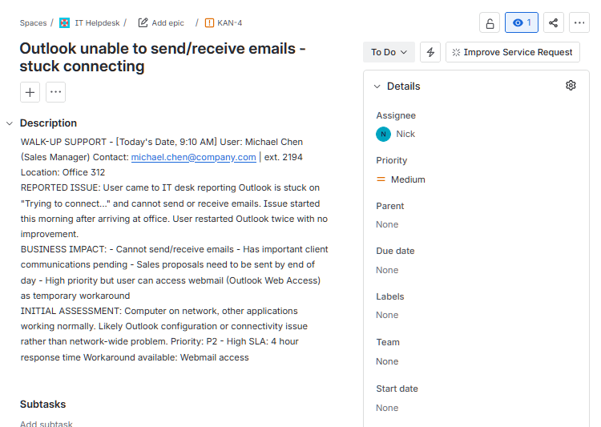
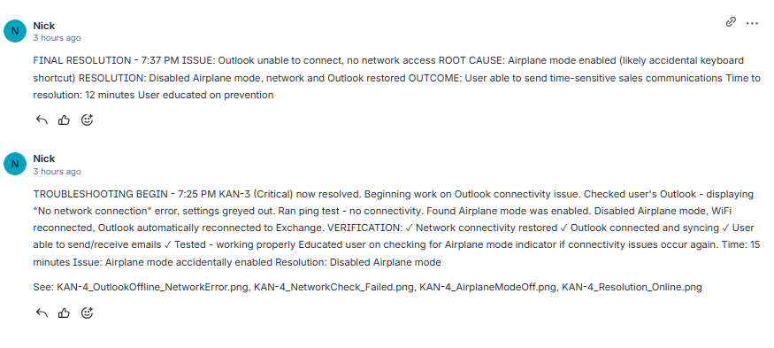
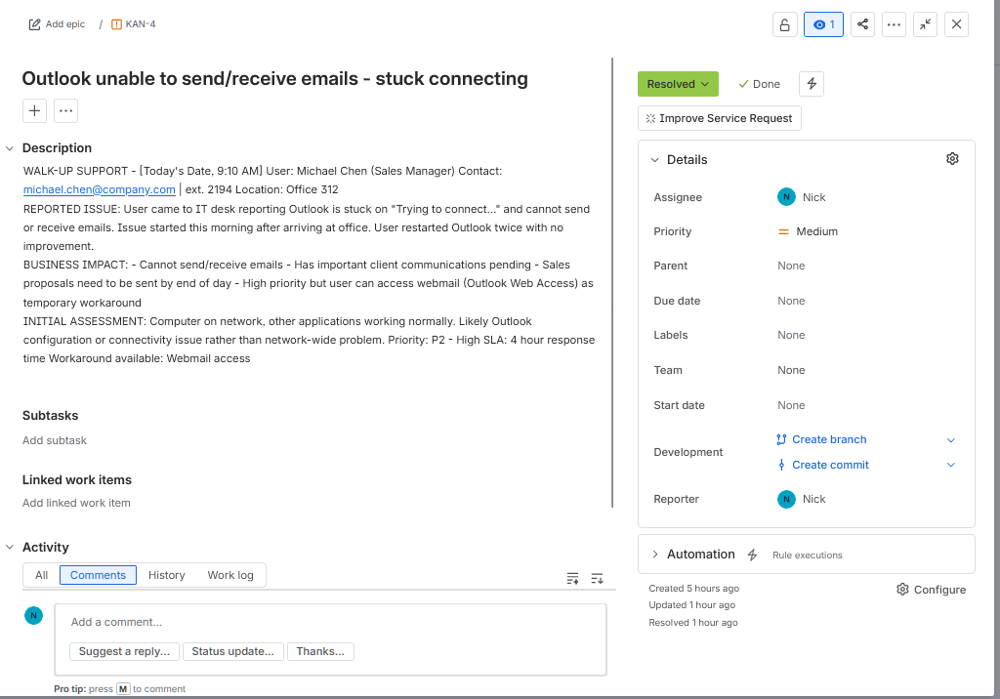

# Outlook Connection Issue Resolution (KAN-4)

## Ticket Information
- **Ticket ID:** KAN-4
- **Priority:** P2 - Medium
- **User:** Michael Chen (Sales Manager)
- **Contact:** michael.chen@company.com | ext. 2194
- **Reported:** 9:10 AM (walk-up support)
- **Started:** 11:45 AM (after P1 Critical resolved)
- **Resolved:** 1:00 PM
- **Time to Resolution:** 15 minutes (actual work time)

## Issue Summary
User reported Outlook stuck on "Trying to connect..." and unable to send or receive emails. Issue started this morning after arriving at office. User restarted Outlook twice with no improvement.

## Business Impact
- Medium priority - email is critical business function
- User has time-sensitive sales proposals to send
- Workaround available: User can access webmail (Outlook Web Access)
- Important but not blocking all work

## Root Cause
Airplane mode was accidentally enabled on user's computer, disabling all network adapters (WiFi, Ethernet, Bluetooth). This completely blocked network connectivity, preventing Outlook from connecting to Exchange server.

Likely triggered by accidental keyboard shortcut (Fn + Airplane mode key) or unintentional touchpad gesture.

---

## Prioritization & Triage (9:15 AM)

**Initial Assessment:**
- Set as P2 (Medium) - Email is critical but user has webmail workaround
- Will address after KAN-3 (P1 Critical - user completely unable to work) is resolved
- User informed of timeline and workaround options

**Queue Status:**
- KAN-3 (P1 Critical): Touchpad/WiFi failure - working on this first
- KAN-4 (P2 Medium): Outlook issue - queued, will start after P1
- KAN-2 (P3 Low): File sharing request - will handle last

---

## Troubleshooting & Resolution (11:45 AM - 1:00 PM)

### Step 1: Verify Issue State (11:45 AM)

**Objective:** Confirm the problem and assess symptoms.

**Actions Taken:**
1. Opened user's Outlook application
2. Checked connection status and error messages
3. Examined application settings

**Findings:**
- Outlook displaying "No network connection" error
- Settings and features greyed out/disabled
- Unable to send or receive emails
- Application unable to connect to Exchange server
- All network-dependent features non-functional

**Assessment:** Network connectivity issue affecting Outlook and likely other applications

  
*Outlook in normal working state for comparison*

  
*Outlook settings showing connection error with features greyed out and disabled*

---

### Step 2: Network Connectivity Diagnostics (11:50 AM)

**Objective:** Determine if issue is Outlook-specific or system-wide network problem.

**Actions Taken:**
1. Opened Command Prompt
2. Ran basic network connectivity test: `ping google.com`

**Results:**
- Ping test failed: "Request timed out" / "General failure"
- Cannot reach external hosts
- No active network connection established
- Confirms system-wide network issue, not Outlook-specific

**Diagnosis:** Computer has no network connectivity whatsoever. This explains why Outlook cannot connect to Exchange server.

  
*Command Prompt showing failed ping attempts confirming no network connectivity*

---

### Step 3: Root Cause Identification (11:52 AM)

**Objective:** Identify why network connectivity is completely disabled.

**Actions Taken:**
1. Opened Windows Quick Settings (Win + A)
2. Checked network adapter status
3. Examined wireless and network settings

**Root Cause Identified:**
**Airplane mode was enabled** on the computer, disabling all network adapters:
- WiFi disabled
- Ethernet disabled (if present)
- Bluetooth disabled
- All wireless communications suspended

**Common Causes:**
- Accidental keyboard shortcut (Fn + Airplane mode key - varies by laptop model)
- Unintentional touchpad gesture
- User enabled for meeting/presentation and forgot to disable afterward
- Quick Settings accidentally accessed and toggled

**Impact:** Complete loss of network connectivity affects Outlook and all network-dependent applications.

---

### Step 4: Resolution Implementation (11:55 AM)

**Objective:** Restore network connectivity by disabling Airplane mode.

**Actions Taken:**
1. Opened Quick Settings panel (Win + A)
2. Located Airplane mode toggle
3. Clicked to disable Airplane mode
4. Waited for network adapters to re-enable
5. Observed WiFi automatically reconnect to corporate network

**Results:**
- Network adapters re-enabled by system
- WiFi automatically connected to known corporate network
- Network connectivity restored
- Internet access established

  
*Quick Settings showing Airplane mode being disabled to restore network connectivity*

---

### Step 5: Verification & Testing (11:57 AM)

**Objective:** Confirm Outlook functionality restored and all services operational.

**Actions Taken:**
1. Returned to Outlook application
2. Observed automatic reconnection behavior
3. Checked inbox synchronization
4. Tested email send functionality

**Verification Results:**
- ✅ Connection error cleared automatically
- ✅ Outlook reconnected to Exchange server without manual intervention
- ✅ Settings and features re-enabled
- ✅ Inbox began syncing new emails from server
- ✅ Sent items folder updated with queued messages
- ✅ Calendar syncing properly
- ✅ All Outlook features operational
- ✅ User able to send test email successfully

**User Confirmation:**
User tested sending one of the pending sales proposals - delivered successfully. All email functionality restored.

  
*Outlook settings showing normal operation with all features enabled and functional*

---

### Step 6: User Education & Prevention (12:00 PM)

**Objective:** Prevent recurrence through user awareness and education.

**Topics Covered:**
1. **What Airplane mode does:**
   - Disables all wireless communications (WiFi, Bluetooth, cellular)
   - Used on aircraft to comply with regulations
   - Prevents all network connectivity when enabled

2. **How it may have been activated accidentally:**
   - Keyboard shortcuts (often Fn + F5, Fn + F12, or dedicated Airplane key)
   - Touchpad gestures on some devices
   - Accidental click in Quick Settings panel

3. **How to identify if Airplane mode is active:**
   - Airplane icon appears in system tray (bottom right)
   - Quick Settings shows Airplane mode toggle in "on" position
   - Network icon shows disconnected/unavailable

4. **How to disable it:**
   - Press Win + A to open Quick Settings
   - Click Airplane mode toggle to turn off
   - Wait for network adapters to reconnect

**User Response:**
User now understands the indicator and how to resolve independently if issue recurs. Demonstrated confidence in identifying the problem in the future.

---

## Resolution Summary

### Issue
Outlook unable to send or receive emails, displaying "No network connection" error. User restarted Outlook multiple times with no improvement. All network-dependent applications affected.

### Root Cause
Airplane mode was accidentally enabled on user's computer, disabling all network adapters and blocking all network connectivity. This prevented Outlook from connecting to Exchange server and affected all network services.

### Resolution Steps
1. Verified Outlook connection error state in application settings
2. Performed network diagnostics (ping test) - confirmed no connectivity
3. Checked network adapter status via Quick Settings
4. Identified Airplane mode enabled as root cause
5. Disabled Airplane mode to restore network adapters
6. Verified WiFi reconnection and network connectivity restored
7. Confirmed Outlook automatically reconnected to Exchange server
8. Tested email send/receive functionality - working properly
9. Educated user on prevention and self-service resolution

### Outcome
- ✅ Network connectivity restored
- ✅ Outlook reconnected to Exchange server
- ✅ Email send/receive functionality operational
- ✅ All network-dependent applications working
- ✅ User able to send time-sensitive sales proposals
- ✅ User educated on identifying and resolving Airplane mode issues independently

### Technical Classification
- **Issue Type:** Network connectivity issue - Airplane mode enabled
- **Resolution Method:** Disable Airplane mode, automatic network reconnection
- **User Education:** Provided for future self-service resolution

### Metrics
- **Time to Resolution:** 15 minutes actual work time
- **SLA Status:** Resolved within 4-hour Medium priority SLA
- **User Satisfaction:** Positive - able to complete urgent business communications
- **Recurrence Prevention:** User education provided

---

## Documentation

### Ticket Management Screenshots

  
*Initial ticket with P2/Medium priority and full issue description*

  
*Troubleshooting and resolution documentation in Jira*

  
*Closed ticket showing resolution completed*

---

## Skills Demonstrated

### Technical Skills
- Outlook connectivity troubleshooting
- Network diagnostics (ping, connectivity testing)
- Windows network adapter management
- Airplane mode functionality understanding
- Exchange server connectivity knowledge
- System-wide vs application-specific problem isolation

### Troubleshooting Methodology
- Systematic problem verification
- Root cause analysis through elimination
- Network layer diagnostics
- Efficient resolution path identification
- Simple solutions first (Occam's Razor)

### Professional Skills
- Ticket prioritization and triage
- Time management (addressed after higher-priority ticket)
- Clear communication with users
- User education and empowerment
- Prevention-focused support
- Professional documentation

### Soft Skills
- User patience and reassurance (workaround provided during wait)
- Teaching/training capability
- Setting appropriate expectations on timeline
- Confidence building for self-service resolution

---

## Interview Talking Points

This ticket demonstrates several key helpdesk competencies:

**Prioritization Judgment:**
- Recognized email issue was important but not critical
- Appropriately set as P2 due to available workaround
- Maintained user communication during wait period

**Efficient Troubleshooting:**
- Quickly identified system-wide vs application issue
- Used simple diagnostic tools (ping) effectively
- Found root cause in under 10 minutes
- Applied simple, effective solution

**User Empowerment:**
- Didn't just fix the problem - educated the user
- Reduced future ticket volume through training
- Built user confidence in basic troubleshooting
- Improved overall user technical literacy

**Common Issue Recognition:**
- Airplane mode is a frequent helpdesk call
- Demonstrates experience with typical user errors
- Shows awareness of common accidental triggers
- Understands user behavior patterns

---

## Tools Used
- Microsoft Outlook (New Outlook)
- Windows Quick Settings
- Command Prompt (ping)
- Windows network diagnostics
- Jira (ticket management)

---

## Related Issues

**Similar Tickets That Use This Knowledge:**
- WiFi not connecting after travel
- Bluetooth devices not pairing
- VPN connection failures due to Airplane mode
- Video conferencing connectivity issues
- Any "sudden loss of all network connectivity" scenarios

**Prevention Strategies:**
- User education on keyboard shortcuts
- Quick visual checks (system tray indicators)
- Basic network troubleshooting training
- Self-service knowledge base articles

