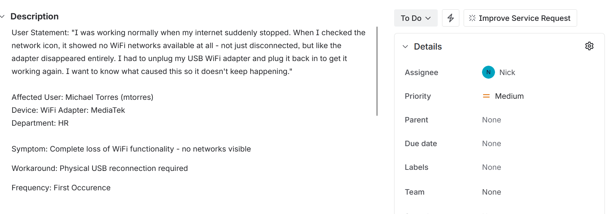
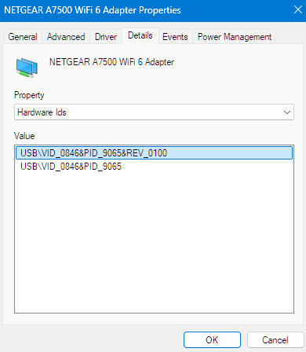
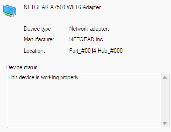
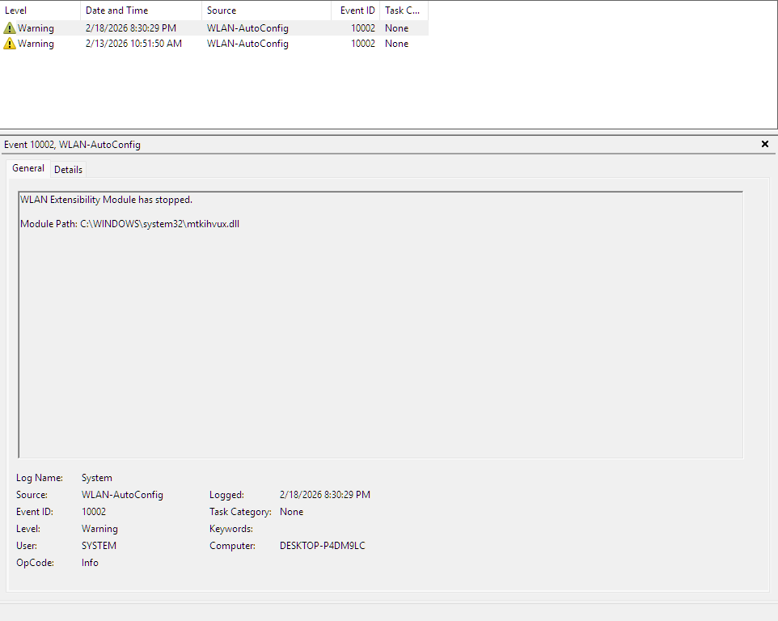
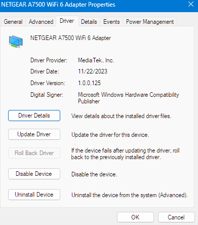
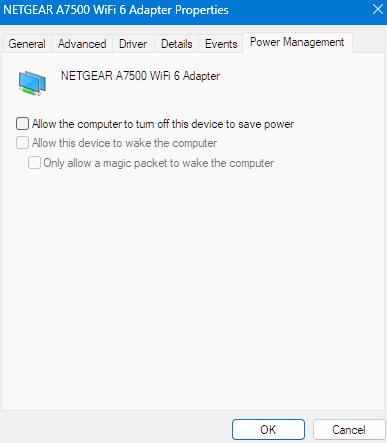
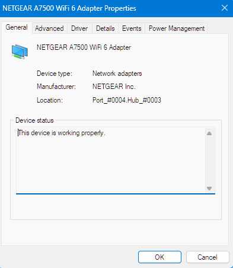
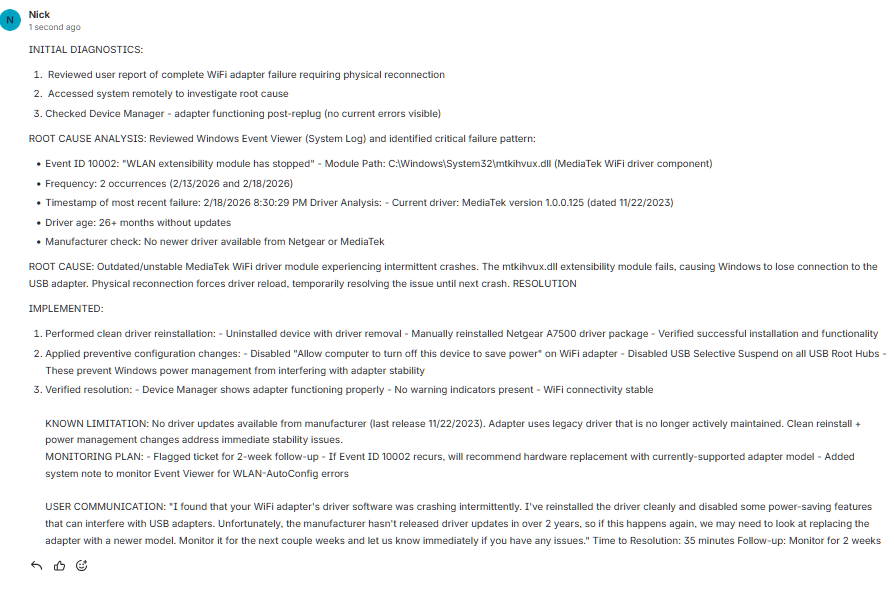

# Activity 3: USB WiFi Adapter Failure - Root Cause Analysis

## Overview
This activity demonstrates real-world troubleshooting of an intermittent hardware failure affecting user productivity. A USB WiFi adapter experienced complete functionality loss, requiring physical reconnection to restore service. Rather than accepting the workaround, this exercise focuses on identifying the underlying cause and implementing preventive measures.

## Scenario
**User Report**: "My WiFi suddenly stopped working - no networks were showing at all. I had to unplug my USB adapter and plug it back in to get it working again. This has happened twice this week. Can you figure out why so I don't have to keep doing this?"

**Business Impact**: Medium priority - User experiencing recurring productivity interruptions requiring manual intervention

## Technical Environment
- **Operating System**: Windows 11 Enterprise
- **Hardware**: Netgear A7500 Nighthawk USB WiFi Adapter
- **Domain**: Labs.local
- **Ticketing System**: Jira Service Management

---

## Ticket Creation

Upon receiving the user's report, I created a formal incident ticket in Jira Service Management to track the issue through its full lifecycle.

*Figure 1: Initial ticket creation showing user-reported symptoms, business impact assessment, and priority assignment*

---

## Diagnostic Phase

### Hardware Identification

The first step was identifying the exact hardware and driver configuration to understand what we were working with.

*Figure 2: Device Manager showing the Netgear A7500 adapter with hardware ID and initial device properties*

Initial assessment showed the device was functional post-reconnection, but the recurring nature of the failure indicated an underlying stability issue that needed investigation.

*Figure 3: Device status showing "working properly" after user's manual reconnection - highlighting that the issue is intermittent*

### Event Viewer Analysis - The Smoking Gun

Rather than accepting the symptom, I investigated Windows Event Viewer to identify the root cause of the failures.

*Figure 4: Event ID 10002 showing WLAN extensibility module crash - the critical evidence identifying `mtkihvux.dll` (MediaTek driver) as the failure point*

**Key Findings:**
- **Event ID**: 10002 - WLAN extensibility module has stopped
- **Module Path**: `C:\Windows\System32\mtkihvux.dll`
- **Timestamp**: 2/18/2026 8:30:29 PM (matches user-reported failure time)
- **Frequency**: 2 occurrences (2/13/2026 and 2/18/2026)
- **Pattern**: No related system errors - isolated driver crash

### Driver Analysis

With the failing module identified, I examined the driver details to assess its currency and support status.

*Figure 5: Driver properties revealing version 1.0.0.125 from 11/22/2023 - a 26+ month old driver with no available updates from the manufacturer*

**Critical Discovery**: The driver was severely outdated with no manufacturer support. Netgear and MediaTek had not released updates in over 2 years, indicating this is legacy hardware with known stability issues.

---

## Resolution Implementation

### Driver Reinstallation

Based on the root cause analysis, I performed a clean driver reinstallation to address potential driver corruption and instability.

**Steps Taken:**
1. Uninstalled the device with complete driver software removal
2. Manually reinstalled the Netgear A7500 driver package
3. Verified successful installation

### Preventive Configuration

To prevent future occurrences, I implemented power management changes that address USB adapter stability issues.

*Figure 6: Power Management settings showing "Allow the computer to turn off this device to save power" disabled - preventing Windows from sleeping the adapter and causing crashes*

**Additional Preventive Measures:**
- Disabled USB Selective Suspend on all USB Root Hub controllers
- Configured adapter to remain active regardless of power state
- These settings prevent Windows power management from interfering with adapter stability

### Post-Resolution Verification

*Figure 7: Device Manager showing the adapter functioning properly after driver reinstallation and power management configuration changes*

---

## Documentation & Closure

The final step was documenting the complete troubleshooting methodology, root cause analysis, and resolution in the ticket for future reference.

*Figure 8: Completed Jira ticket showing comprehensive resolution notes, root cause analysis, preventive measures, known limitations, and monitoring plan*

---

## Skills Demonstrated

### 1. Root Cause Analysis (RCA)
- Used Windows Event Viewer forensics to identify failure pattern
- Analyzed Event ID 10002 (WLAN extensibility module crash)
- Correlated user-reported symptoms with system logs
- Identified driver module crash: `mtkihvux.dll` (MediaTek WiFi driver component)

### 2. Hardware Diagnostics
- Device Manager investigation and driver analysis
- Hardware ID identification for driver sourcing
- Driver version assessment and manufacturer support verification
- Power management configuration review

### 3. Driver Management
- Assessed driver currency (version 1.0.0.125 from 11/22/2023 - 26+ months old)
- Performed clean driver uninstall with software removal
- Manual driver reinstallation from manufacturer package
- Verified no updated drivers available (end-of-support hardware)

### 4. Preventive Maintenance
- Disabled USB Selective Suspend to prevent power-induced failures
- Configured adapter power management settings
- Applied USB Root Hub power settings across all controllers
- Documented hardware limitations for future reference

### 5. Professional Documentation
- Created comprehensive ticket with troubleshooting methodology
- Documented known limitations (no manufacturer driver updates)
- Established monitoring plan for potential hardware replacement
- Translated technical findings into user-friendly communication

## Outcomes & Key Takeaways
- **Immediate**: Driver stability improved through clean reinstall and power management optimization
- **Short-term**: User no longer experiencing daily disconnections requiring manual intervention
- **Long-term**: Documented hardware limitation and replacement criteria for future decision-making

## Key Takeaways

### What Made This Troubleshooting Effective

✅ **Evidence-based approach** - Event Viewer forensics identified the exact failure point rather than guessing  
✅ **Root cause vs. symptom** - Didn't accept "replug it" as a solution; investigated WHY it failed  
✅ **Preventive measures** - Power management configuration reduces likelihood of future failures  
✅ **Honest limitations** - Documented that hardware has no manufacturer support and may need replacement  
✅ **Clear monitoring plan** - Established 2-week follow-up with escalation criteria

### Professional Communication Example

**Technical Documentation (for IT team):**
> "Event ID 10002 indicates WLAN extensibility module crash in mtkihvux.dll. Driver version 1.0.0.125 (11/22/2023) is 26+ months old with no manufacturer updates available. Performed clean reinstall and disabled USB power management. Monitor for recurrence; hardware replacement may be necessary if issue persists."

**User Communication (for end-user):**
> "I found that your WiFi adapter's driver software was crashing intermittently. I've reinstalled the driver cleanly and disabled some power-saving features that can interfere with USB adapters. Unfortunately, the manufacturer hasn't released driver updates in over 2 years, so if this happens again, we may need to look at replacing the adapter with a newer model. Monitor it for the next couple weeks and let us know immediately if you have any issues."

---

## Interview Application

This activity directly addresses common IT helpdesk interview questions:

**"Tell me about a time you had to troubleshoot a recurring technical problem."**

*Sample Answer:* "In my portfolio, I documented a real issue where a user's USB WiFi adapter kept failing intermittently. Instead of just having them replug it each time, I used Event Viewer to identify Event ID 10002 - the MediaTek driver module was crashing. I discovered the driver was 26 months old with no updates available from the manufacturer. I performed a clean driver reinstall and disabled USB power management features that were causing instability. I also set a monitoring plan since the hardware has no manufacturer support, documenting that replacement might be needed if it recurs. This experience taught me the importance of root cause analysis versus just applying workarounds."

**"How do you use Event Viewer in troubleshooting?"**

*Sample Answer:* "Event Viewer is one of my primary diagnostic tools. In a recent case, a user reported intermittent WiFi failures. I filtered the System log for WLAN-AutoConfig and Kernel-PnP events, which revealed Event ID 10002 showing a specific driver module crash. This gave me the exact failure point - the mtkihvux.dll MediaTek driver component - and allowed me to implement a targeted solution rather than trial-and-error troubleshooting."

**"What do you do when there's no perfect technical solution?"**

*Sample Answer:* "I encountered this with a WiFi adapter that had a 26-month-old driver with no manufacturer updates available. I couldn't install a newer driver, so I focused on optimization - clean reinstallation and power management configuration to improve stability. I documented the hardware limitation honestly in the ticket and established monitoring criteria for when replacement would be necessary. Sometimes the professional approach is acknowledging limitations while implementing the best available solution."

---

## Tools & Technologies Used
- **Jira Service Management**: Incident tracking and resolution documentation
- **Windows Event Viewer**: System log analysis and pattern identification
- **Device Manager**: Hardware diagnostics and driver management
- **Windows 11 Enterprise**: Domain-joined workstation environment
- **Active Directory Domain**: Labs.local

## Time to Resolution
**35 minutes** (including diagnostics, driver reinstallation, configuration, and comprehensive documentation)

---

## Visual Documentation

This activity includes **8 integrated screenshots** demonstrating the complete troubleshooting workflow:

1. **Adapter Identification** - Hardware details and initial properties
2. **Device Status** - Intermittent nature of the issue
3. **Ticket Creation** - Professional incident documentation
4. **Root Cause Event** - Event ID 10002 showing driver module crash
5. **Outdated Driver** - Version analysis revealing 26-month-old driver
6. **Power Management** - Preventive configuration changes
7. **Post-Resolution Status** - Verification of successful fix
8. **Ticket Resolution** - Comprehensive RCA documentation

Each screenshot is positioned contextually within the troubleshooting narrative to illustrate key diagnostic findings and resolution steps.

---

**Portfolio Note**: This activity demonstrates authentic troubleshooting of a real production issue, showcasing the ability to move beyond surface-level fixes to identify and address root causes while maintaining honest communication about technical limitations.