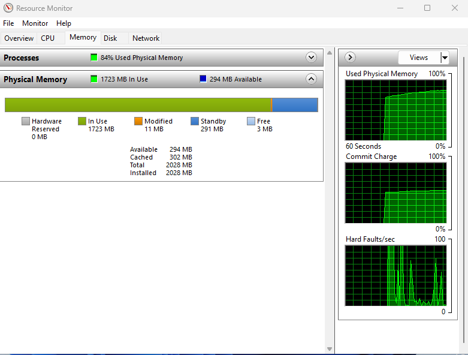
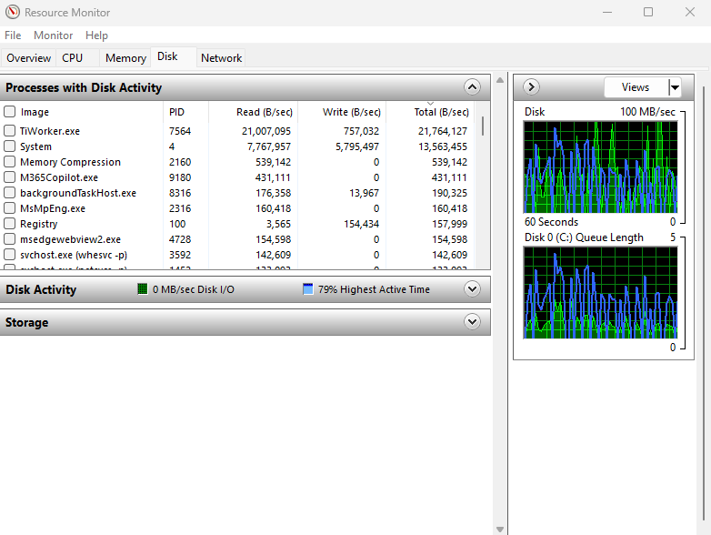
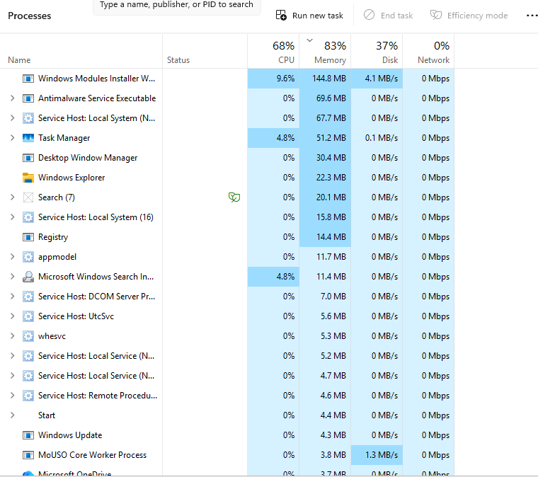
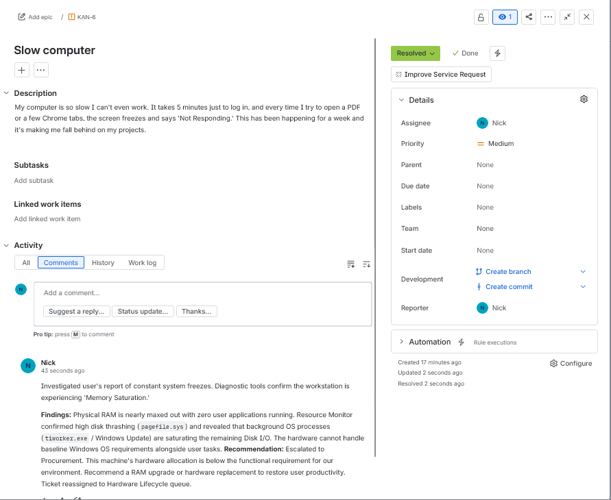

# Virtual Lab: Capacity Analysis & Hardware Lifecycle Recommendation

## Overview
This lab demonstrates real-world IT support troubleshooting for performance issues caused by hardware resource exhaustion. Using diagnostic tools and methodical analysis, I identified that the system's hardware could not meet baseline Windows OS requirements, and escalated the ticket with a hardware lifecycle recommendation.

---

## Lab Environment
- **VM Configuration**: Windows 10 with 2GB RAM (intentionally constrained)
- **Simulated Scenario**: End-user reporting severe performance degradation
- **Tools Used**: Resource Monitor, Task Manager

---

## Scenario: Ticket INC-1044

**User**: Sarah Jenkins (Marketing)  
**Priority**: Medium  
**Description**: 
> "My computer is so slow I can't even work. It takes 5 minutes just to log in, and every time I try to open a PDF or a few Chrome tabs, the screen freezes and says 'Not Responding.' This has been happening for a week."

---

## Troubleshooting Process

### Step 1: Proving Memory Saturation

Opened Resource Monitor (`resmon`) and navigated to the **Memory** tab to check physical memory allocation.

**Findings**: 
- Physical memory nearly maxed out with minimal available RAM
- System is starving for resources even before user applications launch


*Resource Monitor showing critical memory saturation with available memory in single digits*

---

### Step 2: Identifying Disk Thrashing and Background Processes

Checked the **Disk** tab in Resource Monitor and sorted by "Total (B/sec)" to identify I/O bottlenecks.

**Findings**:
- System process (PID 4) showing high disk activity, indicating pagefile thrashing due to RAM overflow
- `tiworker.exe` (Windows Modules Installer Worker) consuming high disk I/O
- Background OS processes saturating the system's already limited resources


*Resource Monitor Disk tab showing System (PID 4) and tiworker.exe dominating disk I/O*

---

### Step 3: Baseline Load Test

Closed all user applications and checked Task Manager to observe the system's resting state.

**Findings**:
- High memory and disk utilization persist with zero user applications running
- Confirms hardware insufficiency rather than user behavior as root cause


*Task Manager showing high resource utilization with no active user applications*

---

## Resolution

### Analyst Report
```
Investigated user's report of constant system freezes. Diagnostic tools confirm 
the workstation is experiencing severe resource exhaustion.

Findings: 
Physical RAM is nearly maxed out with zero user applications running. Resource 
Monitor confirmed high disk thrashing from System process (PID 4), consistent 
with pagefile activity due to memory exhaustion. Background OS processes 
(tiworker.exe / Windows Update) are saturating the remaining Disk I/O. The 
hardware cannot handle baseline Windows OS requirements alongside user tasks.

Recommendation: 
Escalated to Procurement. This machine's hardware allocation is below the functional 
requirement for our environment. Recommend a RAM upgrade or hardware replacement to 
restore user productivity. Ticket reassigned to Hardware Lifecycle queue.
```


*Ticket marked as escalated with complete analyst notes*

---

## Key Takeaways

- **Root Cause Analysis**: Distinguished between symptoms (slow performance) and underlying cause (hardware capacity limits)
- **Evidence-Based Troubleshooting**: Used multiple diagnostic tools to prove hardware exhaustion
- **Professional Documentation**: Provided clear findings and actionable recommendations for procurement
- **Business Context**: Understood IT's role in hardware lifecycle planning and user productivity

---

## Technical Skills Demonstrated

- Windows Resource Monitor analysis
- Task Manager performance diagnostics
- Memory and disk I/O troubleshooting
- Ticketing system documentation
- Hardware capacity planning
- Cross-departmental escalation procedures
