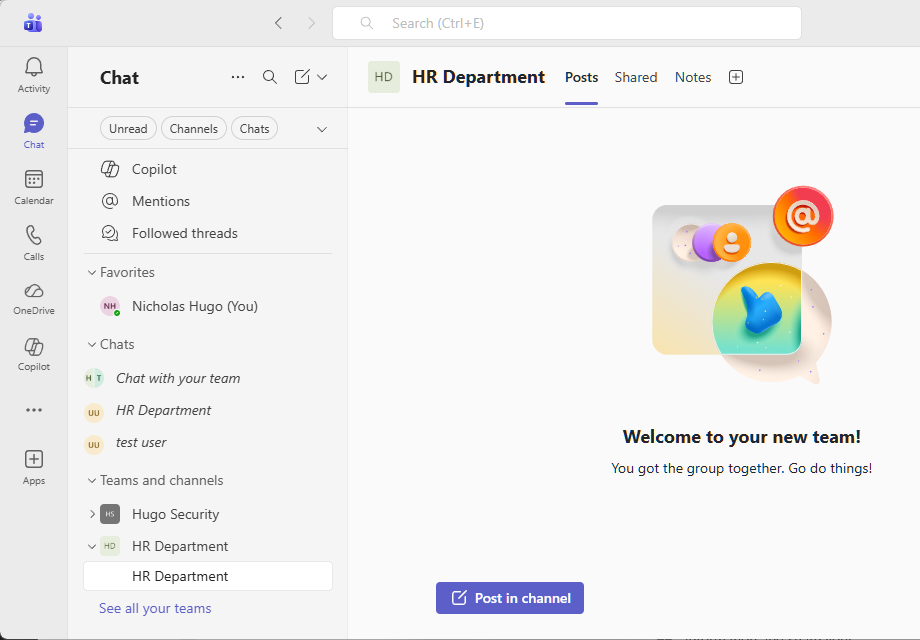
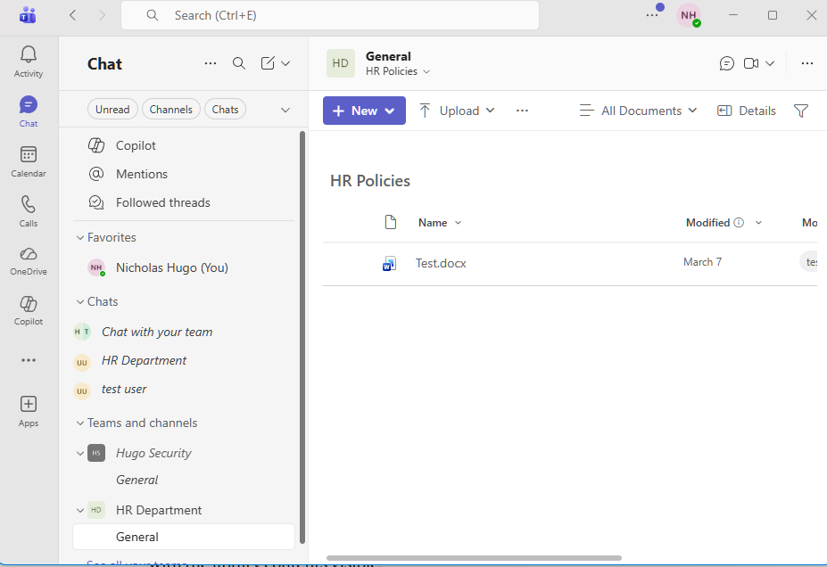
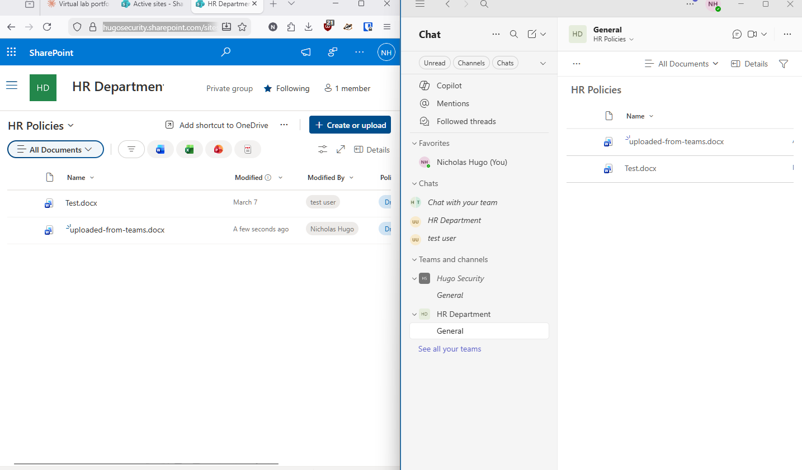
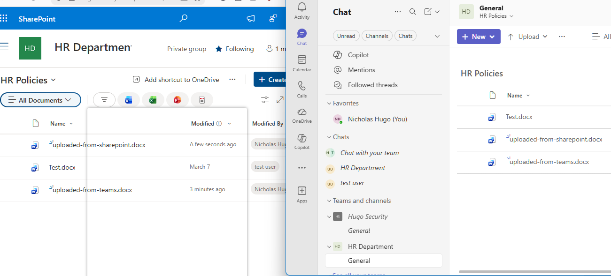
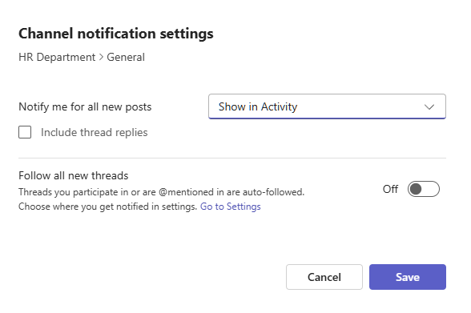

# Activity 10 - SharePoint + Teams Integration

**Category:** SharePoint & Collaboration  
**Platform:** Microsoft Teams, SharePoint Online  
**Difficulty:** Intermediate  

---

## Overview

SharePoint and Teams are not two separate tools - they are two interfaces for the same underlying storage and collaboration platform. This lab demonstrates that relationship by pinning the HR Policies library from Activity 8 inside a Teams channel and verifying bidirectional file access. A file uploaded from Teams appears in SharePoint, and a file uploaded from SharePoint appears in Teams - because it is one library, not a sync or a copy.

---

## Objectives

- Create a Microsoft Teams team for the HR department
- Pin the HR Policies SharePoint library as a tab in the General channel
- Verify bidirectional file access between Teams and SharePoint
- Configure channel notifications for file activity

---

## Tools Used

- Microsoft Teams
- SharePoint Online

---

## Lab Walkthrough

### Phase 1 - Create the HR Department Team

An HR Department team was created in Microsoft Teams from scratch with Private privacy settings. Members were skipped at creation - the focus of this lab is the SharePoint integration, not membership management.

---

### Phase 2 - Pin the HR Policies Library as a Tab

Rather than using the default document library Teams creates automatically, the existing HR Policies library from Activity 8 was pinned directly as a tab in the General channel. This preserves the governance work already done - the Policy Status metadata column, broken permission inheritance, and scoped access - rather than starting fresh in a new library.

> Note: The native SharePoint tab in Teams now requires a Loop page URL in the current UI. The library was instead added using the Website tab with the direct SharePoint library URL, which embeds the full library view inside the channel.

---

### Phase 3 - Upload from Teams, Verify in SharePoint

A test file named `uploaded-from-teams.docx` was uploaded directly from the HR Policies tab inside Teams. The HR Policies library was then opened in a browser via SharePoint and the same file was confirmed present - demonstrating that the Teams tab and the SharePoint library are the same storage location.

---

### Phase 4 - Upload from SharePoint, Verify in Teams

A second test file named `uploaded-from-sharepoint.docx` was uploaded directly from the SharePoint HR Policies library. The HR Policies tab in Teams was refreshed and the file appeared there immediately - confirming the bidirectional relationship.

---

### Phase 5 - Configure Channel Notifications

Channel notifications were enabled for new posts and all new file activity in the General channel. This ensures HR team members are notified when new documents are added or updated without needing to check the library manually.

---

## Reflection

**What was configured**

An HR Department Teams team was created and the HR Policies SharePoint library was pinned as a tab in the General channel. Files were uploaded from both Teams and SharePoint to verify shared storage. Channel notifications were configured for file activity.

**Why each decision was made**

- **Pinned the existing HR Policies library** - preserves the metadata column, permissions, and governance configuration from Activity 8 rather than duplicating effort in a new library
- **Tested both upload directions** - uploading from Teams and from SharePoint separately proves this is one library with two front ends, not a sync relationship
- **Channel notifications** - without notifications team members have no passive awareness of document changes; notifications close that gap without requiring manual checks

**What I'd do differently in production**

- Pin separate libraries as tabs in dedicated channels - HR Policies in one channel, Onboarding in another - so staff navigate directly to what they need
- Use **@mentions in channel posts** when uploading critical documents like policy updates to alert specific team members directly
- Review **Teams governance settings** in the Teams Admin Center to restrict team creation and prevent sprawl in larger organizations

---

## Key Takeaways

Most "my file disappeared from Teams" tickets come from users not understanding that the Files tab and the SharePoint library are the same thing. Knowing this relationship - and being able to explain it clearly - is one of the most practically useful things an IT support person can know in an M365 environment.

---

[← Back to Microsoft 365 Labs](https://nhugo1.github.io/IT-Labs/Microsoft-365/)