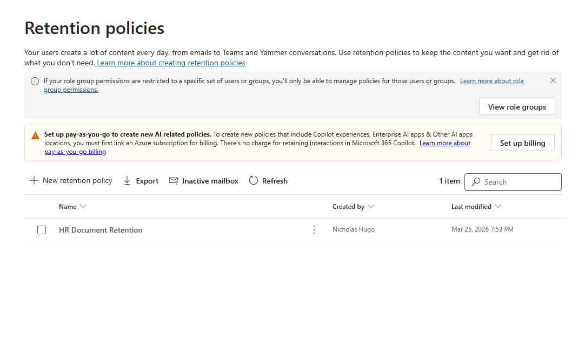
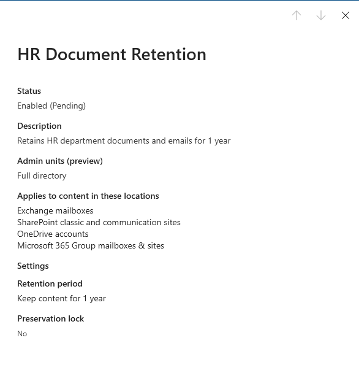
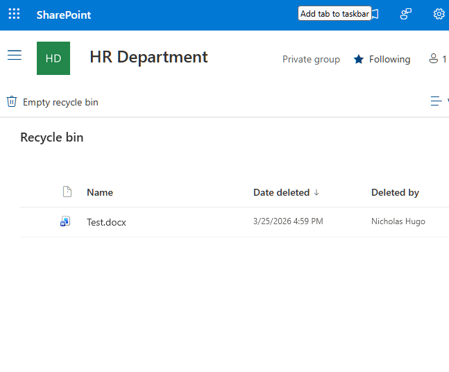

# Activity 11 — Retention Policies & Recycle Bin

## Overview

Retention policies and the recycle bin solve different problems. The recycle bin handles accidental deletion in the short term — it is user-accessible and immediate. Retention policies handle compliance and legal hold requirements — they are invisible to users and operate in the background. This lab covers both, and documents the distinction between retention and backup that is frequently misunderstood in real environments.

---

## Objectives

- Configure a retention policy in Microsoft Purview scoped to a specific SharePoint site and Exchange mailboxes
- Understand the retention policy lifecycle and how content is preserved even after user deletion
- Test the SharePoint two-stage recycle bin and document the recovery process

---

## Tools Used

- Microsoft Purview (`purview.microsoft.com`)
- SharePoint Online

---

## Lab Walkthrough

### Phase 1 — Create a Retention Policy

A retention policy named **HR Document Retention** was created in Microsoft Purview with the following configuration:

- **Locations:** HR Department SharePoint site, all Exchange mailboxes
- **Retention period:** 1 year
- **After expiry:** Do nothing — content is retained for 1 year but not automatically deleted

Scoping the policy to the HR Department site rather than applying it tenant-wide prevents over-retaining unrelated content across the organization.

---

### Phase 2 — Review Policy Detail

The policy detail view was reviewed to confirm the configured locations, retention period, and current status. Retention policies can take up to 24 hours to fully propagate across all locations after creation.

---

### Phase 3 — Test the SharePoint Recycle Bin

A document was deleted from the HR Policies library and located in the site recycle bin via **Site Contents → Recycle Bin**. The file was confirmed present with a deletion timestamp, then restored to the library.

**Two-stage recycle bin reference:**

| Stage | Location | Duration | Who can restore |
|---|---|---|---|
| Stage 1 | Site recycle bin | 93 days | Site members and owners |
| Stage 2 | Site collection recycle bin | 93 days from Stage 1 deletion | Site collection admins only |

After both stages are exhausted content is permanently deleted — unless a retention policy is active, in which case a copy is preserved in a hidden compliance library inaccessible to end users.

---

## Reflection

**What was configured**

A retention policy was created in Microsoft Purview covering the HR Department SharePoint site and all Exchange mailboxes. The policy retains content for 1 year with no automatic deletion after expiry. The SharePoint recycle bin was tested by deleting and restoring a document.

**Retention vs. backup**

| | Retention Policy | Backup |
|---|---|---|
| Purpose | Compliance and legal hold | Recovery from accidental loss |
| User visibility | Invisible — operates in background | Restore process visible to user |
| What it protects | Content preserved even after user deletion | Point-in-time snapshot |

**What I'd do differently in production**

- Create separate retention policies per content type — financial records, HR documents, and general correspondence have different regulatory retention requirements
- Use **retention labels** for document-level control rather than location-level policies
- Configure **disposition reviews** so content is reviewed by a human before deletion at the end of the retention period rather than being auto-deleted

---

## Key Takeaways

Retention policies are a compliance tool, not a backup. Understanding the difference — and being able to explain why a user can still "delete" a file even when a retention policy is active — is directly relevant to any IT support role in an M365 environment.

---

[← Back to Microsoft 365 Labs](https://nhugo1.github.io/IT-Labs/Microsoft-365/)