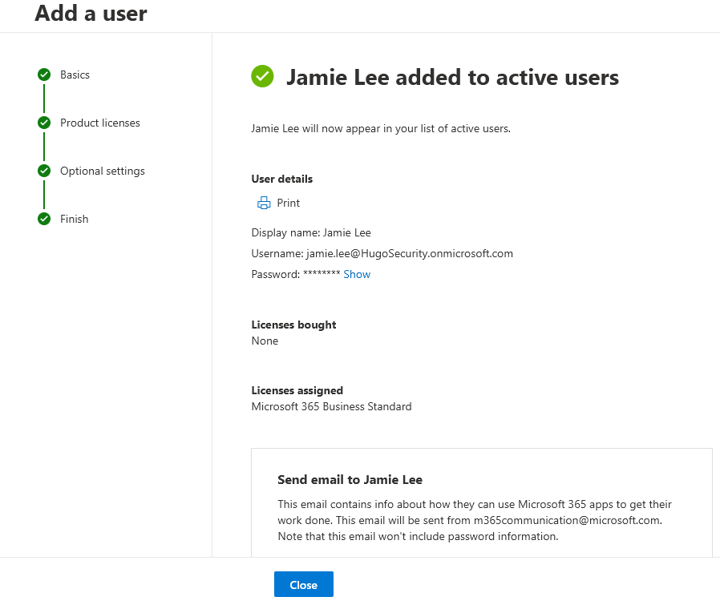
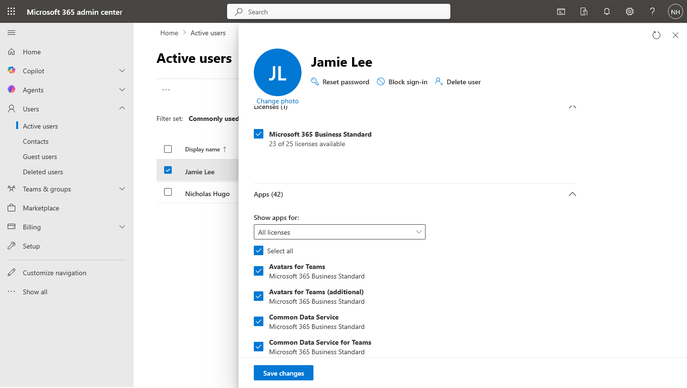
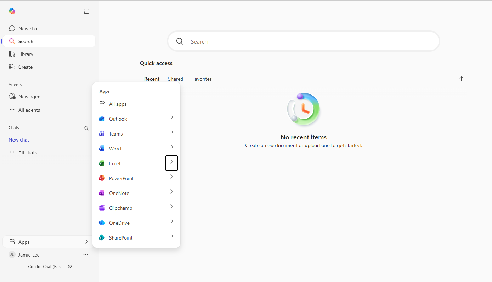

# Activity 1 — New User Onboarding

**Category:** Identity & User Management  
**Platform:** Microsoft 365 Admin Center / Microsoft Entra ID  
**Difficulty:** Foundational  

---

## Overview

This lab simulates a real-world employee onboarding scenario. A new hire is joining the Marketing department and needs a fully configured Microsoft 365 account ready before their start date. The goal is to provision the account correctly from the start — with the right license, accurate profile metadata, and secure password settings — so the user can hit the ground running on day one with zero IT friction.

---

## Objectives

- Create and license a new user account in the Microsoft 365 Admin Center following a realistic onboarding scenario
- Configure essential account properties (department, job title, usage location) that support license assignment and reporting in a real tenant
- Verify the account is fully functional and ready for day-one access from both the admin and end-user perspective

---

## Scenario

> A new hire — **Jamie Lee**, Marketing Coordinator — starts Monday. As the IT admin, you've been asked to have her account ready by Friday EOD. She needs access to email, Teams, and SharePoint.

| Field | Value |
|---|---|
| Display Name | Jamie Lee |
| Username | jamie.lee@\[domain\].onmicrosoft.com |
| Department | Marketing |
| Job Title | Marketing Coordinator |
| Usage Location | United States |
| License | Microsoft 365 Business Standard |
| Password | Temporary — force reset on first login |

---

## Tools Used

- Microsoft 365 Admin Center (`admin.microsoft.com`)

---

## Lab Walkthrough

### Phase 1 — Planning & Design

Defined the user profile, license requirements, and security settings before touching any configuration. Documented all field values upfront to mirror a real IT onboarding checklist.

---

### Phase 2 — Configuration

**Step 1 — Navigate to Active Users**

In the Microsoft 365 Admin Center, go to **Users → Active Users → Add a user**.

**Step 2 — Fill in Basic Info**

Set the display name to **Jamie Lee** and configure the username following the company naming convention (`jamie.lee@[domain].onmicrosoft.com`).

**Step 3 — Assign a License**

Set **Usage Location** to United States first — Microsoft blocks license assignment without this. Then assign **Microsoft 365 Business Standard**, enabling Exchange, Teams, SharePoint, and the full Office suite.

**Step 4 — Set Profile Metadata**

Set **Job Title** to Marketing Coordinator and **Department** to Marketing. These fields populate the Teams and Outlook company directory — skipping them generates helpdesk tickets later when users can't find each other correctly.

**Step 5 — Configure Role & Password**

Set role to **User (no admin access)** — least privilege principle. Enable **force password reset on first sign-in** so the admin never knows the user's permanent password.

**Step 6 — Review and Finish**

Confirm all settings on the summary screen before submitting.

---

### Phase 3 — Verification

**Step 1 — Confirm the account in Active Users**

Search for Jamie Lee in Active Users and open her profile. Verify department, job title, and license are all correctly applied under the **Licenses and Apps** tab.

**Step 2 — Test end-user sign-in**

Open a private browser window, navigate to `portal.office.com`, and sign in as Jamie Lee using the temporary password. Complete the first-login password reset and confirm access to the M365 app launcher.

---

### Phase 4 — Reflection

**What was configured**

A new standard user account was provisioned for an incoming Marketing Coordinator. A Microsoft 365 Business Standard license was assigned, giving access to Exchange Online, Teams, SharePoint, and the full Office suite. The account was configured with accurate department and job title metadata and set to require a password change on first login.

**Why each decision was made**

- **Usage Location set first** — required by Microsoft before any license can be assigned; the option is grayed out without it
- **Force password reset** — the admin should never know a user's permanent password; standard security hygiene
- **Department and Title filled in** — populates the Teams directory and Outlook contact card; skipping it creates helpdesk tickets later
- **Standard user role** — least privilege; no business reason for a Marketing Coordinator to have admin access

**What I'd do differently in production**

- Use a naming convention policy in Entra ID to enforce consistent username formatting
- Trigger onboarding via a ticketing system workflow (ServiceNow, Jira) rather than manually
- Add the user to the appropriate Microsoft 365 Group or Team as part of onboarding
- Use dynamic group membership based on department to automate license assignment

---

## Key Takeaways

User provisioning is one of the most frequent tasks in any helpdesk or IT admin role. Getting it right the first time — correct license, accurate metadata, secure password settings — prevents downstream issues and reflects the kind of attention to detail that matters in a real IT environment.

---

[← Back to Microsoft 365 Labs](https://nhugo1.github.io/IT-Labs/Microsoft-365/)# Activity 1 — New User Onboarding

**Category:** Identity & User Management  
**Platform:** Microsoft 365 Admin Center / Microsoft Entra ID  
**Difficulty:** Foundational  

---

## Overview

This lab simulates a real-world employee onboarding scenario. A new hire is joining the Marketing department and needs a fully configured Microsoft 365 account ready before their start date. The goal is to provision the account correctly from the start — with the right license, accurate profile metadata, and secure password settings — so the user can hit the ground running on day one with zero IT friction.

---

## Objectives

- Create and license a new user account in the Microsoft 365 Admin Center following a realistic onboarding scenario
- Configure essential account properties (department, job title, usage location) that support license assignment and reporting in a real tenant
- Verify the account is fully functional and ready for day-one access from both the admin and end-user perspective

---

## Scenario

> A new hire — **Jamie Lee**, Marketing Coordinator — starts Monday. As the IT admin, you've been asked to have her account ready by Friday EOD. She needs access to email, Teams, and SharePoint.

| Field | Value |
|---|---|
| Display Name | Jamie Lee |
| Username | jamie.lee@\[domain\].onmicrosoft.com |
| Department | Marketing |
| Job Title | Marketing Coordinator |
| Usage Location | United States |
| License | Microsoft 365 Business Standard |
| Password | Temporary — force reset on first login |

---

## Tools Used

- Microsoft 365 Admin Center (`admin.microsoft.com`)

---

## Lab Walkthrough

### Phase 1 — Planning & Design

Defined the user profile, license requirements, and security settings before touching any configuration. Documented all field values upfront to mirror a real IT onboarding checklist.

---

### Phase 2 — Configuration

**Step 1 — Navigate to Active Users**

In the Microsoft 365 Admin Center, go to **Users → Active Users → Add a user**.

**Step 2 — Fill in Basic Info**

Set the display name to **Jamie Lee** and configure the username following the company naming convention (`jamie.lee@[domain].onmicrosoft.com`).

**Step 3 — Assign a License**

Set **Usage Location** to United States first — Microsoft blocks license assignment without this. Then assign **Microsoft 365 Business Standard**, enabling Exchange, Teams, SharePoint, and the full Office suite.

**Step 4 — Set Profile Metadata**

Set **Job Title** to Marketing Coordinator and **Department** to Marketing. These fields populate the Teams and Outlook company directory — skipping them generates helpdesk tickets later when users can't find each other correctly.

**Step 5 — Configure Role & Password**

Set role to **User (no admin access)** — least privilege principle. Enable **force password reset on first sign-in** so the admin never knows the user's permanent password.

**Step 6 — Review and Finish**

Confirm all settings on the summary screen before submitting.

---

### Phase 3 — Verification

**Step 1 — Confirm the account in Active Users**

Search for Jamie Lee in Active Users and open her profile. Verify department, job title, and license are all correctly applied under the **Licenses and Apps** tab.

**Step 2 — Test end-user sign-in**

Open a private browser window, navigate to `portal.office.com`, and sign in as Jamie Lee using the temporary password. Complete the first-login password reset and confirm access to the M365 app launcher.

---

### Phase 4 — Reflection

**What was configured**

A new standard user account was provisioned for an incoming Marketing Coordinator. A Microsoft 365 Business Standard license was assigned, giving access to Exchange Online, Teams, SharePoint, and the full Office suite. The account was configured with accurate department and job title metadata and set to require a password change on first login.

**Why each decision was made**

- **Usage Location set first** — required by Microsoft before any license can be assigned; the option is grayed out without it
- **Force password reset** — the admin should never know a user's permanent password; standard security hygiene
- **Department and Title filled in** — populates the Teams directory and Outlook contact card; skipping it creates helpdesk tickets later
- **Standard user role** — least privilege; no business reason for a Marketing Coordinator to have admin access

**What I'd do differently in production**

- Use a naming convention policy in Entra ID to enforce consistent username formatting
- Trigger onboarding via a ticketing system workflow (ServiceNow, Jira) rather than manually
- Add the user to the appropriate Microsoft 365 Group or Team as part of onboarding
- Use dynamic group membership based on department to automate license assignment

---

## Key Takeaways

User provisioning is one of the most frequent tasks in any helpdesk or IT admin role. Getting it right the first time — correct license, accurate metadata, secure password settings — prevents downstream issues and reflects the kind of attention to detail that matters in a real IT environment.

---

[← Back to Microsoft 365 Labs](https://nhugo1.github.io/IT-Labs/Microsoft-365/)
