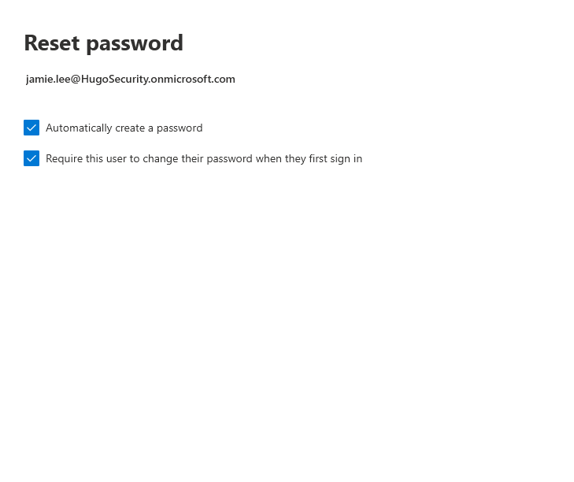
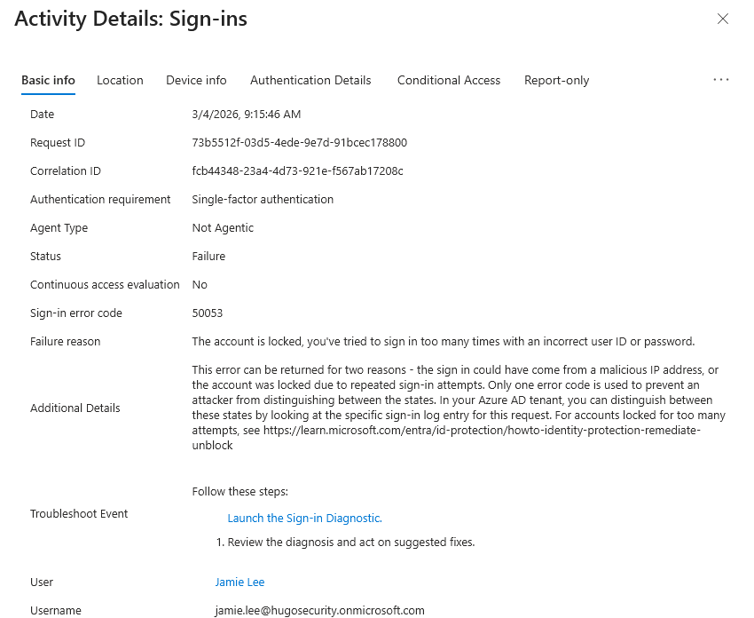
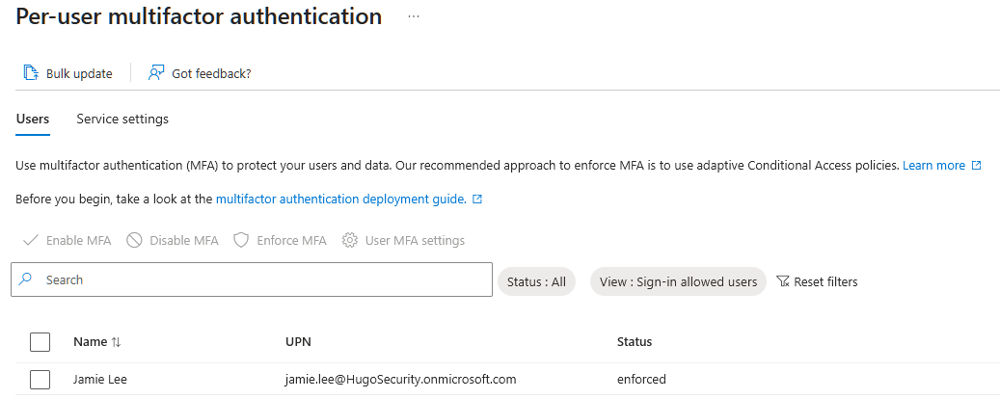
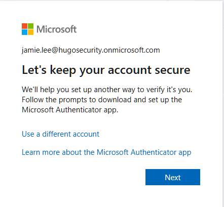
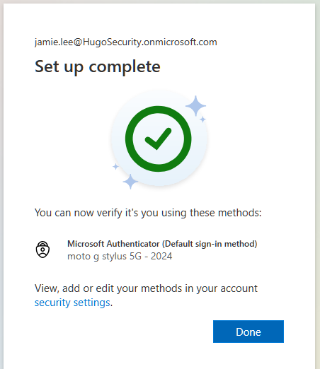

# Activity 2 — Password Reset, Account Unlock & Per-User MFA

**Category:** Identity & User Management  
**Platform:** Microsoft 365 Admin Center / Microsoft Entra ID  
**Difficulty:** Foundational  

---

## Overview

This lab covers the most common identity-related helpdesk tasks in a Microsoft 365 environment: resetting a user's password, responding to an account lockout, and enabling multi-factor authentication. These three scenarios make up a significant portion of real-world helpdesk ticket volume and are foundational skills for any IT support role.

---

## Objectives

- Perform a secure password reset for a user who cannot sign in, following proper verification and handoff procedures
- Demonstrate understanding of account lockout behavior in a cloud-only Entra ID environment and how it differs from hybrid AD environments
- Enable and enforce per-user MFA and walk through the end-user MFA registration experience to verify the configuration works end-to-end

---

## Scenario

Two tickets came in this morning:

**Ticket 1 — Medium Priority**
> *"Hi IT, I can't log into my Microsoft account. It keeps saying my password is wrong but I know it's right. Can you help? — Jamie Lee"*

**Ticket 2 — IT Initiative**
> *Your manager has asked you to enable MFA on Jamie Lee's account as part of a company-wide security rollout.*

---

## Tools Used

- Microsoft 365 Admin Center (`admin.microsoft.com`)
- Microsoft Entra ID (`entra.microsoft.com`)

---

## Lab Walkthrough

### Phase 1 — Planning & Design

Before taking action, it's important to distinguish between the possible causes of a sign-in failure — they look identical to the user but require different fixes:

| Symptom | Likely Cause | Fix |
|---|---|---|
| "Password incorrect" | Wrong password or expired | Reset password |
| "Account locked" | Too many failed sign-in attempts | Wait for lockout to expire or reset password |
| "Account disabled" | Intentionally disabled by IT | Re-enable after investigation |
| "Need more info" on sign-in | MFA not yet registered | Guide through MFA registration |

In this scenario Jamie recently onboarded, so the most likely cause is a forgotten or mistyped temporary password. The MFA enablement is a separate IT initiative handled in the same workflow.

---

### Phase 2 — Configuration

#### Part A — Password Reset

**Step 1 — Locate the user in Active Users**

In the Microsoft 365 Admin Center, navigate to **Users → Active Users**, search for Jamie Lee, and open her profile panel.

**Step 2 — Reset the password**

Click **Reset password** in her profile panel. Select auto-generate password, check **Require this user to change their password when they first sign in**, and click **Reset password**. Securely share the temporary password with the user.

---

#### Part B — Account Lockout

To demonstrate the lockout experience, multiple failed sign-in attempts were made against Jamie's account until Microsoft blocked further attempts.

**Important note on cloud-only vs. hybrid environments:**  
In a cloud-only Entra ID tenant, there is no manual "Unlock account" button exposed in the portal — the lockout clears automatically after the lockout duration expires, or is resolved by resetting the password. In a **hybrid environment** with on-premises Active Directory synced to Entra ID, the unlock is performed directly in **Active Directory Users and Computers (ADUC)** on the user object. This is a key distinction between cloud-only and hybrid identity management.

---

#### Part C — Enable Per-User MFA

**Step 1 — Navigate to the per-user MFA portal**

In the Microsoft 365 Admin Center, go to **Users → Active Users** and click **Multi-factor authentication** in the top menu bar.

**Step 2 — Enforce MFA for Jamie Lee**

Locate Jamie Lee in the list, check her name, and in the right panel click **Enable**, then update to **Enforced**. 

> The per-user MFA portal has three states: **Disabled**, **Enabled** (MFA configured but not yet required), and **Enforced** (user is actively required to register and use MFA on every sign-in). Setting to Enforced rather than just Enabled ensures the user is prompted immediately on next login.

---

### Phase 3 — Verification

**Step 1 — Test the password reset**

In a private browser window, sign in to `portal.office.com` as Jamie Lee using the temporary password. Confirm the forced password change prompt appears and that after resetting, she lands on the M365 home page.

**Step 2 — Verify MFA registration prompt**

On the next fresh sign-in with MFA enforced, Jamie is prompted with the additional security verification screen. Complete the MFA registration flow using the Microsoft Authenticator app or SMS.

---

### Phase 4 — Reflection

**What was configured**

A password reset was performed for a user unable to sign in, with a forced reset on first login. Account lockout behavior was demonstrated from the end-user perspective. Per-user MFA was enabled and set to Enforced, and the full MFA registration flow was completed and verified from the user's perspective.

**Why each decision was made**

- **Force password change on reset** — the admin should never know a user's permanent password; this is standard security hygiene
- **Enforced over Enabled** — setting MFA to Enabled allows users to skip registration; Enforced ensures they cannot bypass it on next sign-in
- **Verified from end-user perspective** — admin-side confirmation alone doesn't close the ticket; the fix isn't done until the user can actually sign in

**Cloud-only vs. hybrid identity — a key distinction**

In this cloud-only Entra ID tenant, account lockouts clear automatically and there is no manual unlock button in the portal. In a hybrid environment where on-premises Active Directory is synced to Entra ID via AD Connect, the admin must manually unlock the account in ADUC before the user can sign in — the cloud-side reset alone is not sufficient. Understanding this distinction is important when supporting environments that haven't fully migrated to the cloud.

**What I'd do differently in production**

- Verify the user's identity before resetting — callback, manager confirmation, or employee ID; never reset based on an email request alone
- Use **Conditional Access policies** to enforce MFA across all users automatically rather than enabling per-user manually — covered in Lab 5
- Implement **Self-Service Password Reset (SSPR)** so users can reset their own passwords without opening a ticket, reducing helpdesk volume
- Log all password reset actions in the ticketing system for audit trail purposes

---

## Key Takeaways

Password resets and MFA management are among the highest-volume tasks in any IT helpdesk role. Handling them correctly — verifying identity, forcing password changes, understanding the difference between Enabled and Enforced MFA, and recognizing how lockout behavior differs between cloud and hybrid environments — demonstrates the kind of practical, security-conscious approach that distinguishes a strong IT support candidate.