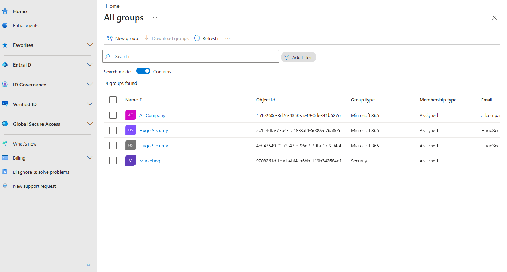
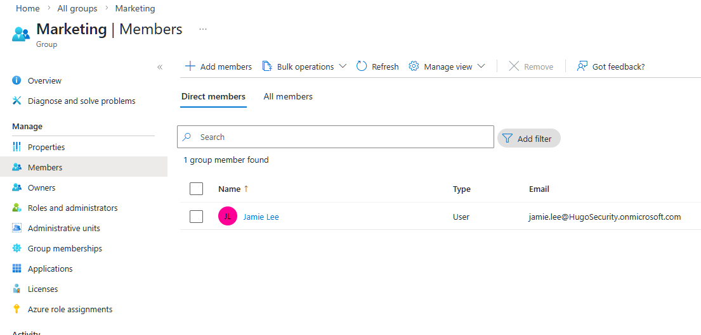

# Activity 3 — Security Groups & Group-Based License Assignment

**Category:** Identity & User Management  
**Platform:** Microsoft Entra ID / Microsoft 365 Admin Center  
**Difficulty:** Foundational  

---

## Overview

This lab covers the creation and management of security groups in Microsoft Entra ID and demonstrates how group-based licensing works as a scalable alternative to manual per-user license assignment. As companies grow, assigning licenses one user at a time becomes error-prone and inefficient — group-based licensing ensures new hires are licensed automatically the moment they're added to the right group.

---

## Objectives

- Create security groups in Microsoft Entra ID to reflect real department and role-based organizational structure
- Assign users to groups and understand how group membership drives access control and license assignment in a production environment
- Demonstrate the group-based license assignment workflow and document the Entra ID P1 licensing requirement encountered in a trial tenant

---

## Scenario

> Your company is growing and the manual approach of assigning licenses one user at a time is causing problems — new hires sometimes go a full day without access because someone forgot to assign a license. Your manager has asked you to set up a group-based licensing structure so that any user added to the Marketing group automatically receives the correct license.

---

## Tools Used

- Microsoft Entra ID (`entra.microsoft.com`)
- Microsoft 365 Admin Center (`admin.microsoft.com`)

---

## Lab Walkthrough

### Phase 1 — Planning & Design

Group structure planned before any configuration was touched:

| Group Name | Type | Purpose | License |
|---|---|---|---|
| Marketing | Security | All marketing department users | Microsoft 365 Business Standard |
| IT Admins | Security | IT staff — admin access and role control | None (used for role assignment) |

**Why security groups over Microsoft 365 Groups?**  
Security groups are designed for access control and license assignment. Microsoft 365 Groups are collaboration-focused and come bundled with a shared mailbox, SharePoint site, and Team — unnecessary overhead for this use case.

---

### Phase 2 — Configuration

#### Part A — Create the Marketing Security Group

1. In Entra ID, navigate to **Groups → All Groups → New group**
2. Set **Group type** to Security
3. **Group name:** Marketing
4. **Group description:** All Marketing department users — used for license assignment and access control
5. **Membership type:** Assigned
6. Click **Create**

#### Part B — Create the IT Admins Security Group

Repeated the same steps with:
- **Group name:** IT Admins
- **Group description:** IT department staff — used for admin role and access control

---

#### Part C — Add Members to the Marketing Group

1. In **Groups → All Groups**, clicked on the **Marketing** group
2. Navigated to **Members** in the left panel
3. Clicked **Add members**, searched for and added **Jamie Lee**

---

#### Part D — Group-Based License Assignment

Navigated to **Billing → Licenses → Microsoft 365 Business Standard → Assign licenses** in the Microsoft 365 Admin Center and attempted to assign the license to the Marketing security group.

The following error was returned:

> *"Group licensing is not allowed on this tenant."*

**Why this happened:**  
Group-based licensing in Microsoft 365 requires **Azure AD Premium P1** (now Entra ID P1), which is not included in the Microsoft 365 Business Standard trial tenant used for this lab. This is a licensing tier limitation, not a configuration error.

**What this looks like in production:**  
In a tenant with Entra ID P1, the license assignment completes successfully and any user added to the Marketing group automatically inherits the Microsoft 365 Business Standard license. When a user is removed from the group, the license is automatically reclaimed — no manual intervention required.

---

### Phase 3 — Verification

Security group creation and member assignment were verified successfully. Jamie Lee is confirmed as a member of the Marketing group, and both the Marketing and IT Admins groups are visible in the Entra ID Groups directory.

Group-based license assignment could not be completed due to the tenant licensing limitation documented above. In a production environment with Entra ID P1, verification would involve checking the user's **Licenses and Apps** tab in Active Users to confirm the license shows as inherited from the group rather than directly assigned.

---

### Phase 4 — Reflection

**What was configured**

Two security groups — Marketing and IT Admins — were created in Microsoft Entra ID. Jamie Lee was added to the Marketing group. A group-based license assignment was attempted and the Entra ID P1 requirement was identified and documented.

**Why each decision was made**

- **Security groups over M365 Groups** — the right tool for license assignment and access control; M365 Groups carry collaboration overhead that isn't needed here
- **Assigned membership over dynamic** — appropriate for a small environment; dynamic membership, which automatically adds users based on profile attributes like Department, is a more scalable approach but also requires Entra ID P1
- **Group-based licensing over per-user** — eliminates the manual step that causes day-one access delays; licenses follow group membership automatically at scale

**Tenant limitation encountered**

Group-based licensing requires **Entra ID P1**, which is not included in the Microsoft 365 Business Standard trial. In a real SMB or mid-market environment this license is commonly available either as a standalone add-on or as part of Microsoft 365 Business Premium. Recognizing licensing tier requirements and knowing what features they unlock is an important part of managing a real M365 tenant.

**What I'd do differently in production**

- Use **dynamic membership rules** based on the Department attribute so users are automatically placed in the correct group at the time of account creation — no manual group management required
- Create department groups upfront as part of initial tenant setup rather than reactively as the company grows
- Regularly audit group membership to ensure offboarded users are removed and licenses are reclaimed promptly
- Use consistent naming conventions for groups to keep the directory searchable and organized at scale

---

## Key Takeaways

Security groups are foundational to how access, licensing, and policy enforcement work in Microsoft 365. Even in this lab where the group-based licensing feature was blocked by a tenant limitation, the exercise demonstrates an understanding of why the approach matters — scalability, consistency, and reduced risk of human error during onboarding. Recognizing a licensing tier limitation and explaining it clearly is itself a real-world IT skill.

---

[← Back to Microsoft 365 Labs](https://nhugo1.github.io/IT-Labs/Microsoft-365/)