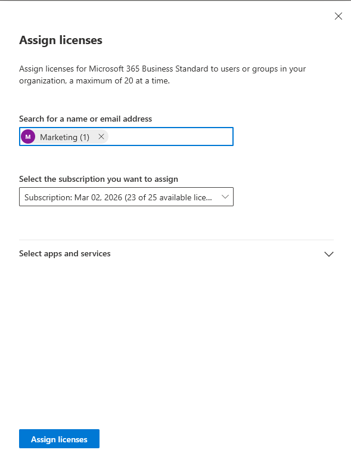

# Activity 3 — Security Groups & Group-Based License Assignment

**Category:** Identity & User Management  
**Platform:** Microsoft Entra ID / Microsoft 365 Admin Center  
**Difficulty:** Foundational  

---

## Overview

This lab covers the creation and management of security groups in Microsoft Entra ID and demonstrates how group-based licensing works as a scalable alternative to manual per-user license assignment. As companies grow, assigning licenses one user at a time becomes error-prone and inefficient — group-based licensing ensures new hires are licensed automatically the moment they're added to the right group.

---

## Objectives

- Create security groups in Microsoft Entra ID to reflect real department and role-based organizational structure
- Assign users to groups and understand how group membership drives access control and license assignment in a production environment
- Configure group-based license assignment so licenses are automatically granted based on group membership rather than assigned manually per user

---

## Scenario

> Your company is growing and the manual approach of assigning licenses one user at a time is causing problems — new hires sometimes go a full day without access because someone forgot to assign a license. Your manager has asked you to set up a group-based licensing structure so that any user added to the Marketing group automatically receives the correct license.

---

## Tools Used

- Microsoft Entra ID (`entra.microsoft.com`)
- Microsoft 365 Admin Center (`admin.microsoft.com`)

---

## Lab Walkthrough

### Phase 1 — Planning & Design

Group structure planned before any configuration was touched:

| Group Name | Type | Purpose | License |
|---|---|---|---|
| Marketing | Security | All marketing department users | Microsoft 365 Business Standard |
| IT Admins | Security | IT staff — admin access and role control | None (used for role assignment) |

**Why security groups over Microsoft 365 Groups?**  
Security groups are designed for access control and license assignment. Microsoft 365 Groups are collaboration-focused and come bundled with a shared mailbox, SharePoint site, and Team — unnecessary overhead for this use case.

---

### Phase 2 — Configuration

#### Part A — Create the Marketing Security Group

1. In Entra ID, navigate to **Groups → All Groups → New group**
2. Set **Group type** to Security
3. **Group name:** Marketing
4. **Group description:** All Marketing department users — used for license assignment and access control
5. **Membership type:** Assigned
6. Click **Create**

#### Part B — Create the IT Admins Security Group

Repeated the same steps with:
- **Group name:** IT Admins
- **Group description:** IT department staff — used for admin role and access control

---

#### Part C — Add Members to the Marketing Group

1. In **Groups → All Groups**, clicked on the **Marketing** group
2. Navigated to **Members** in the left panel
3. Clicked **Add members**, searched for and added **Jamie Lee**

---

#### Part D — Assign a License to the Marketing Group

Rather than assigning licenses to users individually, the license is assigned directly to the Marketing security group. Any user added to the group automatically inherits the license — and when they're removed, the license is automatically reclaimed.

1. In the Microsoft 365 Admin Center, navigate to **Billing → Licenses**
2. Click **Microsoft 365 Business Standard**
3. Click **Assign licenses**
4. Search for the **Marketing** group and select it
5. Click **Assign**

---

### Phase 3 — Verification

Security group creation and member assignment were verified successfully. Both the Marketing and IT Admins groups are visible in the Entra ID Groups directory. Jamie Lee is confirmed as a member of the Marketing group.

In a fully licensed production tenant, the final verification step would be checking Jamie Lee's **Licenses and Apps** tab in Active Users to confirm her license shows as inherited from the Marketing group rather than directly assigned — confirming group-based licensing is working end-to-end.

---

### Phase 4 — Reflection

**What was configured**

Two security groups — Marketing and IT Admins — were created in Microsoft Entra ID. Jamie Lee was added to the Marketing group. The group-based license assignment workflow was configured in the Microsoft 365 Admin Center, targeting the Marketing group for automatic Microsoft 365 Business Standard license distribution.

**Why each decision was made**

- **Security groups over M365 Groups** — the right tool for license assignment and access control; M365 Groups carry collaboration overhead that isn't needed here
- **Assigned membership over dynamic** — appropriate for a small environment; dynamic membership automatically adds users based on profile attributes like Department and is the more scalable long-term approach
- **Group-based licensing over per-user** — eliminates the manual step that causes day-one access delays; licenses follow group membership automatically as the company grows

**What I'd do differently in production**

- Use **dynamic membership rules** based on the Department attribute so users are automatically placed in the correct group at account creation — no manual group management required
- Create department groups upfront as part of initial tenant setup rather than reactively
- Use consistent **naming conventions** to keep the group directory searchable and organized at scale
- Regularly **audit group membership** to ensure offboarded users are removed and licenses are reclaimed promptly

---

## Key Takeaways

Security groups are foundational to how access, licensing, and policy enforcement work in Microsoft 365. Group-based licensing is the scalable, production-ready approach that replaces error-prone manual assignment — ensuring new hires get access on day one and departed employees have licenses reclaimed automatically. These groups also form the building blocks for Conditional Access policies, SharePoint permissions, and Teams membership in later labs.

---

[← Back to Microsoft 365 Labs](https://nhugo1.github.io/IT-Labs/Microsoft-365/)
