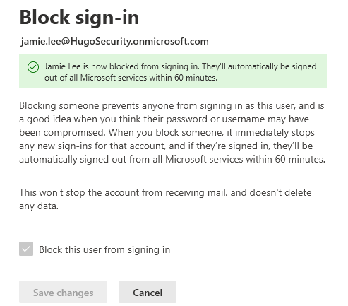
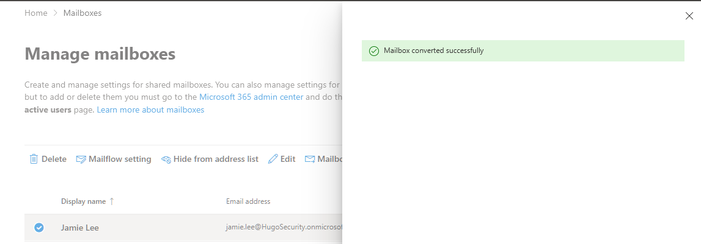
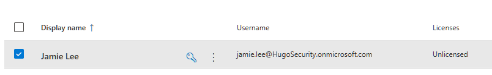
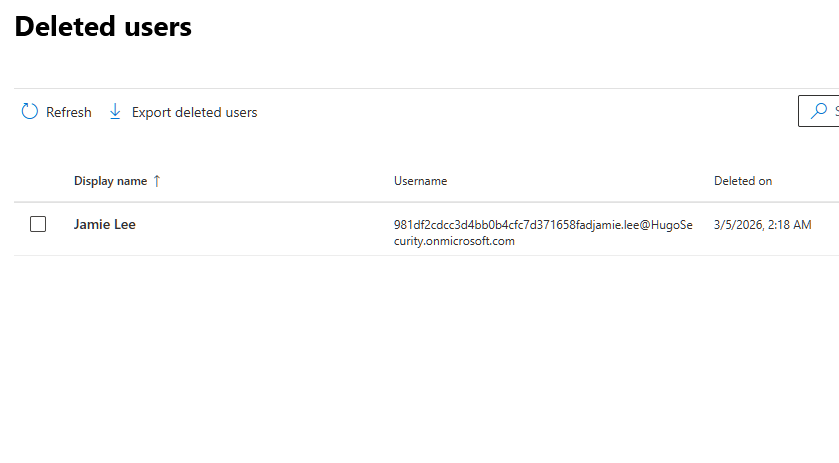

# Activity 4 — User Offboarding

**Category:** Identity & User Management  
**Platform:** Microsoft 365 Admin Center / Exchange Admin Center / Microsoft Entra ID  
**Difficulty:** Foundational  

---

## Overview

User offboarding is one of the most security-critical tasks in IT administration. A missed step — an active session left open, a license not reclaimed, a group membership left in place — can result in unauthorized data access or unnecessary cost. This lab demonstrates a complete, ordered offboarding workflow for a departing employee, covering access termination, data preservation, license reclamation, and account cleanup.

---

## Objectives

- Execute a complete and secure user offboarding workflow covering all steps required to protect company data when an employee leaves
- Demonstrate the correct order of operations for offboarding and explain why sequence matters
- Handle mailbox continuity by converting a user mailbox to a shared mailbox, preserving email access for the team without requiring an ongoing license

---

## Scenario

> Jamie Lee has resigned effective immediately. HR has notified IT and you need to act fast. The priorities are: block her access immediately, preserve her email and data, and clean up her licenses so the company isn't paying for an unused account.

---

## Tools Used

- Microsoft 365 Admin Center (`admin.microsoft.com`)
- Exchange Admin Center (`admin.exchange.microsoft.com`)
- Microsoft Entra ID (`entra.microsoft.com`)

---

## Lab Walkthrough

### Phase 1 — Planning & Design

Offboarding has a specific order of operations. Doing it out of sequence can leave security gaps or cause data loss:

| Step | Action | Why |
|---|---|---|
| 1 | Block sign-in | Immediately cuts off access |
| 2 | Revoke active sessions | Forces sign-out on all active devices |
| 3 | Reset password | Invalidates any cached credentials |
| 4 | Convert mailbox | Preserves email before license is removed |
| 5 | Remove licenses | Stops billing, frees the license for reuse |
| 6 | Remove group memberships | Revokes access to shared resources |
| 7 | Delete account | Soft delete — recoverable for 30 days |

---

### Phase 2 — Configuration

#### Step 1 — Block Sign-In

1. In the Microsoft 365 Admin Center, navigate to **Users → Active Users**
2. Click on **Jamie Lee** to open her profile panel
3. Click **Block sign-in**
4. Check **Block this user from signing in**
5. Click **Save changes**

> This is always step one. The moment IT is notified of a departure, cutting off access is the top priority — everything else can follow.

---

#### Step 2 — Revoke Active Sessions

The revoke sessions option appears in the user's profile when active sessions exist. In this lab environment Jamie had no active sessions at the time of offboarding, so the option was not available to action.

In a real departure scenario the user would have active sessions on their work laptop, phone, Outlook, and Teams. Revoking sessions forces an immediate sign-out across all devices — blocking sign-in alone does not terminate sessions that are already open.

---

#### Step 3 — Reset the Password

1. In Jamie's profile panel, click **Reset password**
2. Auto-generate a new password
3. Do not share it — this step exists solely to invalidate her old credentials and prevent cached credential reuse

---

#### Step 4 — Convert Mailbox to Shared Mailbox

Rather than deleting Jamie's mailbox and losing her email history, it is converted to a shared mailbox. This preserves all her email indefinitely and allows her manager or teammates to access it without consuming a license.

1. Go to the Exchange Admin Center at `admin.exchange.microsoft.com`
2. Navigate to **Recipients → Mailboxes**
3. Click on **Jamie Lee**
4. Select **Convert to shared mailbox** and confirm

> A shared mailbox does not require a license as long as it remains under 50GB. This is standard practice at most SMBs — it keeps email accessible to the team and eliminates the ongoing license cost.

---

#### Step 5 — Remove Licenses

1. Back in the M365 Admin Center, open Jamie's profile
2. Click the **Licenses and Apps** tab
3. Uncheck **Microsoft 365 Business Standard**
4. Click **Save changes**

> Licenses are always removed after the mailbox is handled — removing the license first can trigger mailbox deletion before the data has been preserved.

---

#### Step 6 — Remove Group Memberships

1. In Jamie's profile, navigate to the **Groups** tab
2. Remove her from all groups — in this case the **Marketing** group created in Activity 3
3. This revokes her access to any SharePoint sites, Teams channels, or shared resources tied to those groups

---

#### Step 7 — Delete the Account

1. In Active Users, select Jamie Lee
2. Click **Delete user** and confirm

> Deleted accounts enter a 30-day soft-delete period and are fully recoverable during this window. After 30 days the account is permanently deleted. In a real environment the offboarding is not considered fully closed until this window has passed without issue.

---

### Phase 3 — Verification

Sign-in was confirmed as blocked prior to account deletion. The shared mailbox conversion was verified in the Exchange Admin Center with the mailbox type showing as Shared. The license removal was confirmed on the Licenses and Apps tab. Jamie Lee is visible in the Deleted Users list, confirming the account is in the soft-delete recovery window.

---

### Phase 4 — Reflection

**What was configured**

A complete offboarding was performed for a departing employee. Sign-in was blocked immediately, the password was reset to invalidate cached credentials, and the mailbox was converted to a shared mailbox before the license was removed. Group memberships were cleared and the account was soft-deleted with a 30-day recovery window.

**Why each decision was made**

- **Block sign-in first** — access termination is the highest priority the moment a departure is confirmed; data preservation and cleanup follow
- **Convert mailbox before removing license** — removing the license first risks triggering mailbox deletion before the email is preserved; sequence matters here
- **Shared mailbox over deletion** — preserves the full email history for the team at no ongoing license cost, as long as the mailbox stays under 50GB
- **Soft delete over permanent deletion** — the 30-day recovery window is a safety net in case something was missed; permanent deletion should never be the immediate action
- **Remove group memberships** — groups grant access to SharePoint, Teams, and shared resources; leaving a departed user in groups is a security gap even on a disabled account

**Session revocation — a note on real environments**

In this lab Jamie had no active sessions at the time of offboarding so the revoke sessions step could not be demonstrated. In a real departure scenario this step is critical — an employee who has been blocked from signing in can still access data through an active Teams or OneDrive session until it is explicitly revoked. The revoke sessions option appears in the user's profile panel in Active Users when active sessions exist.

**What I'd do differently in production**

- Use a formal **offboarding checklist** tied to an HR ticket so every step is documented and nothing is missed
- Set up **litigation hold** on the mailbox before converting if the company has legal or compliance requirements around email retention
- Automate the most time-sensitive steps — block sign-in and revoke sessions — using **PowerShell or Power Automate** triggered the moment HR submits the offboarding request
- Use **Microsoft Entra ID access reviews** to periodically audit group memberships so departed users don't linger in groups between offboarding cycles

---

## Key Takeaways

Offboarding is the other half of the user lifecycle story that starts with onboarding. Doing it correctly — in the right order, with attention to data preservation and license reclamation — demonstrates security awareness and operational maturity that goes beyond just knowing how to click buttons. Every step in this workflow has a business or security reason behind it, and being able to articulate those reasons is what sets a strong IT candidate apart.

---

[← Back to Microsoft 365 Labs](https://nhugo1.github.io/IT-Labs/Microsoft-365/)