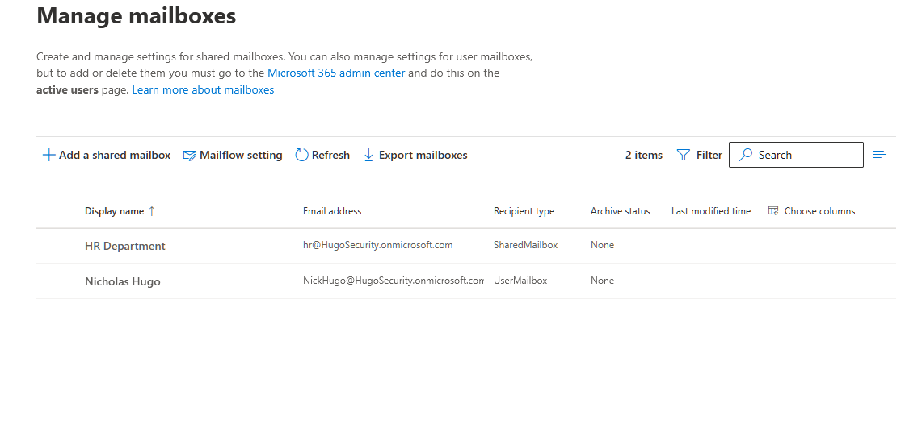
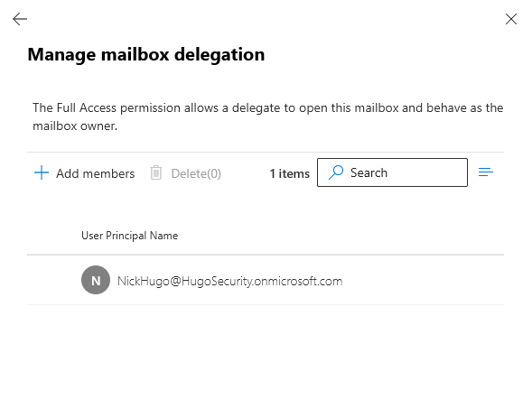
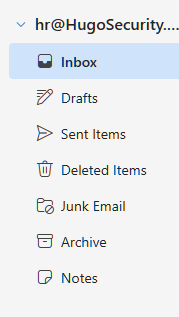
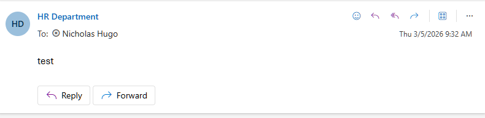

# Activity 5 — Shared Mailbox & Permissions

**Category:** Exchange & Email Administration  
**Platform:** Exchange Admin Center / Outlook on the Web  
**Difficulty:** Foundational  

---

## Overview

Shared mailboxes are one of the most common Exchange administration tasks at any SMB or mid-market company. Almost every department has one — support@, info@, hr@, billing@. This lab demonstrates how to create a shared mailbox from scratch, assign the correct permissions, and verify it works end-to-end from the user's perspective.

---

## Objectives

- Create a shared mailbox to simulate a real department inbox used in a production environment
- Assign Full Access and Send As permissions to specific users and explain the difference between each permission type
- Verify the shared mailbox is accessible and functional from the end-user perspective in Outlook on the web

---

## Scenario

> The HR department has requested a shared inbox so that all HR-related emails go to one place and can be managed by multiple team members. You need to create the mailbox, grant the appropriate permissions, and verify it works.

---

## Tools Used

- Exchange Admin Center (`admin.exchange.microsoft.com`)
- Outlook on the Web (`outlook.office.com`)

---

## Lab Walkthrough

### Phase 1 — Planning & Design

| Field | Value |
|---|---|
| Display Name | HR Department |
| Email Address | hr@[domain].onmicrosoft.com |
| Full Access | Admin account |
| Send As | Admin account |

**Full Access vs. Send As — what's the difference?**

| Permission | What it allows |
|---|---|
| Full Access | Open the mailbox and manage emails — replies come from your own address |
| Send As | Send emails that appear to come from the shared mailbox address |
| Send on Behalf | Send emails showing both your name and the shared mailbox name |

In most real-world setups both Full Access and Send As are assigned together so the delegate can both manage and respond from the shared inbox without exposing their personal address.

---

### Phase 2 — Configuration

#### Step 1 — Create the Shared Mailbox

1. In the Exchange Admin Center, navigate to **Recipients → Mailboxes**
2. Click **Add a shared mailbox**
3. Set the display name to **HR Department** and configure the email address
4. Click **Create**

---

#### Step 2 — Assign Full Access Permission

1. Click on the **HR Department** mailbox and navigate to the **Delegation** tab
2. Under **Full Access**, click **Edit → Add members**
3. Search for and add the admin account
4. Click **Save**

#### Step 3 — Assign Send As Permission

1. Still in the **Delegation** tab, under **Send as**, click **Edit → Add members**
2. Search for and add the admin account
3. Click **Save**

> Permission changes in Exchange Online are not instant — propagation can take up to an hour. If Send As fails immediately after assignment, signing out and back into Outlook on the web forces the session to pick up the updated permissions.

---

### Phase 3 — Verification

#### Step 1 — Access the shared mailbox

1. In Outlook on the web, click the profile icon and select **Open another mailbox**
2. Enter the HR Department email address and click **Open**
3. The shared mailbox opens in a separate browser tab

#### Step 2 — Send a test email from the shared mailbox

1. In the HR Department mailbox, compose a new message
2. Confirm the From field shows the HR Department address
3. Send a test email to the admin account and confirm it arrives showing it was sent from the shared mailbox address

---

### Phase 4 — Reflection

**What was configured**

A shared mailbox was created for the HR department with a dedicated email address. Full Access and Send As permissions were granted to the admin account, allowing the mailbox to be opened and emails to be sent as the HR Department address. Both permissions were verified from the end-user perspective in Outlook on the web.

**Why each decision was made**

- **Shared mailbox over a regular user mailbox** — shared mailboxes don't require a license, can be accessed by multiple people simultaneously, and are the correct tool for team or department inboxes
- **Both Full Access and Send As assigned** — Full Access alone lets you read mail but replies come from your personal address, which looks unprofessional for a department inbox; Send As ensures all outgoing mail appears to come from HR
- **Verified from end-user perspective** — confirming the mailbox opens and Send As works from Outlook on the web is what closes the ticket; admin-side configuration alone isn't enough

**Permission propagation — a note on real environments**

Exchange Online permission changes are not applied instantly. After assigning Full Access and Send As, there can be a propagation delay of up to an hour before the permissions take effect. In a real helpdesk scenario this is worth communicating to the user so they don't assume something is broken — the fix is already in place, it just needs time to propagate.

**What I'd do differently in production**

- Add **all relevant HR staff** as delegates rather than a single account — in a real team, everyone who manages HR email needs access
- Configure **automatic replies** on the shared mailbox so senders receive confirmation their email was received
- Monitor **mailbox size** — shared mailboxes are license-free up to 50GB; beyond that a license is required, so proactive monitoring prevents surprise compliance issues
- Consider a **distribution list** if the requirement is simply forwarding incoming mail to multiple recipients rather than shared management of a single inbox — a lighter-weight solution for simpler use cases

---

## Key Takeaways

Shared mailboxes are a fundamental Exchange administration skill. Understanding not just how to create them but why each permission type exists — and being able to explain the difference between Full Access, Send As, and Send on Behalf — demonstrates the kind of practical knowledge that translates directly to real helpdesk and junior admin work.

---

[← Back to Microsoft 365 Labs](https://nhugo1.github.io/IT-Labs/Microsoft-365/)