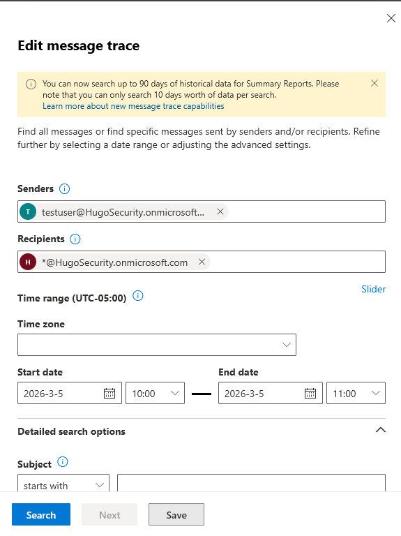
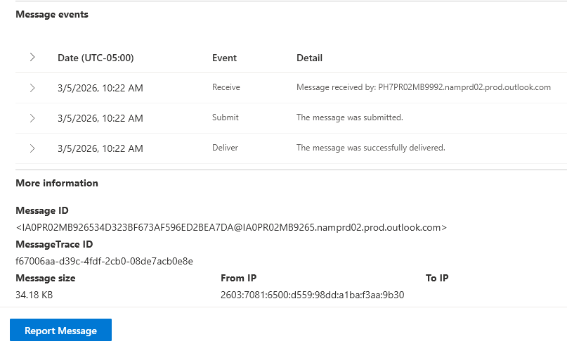

# Activity 6 — Email Trace & Missing Mail Investigation

**Category:** Exchange & Email Administration  
**Platform:** Exchange Admin Center  
**Difficulty:** Foundational  

---

## Overview

Missing email complaints are one of the most common helpdesk tickets at any company running Microsoft 365 or Exchange. This lab demonstrates how to use the Message Trace tool in the Exchange Admin Center to investigate a reported case of missing or undelivered mail — tracking an email through the full delivery pipeline and interpreting the results to determine exactly what happened to it.

---

## Objectives

- Use the Message Trace tool in the Exchange Admin Center to investigate a reported missing email
- Interpret message trace results and delivery event logs to identify what happened to a message
- Demonstrate a systematic approach to email troubleshooting that goes beyond "I didn't get it"

---

## Scenario

> A user calls the helpdesk: *"I was expecting an important email from a colleague this morning and it never showed up. Can you check what happened to it?"*

A test email was sent between two accounts in the tenant and Message Trace was used to locate, track, and verify delivery.

---

## Tools Used

- Exchange Admin Center (`admin.exchange.microsoft.com`)

---

## Lab Walkthrough

### Phase 1 — Planning & Design

Before running a trace, the right information needs to be collected. In a real ticket this means asking the user:

| Info Needed | Why |
|---|---|
| Sender email address | Required to filter the trace |
| Recipient email address | Required to filter the trace |
| Approximate date and time | Narrows the search window |
| Subject line (if known) | Helps identify the specific message |

Message Trace covers up to 10 days in the standard view and up to 90 days using the extended trace. For most helpdesk tickets the standard view is sufficient.

---

### Phase 2 — Configuration

#### Step 1 — Send a test email

A test user account was created in the M365 Admin Center and used to send a test email to the admin account via Outlook on the web. This gives a known message to trace with a confirmed sender, recipient, and approximate send time.

#### Step 2 — Run the Message Trace

1. In the Exchange Admin Center, navigate to **Mail flow → Message trace**
2. Click **Start a trace**
3. Set the following filters:
   - **Senders:** testuser@[domain].onmicrosoft.com
   - **Recipients:** admin account email
   - **Time range:** Last 6 hours
4. Click **Search**

---

#### Step 3 — Examine the trace detail

1. Click on the message in the results list to open the trace detail
2. Review the delivery status, timestamp, sending server, and full delivery event log

---

### Phase 3 — Verification

The trace returned a status of **Delivered**, confirming the test email successfully reached the recipient's mailbox. The detail view showed the full delivery path and timestamps, confirming no delays or policy blocks occurred.

**Understanding message trace statuses — real-world reference:**

| Status | What it means |
|---|---|
| Delivered | Message reached the recipient's mailbox successfully |
| Pending | Message is queued — likely a temporary delay |
| Failed | Delivery failed — check the detail for the error code |
| Filtered as spam | Caught by spam filter — advise user to check Junk folder |
| Quarantined | Blocked by a policy — admin action may be required |
| GettingStatus | Trace still running — check back shortly |

---

### Phase 4 — Reflection

**What was configured**

A test email was sent between two tenant accounts. The Message Trace tool was used to locate the message, review its delivery path, and confirm its status. The detail view was examined to understand the full mail flow event log including delivery timestamps and routing hops.

**Why each decision was made**

- **Sent a known test email first** — having a controlled message to trace makes it straightforward to verify the tool is working and interpret the results accurately
- **Used a 6-hour time range** — Message Trace logs are not real-time and can take up to 15 minutes to appear after delivery; a wider window accounts for this and avoids false negatives
- **Reviewed the detail view over the summary** — the summary status alone doesn't tell the full story; the detail view shows the exact delivery path and timestamps which are essential for diagnosing delays or failures

**Common real-world scenarios this tool solves**

- **User says they never got an email** — trace shows Delivered; the email arrived, the user may have deleted it or it landed in a subfolder
- **Email went to junk** — trace shows Filtered as spam; advise the user to check Junk and whitelist the sender
- **Email bounced back to sender** — trace shows Failed with an error code; use the code to identify the cause (full mailbox, invalid address, policy block)
- **Email delayed but eventually arrived** — trace shows a gap in timestamps between events; useful for diagnosing mail flow latency and SLA reporting

**What I'd do differently in production**

- For emails older than 10 days, use the **Extended trace** option which covers up to 90 days — essential for compliance or legal investigations
- If the trace shows **Quarantined**, check the **Microsoft Defender portal** to review whether the message was incorrectly flagged and release it if appropriate
- Always document the trace results in the helpdesk ticket before closing — the delivery timestamp and status serve as evidence if the user escalates or disputes the resolution

---

## Key Takeaways

Message Trace is the go-to diagnostic tool for any email-related helpdesk ticket in a Microsoft 365 environment. Knowing how to run a trace efficiently, interpret every possible status, and read the delivery detail view is a skill that comes up constantly in IT support roles — and being able to walk through it confidently is a strong signal in any entry-level interview.

---

[← Back to Microsoft 365 Labs](https://nhugo1.github.io/IT-Labs/Microsoft-365/)