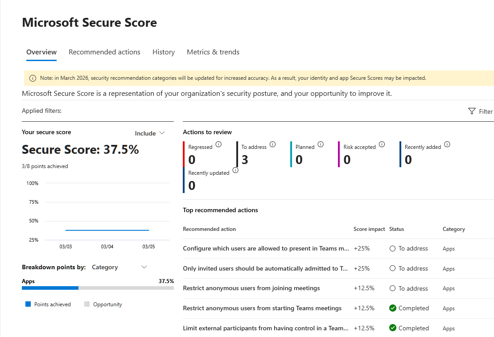
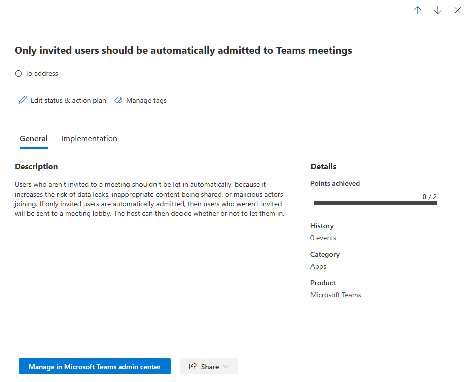
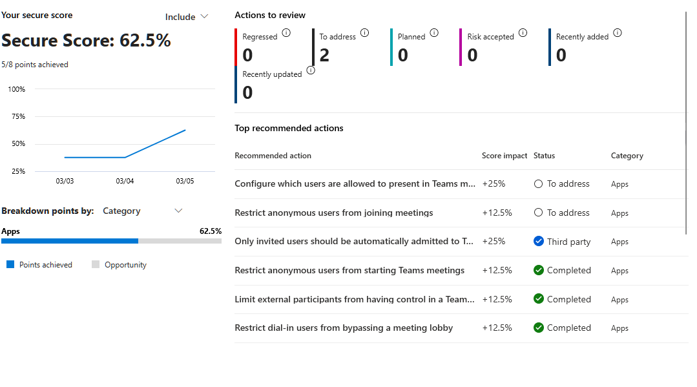

# Activity 7 — Secure Score Review & Hardening

**Category:** Security & Compliance  
**Platform:** Microsoft Defender Portal  
**Difficulty:** Foundational  

---

## Overview

Microsoft Secure Score is a quantified, prioritized view of a tenant's security posture. Rather than guessing what to fix, it ranks security improvements by impact and maps them to industry frameworks like NIST and ISO 27001. This lab demonstrates how to review the Secure Score dashboard, identify actionable recommendations, and implement a security improvement — showing that IT administration includes a security responsibility, not just keeping systems running.

---

## Objectives

- Review the Microsoft Secure Score dashboard to assess the current security posture of the tenant
- Identify and implement at least one actionable security improvement recommended by Secure Score
- Demonstrate understanding of how Secure Score works as a continuous security improvement framework

---

## Scenario

> *"How secure is our Microsoft 365 environment right now? And what's the one thing we should fix first?"*

The Secure Score dashboard was used to answer both questions — reviewing the current score, identifying what's driving it down, and implementing a high-impact recommendation.

---

## Tools Used

- Microsoft Defender Portal (`security.microsoft.com`)

---

## Lab Walkthrough

### Phase 1 — Planning & Design

Microsoft Secure Score evaluates a tenant against security best practices and assigns points for each one implemented. Each recommendation falls into one of five categories:

| Category | What it covers |
|---|---|
| Identity | MFA, admin account protection, risky sign-in policies |
| Data | Sensitivity labels, DLP, information protection |
| Device | Intune compliance, endpoint protection |
| Apps | App permissions, OAuth policies |
| Infrastructure | Tenant-level settings, legacy authentication |

The goal isn't to hit 100 — it's to prioritize the recommendations with the highest impact and lowest implementation effort for the specific environment.

---

### Phase 2 — Configuration

#### Step 1 — Review the Secure Score dashboard

Navigated to **Secure Score** in the Microsoft Defender portal and reviewed the overview dashboard — noting the current score, maximum possible score, category breakdown, and score history.

---

#### Step 2 — Identify a high-impact recommendation

Clicked the **Recommended actions** tab and filtered by **Identity** to focus on the highest-impact improvements. Reviewed each recommendation's point value, implementation effort, and current status to identify the best candidate to action.

---

#### Step 3 — Implement the recommendation

Followed the implementation guidance provided directly in the recommendation detail page and applied the change in the appropriate portal. After implementing, returned to the Secure Score dashboard to verify the improvement was reflected.

> Note: Secure Score updates are not always instant — changes can take up to 24 hours to be reflected in the score. Some recommendations update automatically while others require manual status confirmation.

---

### Phase 3 — Verification

The implemented recommendation is reflected in the Secure Score dashboard as addressed. The point increase and contributing category were noted, confirming the security improvement was applied successfully.

---

### Phase 4 — Reflection

**What was configured**

The Microsoft Secure Score dashboard was reviewed to assess the tenant's current security posture. A high-impact Identity recommendation was identified, implemented, and verified against the updated score.

**Why Secure Score matters**

Secure Score gives IT admins a structured, prioritized view of security gaps rather than requiring them to guess what to fix. For a small IT team at an SMB, this kind of prioritization is invaluable — you can't address everything at once, so knowing what has the highest impact is half the battle. It also maps recommendations to compliance frameworks like NIST and ISO 27001, which matters for regulated industries.

**What I'd do differently in production**

- Review Secure Score on a **monthly cadence** and track progress over time using the history graph
- Use the **comparison feature** to benchmark the tenant's score against similar organizations in the same industry
- Prioritize **Identity recommendations** first — compromised identities are the most common attack vector in M365 environments
- Present Secure Score to management as a **security KPI** — it's one of the few security metrics that's immediately understandable to non-technical stakeholders and useful for board-level reporting

---

## Key Takeaways

Secure Score is one of the first things a security-conscious IT manager looks at when evaluating an M365 tenant. Being able to navigate it, explain what the score means, and implement improvements demonstrates security awareness that goes beyond basic administration — and that mindset is increasingly expected even at the helpdesk and junior admin level.

---

[← Back to Microsoft 365 Labs](https://nhugo1.github.io/IT-Labs/Microsoft-365/)