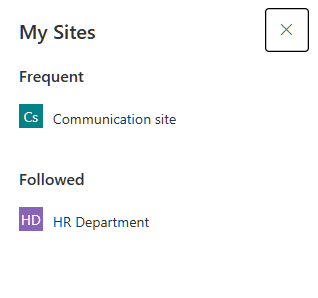
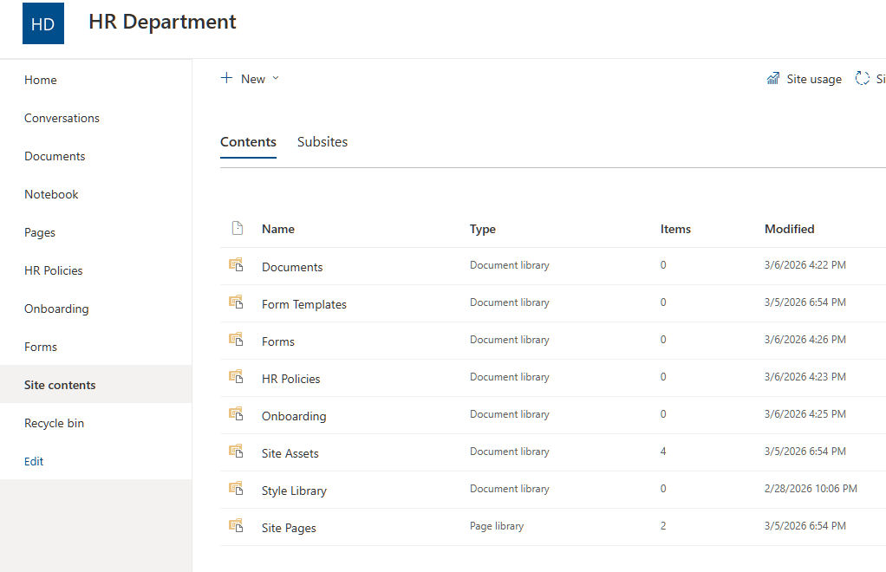
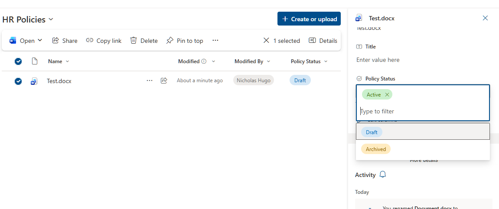
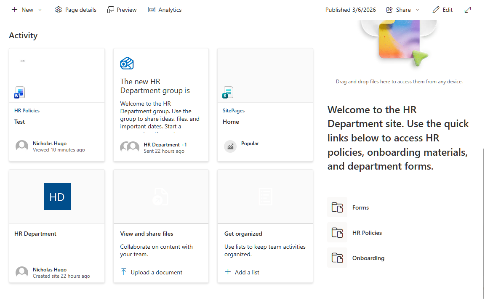
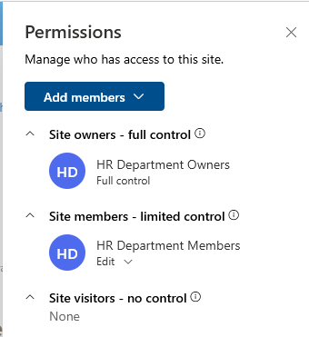

# Activity 8 — Create & Configure a SharePoint Site

**Category:** SharePoint & Collaboration  
**Platform:** SharePoint Admin Center, SharePoint Online  
**Difficulty:** Intermediate  

---

## Overview

Anyone can create a SharePoint site. What separates a capable IT admin from someone who just clicked around the portal is understanding why the structure matters — separate libraries for independent permissions, metadata instead of folders for scalable document management, and a configured homepage so the site is actually usable from day one. This lab builds an HR Department team site from scratch with a production-ready structure that carries forward into Activities 9 and 10.

---

## Objectives

- Create a SharePoint team site via the SharePoint Admin Center
- Build out a logical document library structure for a department use case
- Add a metadata column to demonstrate structured document management
- Customize the site homepage for end-user usability
- Review and understand the default SharePoint permission model

---

## Tools Used

- SharePoint Admin Center
- SharePoint Online

---

## Planning

| Setting | Value |
|---|---|
| Site type | Team site |
| Site name | HR Department |
| Description | Central hub for HR policies, onboarding materials, and forms |
| Privacy | Private — members only |
| Document libraries | HR Policies, Onboarding, Forms |
| Custom column | Policy Status (Choice: Draft, Active, Archived) on HR Policies library |

**Team site vs. Communication site:**

| Type | Best for |
|---|---|
| Team site | Internal collaboration — shared documents, connected to Teams |
| Communication site | Broadcasting to a broad audience — news, announcements, intranet |

For a department working together on shared documents, a team site is the correct choice. A communication site is one-way broadcasting, not a collaboration workspace.

---

## Lab Walkthrough

### Phase 1 — Site Creation

The HR Department team site was created via **SharePoint Admin Center → Sites → Active sites → Create**. The site was set to **Private** so only members explicitly added can access it — the appropriate default for a department handling sensitive HR data.

The new site creation wizard prompted for a template selection — **Team site** was selected, which provisions a standard collaborative workspace with a connected Microsoft 365 group, shared mailbox, and notebook.

---

### Phase 2 — Document Library Structure

Rather than using the default Documents library for all content, three separate libraries were created — one per content type:

- **HR Policies** — company policies and procedures
- **Onboarding** — employee onboarding documents and checklists
- **Forms** — HR forms and templates

Separate libraries are best practice because each library can have its own permissions, columns, and settings configured independently. A single library with subfolders makes it impossible to restrict access to one content type without exposing everything else — a significant limitation in environments handling sensitive documents.

---

### Phase 3 — Metadata Column

A **Policy Status** choice column was added to the HR Policies library with three states: Draft, Active, and Archived. The default value was set to Draft so all newly uploaded documents are automatically staged for review.

Metadata columns are one of the most powerful features in SharePoint. They allow documents to be filtered, sorted, and managed without relying on folder structure — which doesn't scale. A Policy Status column means an HR manager can instantly filter the library to show only Active policies, or identify everything still sitting in Draft, without opening a single folder.

A test document was uploaded and its status manually set to **Active** to verify the column is functioning correctly.

---

### Phase 4 — Homepage Customization

The default SharePoint homepage is not useful for end users — it shows a news feed and activity log but gives no indication of how the site is structured or where to go. Two web parts were added to make the site immediately navigable:

- A **Text web part** with a welcome message orienting users to the site's purpose
- A **Quick Links web part** with direct links to all three document libraries

After editing, the page was republished to make the changes live.

---

### Phase 5 — Permission Review

The default SharePoint permission groups were reviewed via **gear icon → Site permissions**:

| Group | Access Level | What it allows |
|---|---|---|
| HR Department Owners | Full Control | Manage site, settings, and membership |
| HR Department Members | Edit | Add, edit, and delete content |
| HR Department Visitors | Read | View content only |

The admin account was automatically placed in the Owners group at site creation. This three-tier model is the foundation that Activity 9 builds on — breaking inheritance, creating custom permission levels, and scoping guest access to specific libraries.

---

## Reflection

**What was configured**

An HR Department team site was created in SharePoint Online with three document libraries, a Policy Status metadata column, a customized homepage, and a reviewed permission structure. A test document was uploaded and tagged with Active status to verify the metadata column is working.

**Why each decision was made**

- **Separate libraries over subfolders** — libraries support independent permission management at scale; subfolders inside a single library create an all-or-nothing access problem
- **Metadata over folders** — a Policy Status column allows filtering and sorting across all documents without requiring users to know the folder structure; folder-based organization breaks down as document volume grows
- **Private site** — HR documents contain sensitive information; restricting access to explicitly added members is the correct default, not something to add later
- **Homepage quick links** — a configured homepage reduces friction from day one; users shouldn't have to figure out site structure themselves

**What I'd do differently in production**

- Enable **versioning** on each library so document history is automatically retained and recoverable
- Configure **library-level permissions** — HR managers get Edit access on the Policies library while general HR staff get Read-only
- Add additional metadata columns — document owner, review date, expiry date — to support governance and compliance workflows
- Create a **site template** after setup so future department sites can be provisioned consistently without repeating this process
- Set up **Power Automate flows** to notify the HR team when new documents are uploaded or policy statuses change

---

## Key Takeaways

SharePoint site structure decisions made at setup time are very difficult to undo at scale. Choosing separate libraries over subfolders, metadata over folders, and private over public from the start reflects the kind of deliberate, governance-aware thinking that distinguishes an IT admin who understands SharePoint from one who has simply used it.

---

[← Back to Microsoft 365 Labs](https://nhugo1.github.io/IT-Labs/Microsoft-365/)