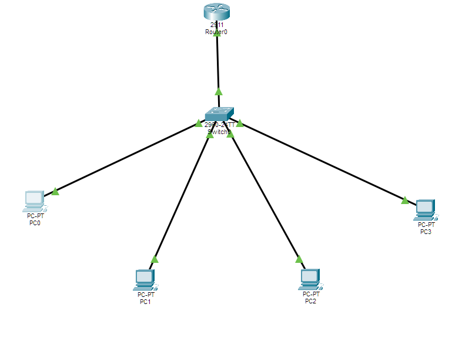
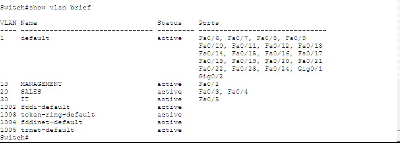
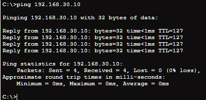
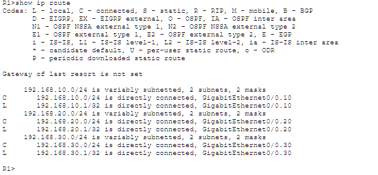
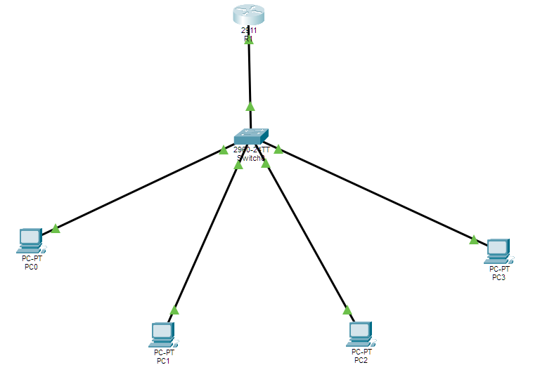

# Activity 1: VLAN Segmentation & Inter-VLAN Routing
---

## Overview

This lab builds a three-VLAN segmented enterprise network using a Cisco 2960 switch and Cisco 2911 router. VLANs isolate traffic between departments at Layer 2, while router-on-a-stick inter-VLAN routing enables controlled cross-department communication at Layer 3.

The design mirrors real enterprise network segmentation — separating Management, Sales, and IT department traffic over a single physical infrastructure using 802.1Q trunking and router subinterfaces.

---

## Objectives

- Design and implement a three-VLAN network using a Cisco 2960 switch, demonstrating 802.1Q tagging, access port assignment, and trunk port configuration
- Configure router-on-a-stick inter-VLAN routing on a Cisco 2911 using subinterfaces and 802.1Q encapsulation
- Verify VLAN isolation and inter-VLAN routing using ping tests and show commands

---

## Network Design

### VLAN Plan

| VLAN ID | Name | Subnet | Gateway |
|---|---|---|---|
| 10 | MANAGEMENT | 192.168.10.0/24 | 192.168.10.1 |
| 20 | SALES | 192.168.20.0/24 | 192.168.20.1 |
| 30 | IT | 192.168.30.0/24 | 192.168.30.1 |

### Host Assignments

| Device | VLAN | IP Address | Default Gateway |
|---|---|---|---|
| PC0 | 10 — MANAGEMENT | 192.168.10.10 | 192.168.10.1 |
| PC1 | 20 — SALES | 192.168.20.10 | 192.168.20.1 |
| PC2 | 20 — SALES | 192.168.20.11 | 192.168.20.1 |
| PC3 | 30 — IT | 192.168.30.10 | 192.168.30.1 |

### Interface Plan

| Device | Interface | Role |
|---|---|---|
| R1 | GigabitEthernet0/0 | Physical trunk uplink (no IP) |
| R1 | G0/0.10 | VLAN 10 gateway — 192.168.10.1 |
| R1 | G0/0.20 | VLAN 20 gateway — 192.168.20.1 |
| R1 | G0/0.30 | VLAN 30 gateway — 192.168.30.1 |
| SW1 | FastEthernet0/1 | Trunk port to R1 |
| SW1 | Fa0/2 | Access port — VLAN 10 (PC0) |
| SW1 | Fa0/3 | Access port — VLAN 20 (PC1) |
| SW1 | Fa0/4 | Access port — VLAN 20 (PC2) |
| SW1 | Fa0/5 | Access port — VLAN 30 (PC3) |

---

## Phase 1 — Planning & Design

Topology built in Cisco Packet Tracer with all devices placed, labeled, and cabled prior to any CLI configuration. R1 connects to SW1 via a single trunk link (G0/0 → Fa0/1). Four PCs connect to SW1 on dedicated access ports.



---

## Phase 2 — Build & Configure

### Switch — VLAN Creation & Port Assignment

VLANs 10, 20, and 30 created on SW1 with descriptive names. Access ports assigned to each VLAN. Trunk port Fa0/1 configured with `dot1q` encapsulation to carry all VLANs to the router.

```
SW1# show vlan brief
```



### Router — Subinterface Configuration (Router-on-a-Stick)

Physical interface G0/0 brought up with no IP. Three subinterfaces created — one per VLAN — each with `encapsulation dot1Q [vlan-id]` and the gateway IP for that segment.

```
R1# show ip interface brief
```


### Key CLI Commands

**Switch:**
```
vlan 10
 name MANAGEMENT
vlan 20
 name SALES
vlan 30
 name IT

interface fastEthernet 0/2
 switchport mode access
 switchport access vlan 10

interface fastEthernet 0/1
 switchport mode trunk
 switchport trunk encapsulation dot1q
```

**Router:**
```
interface GigabitEthernet0/0
 no shutdown

interface GigabitEthernet0/0.10
 encapsulation dot1Q 10
 ip address 192.168.10.1 255.255.255.0

interface GigabitEthernet0/0.20
 encapsulation dot1Q 20
 ip address 192.168.20.1 255.255.255.0

interface GigabitEthernet0/0.30
 encapsulation dot1Q 30
 ip address 192.168.30.1 255.255.255.0
```

---

## Phase 3 — Verification & Testing

### Inter-VLAN Routing — Ping Test

Successful ping from PC0 (VLAN 10 — 192.168.10.10) to PC3 (VLAN 30 — 192.168.30.10), confirming traffic is routing through R1's subinterfaces across VLAN boundaries.



### Routing Table Verification

`show ip route` confirms three directly connected routes — one per subinterface — proving the router has full visibility of all three VLAN subnets.



### VLAN Isolation Test

PC1 temporarily moved to VLAN 99 (non-existent). Ping to PC2 (VLAN 20) failed, confirming the switch is enforcing VLAN boundaries at Layer 2. Port restored to VLAN 20 — connectivity resumed immediately.

---

## Phase 4 — Final Topology

Completed and verified topology with all link lights green and all cross-VLAN pings confirmed successful.



---

## Net+ Exam Topics Reinforced

- IEEE 802.1Q VLAN tagging and trunking
- Access port vs. trunk port behavior
- Router-on-a-stick inter-VLAN routing with subinterfaces
- Layer 2 vs. Layer 3 forwarding decisions
- IP addressing and /24 subnet design
- Verification commands: `show vlan brief`, `show ip interface brief`, `show ip route`

---

## Production Considerations

- **Layer 3 switch with SVIs** would replace router-on-a-stick in production — more scalable, eliminates the single trunk link bottleneck
- **Native VLAN hardening** — VLAN 1 should be changed to an unused ID to prevent VLAN hopping attacks
- **Unused port shutdown** — all inactive switch ports should be shut down and placed in a parking lot VLAN
- **DHCP helper addresses** (`ip helper-address`) would forward DHCP requests from each VLAN to a centralized server
- **Port security** on access ports to limit MAC addresses per port

---

## Files

- `Activity1_VLAN-Segmentation.pkt` — Packet Tracer save file (open to inspect full configuration)
- `screenshots/` — All lab evidence screenshots

---


[← Back to Network+ Lab Series](../README.md)


