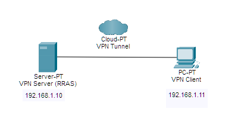
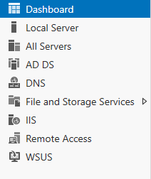
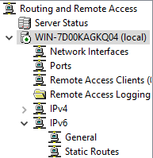
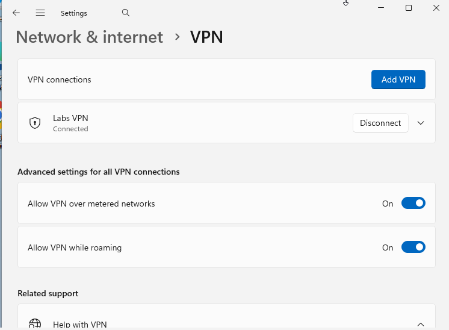
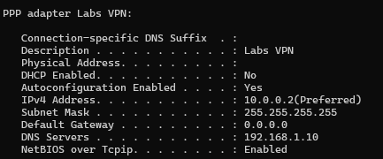
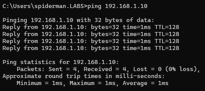

# Activity 2: Remote Access VPN with Windows RRAS

## Overview

This lab configures a remote access VPN using Windows Server 2022's built-in Routing and Remote Access Service (RRAS). The scenario simulates an employee working remotely who needs to securely connect to the corporate network — one of the most common real-world infrastructure and support tasks in enterprise IT.

The server is configured as an L2TP/IPSec VPN endpoint with a static IP address pool. The Windows 11 VM connects using the built-in Windows VPN client, authenticates against Active Directory, and receives an IP from the pool — establishing a verified encrypted tunnel.

---

## Objectives

- Install and configure the RRAS role on Windows Server 2022 as an L2TP/IPSec VPN endpoint, including IP address pool assignment and pre-shared key authentication
- Configure a Windows 11 VPN client connection using the built-in VPN settings and establish an authenticated tunnel to the RRAS server
- Verify tunnel establishment and authenticated access using ipconfig, ping, and the RRAS management console

---

## Network Architecture

| Component | Value |
|---|---|
| VPN Server | Windows Server 2022 (Labs.local DC) |
| VPN Protocol | L2TP/IPSec with Pre-Shared Key |
| User Authentication | MS-CHAPv2 against Active Directory |
| Client IP Pool | 10.0.0.1 — 10.0.0.10 |
| VPN Client | Windows 11 built-in VPN client |
| VPN Ports | UDP 1701 (L2TP), UDP 500 & 4500 (IPSec) |

### Authentication Stack

| Layer | Method | Purpose |
|---|---|---|
| Tunnel authentication | IPSec Pre-Shared Key | Verifies server identity before credentials are exchanged |
| User authentication | MS-CHAPv2 | Validates AD credentials and checks dial-in permissions |

---

## Phase 1 — Planning & Design

VPN architecture defined prior to configuration: server role, protocol selection, IP pool range, and AD user account requirements documented before any changes were made to the server.



---

## Phase 2 — Build & Configure

### RRAS Role Installation

Remote Access role installed via Server Manager with the DirectAccess and VPN (RAS) and Routing role services selected.



### RRAS Service Configuration

RRAS configured via the Setup Wizard using Custom configuration > VPN access. Service started and confirmed running. IP address pool (10.0.0.1–10.0.0.10) configured under server Properties > IPv4. L2TP pre-shared key set under server Properties > Security.



### AD User Account

Dedicated `vpnuser` account created in Active Directory Users and Computers. Dial-in permission set to **Allow access** on the user's Dial-in tab — required for RRAS to accept the connection after authentication.

### Windows Firewall

Inbound rules verified for L2TP (UDP 1701) and IKE/IPSec (UDP 500, 4500). Rules created automatically by RRAS during installation.

### VPN Client Configuration

Windows 11 VPN connection created via Settings > Network & Internet > VPN using the following parameters: provider set to Windows built-in, VPN type set to L2TP/IPSec with pre-shared key, server address set to the DC's IP, credentials set to `vpnuser`.



### Key Configuration Reference

**RRAS IP Pool:**
```
Start IP: 10.0.0.1
End IP:   10.0.0.10
```

**Windows 11 VPN Client Settings:**
```
VPN Provider:    Windows (built-in)
Connection name: Labs VPN
VPN type:        L2TP/IPSec with pre-shared key
Sign-in info:    Username and password
```

---

## Phase 3 — Verification & Testing

### Tunnel Establishment — ipconfig /all

With the VPN connected, `ipconfig /all` on the Windows 11 VM shows a PPP adapter (WAN Miniport L2TP) with an IP address in the `10.0.0.x` range — assigned from the RRAS pool. This is the definitive proof that the tunnel is established and active.



### Server-Side Session Verification

RRAS management console on Windows Server 2022 shows `vpnuser` listed under Remote Access Clients with an active connection time and assigned IP — confirming authentication succeeded and the session is live from the server's perspective.



---

## Phase 4 — Documentation & Reflection

### How It Works

The connection follows a two-phase process. First, IPSec uses the pre-shared key to authenticate both endpoints and establish an encrypted channel — this happens before any user credentials are sent. Second, once the tunnel is up, MS-CHAPv2 validates the user's AD credentials and RRAS checks the dial-in permission on the account. If both pass, an IP from the pool is assigned and the session is established.

### Net+ Exam Topics Reinforced

- VPN types: remote access vs. site-to-site
- VPN protocols: L2TP, IPSec, tunneling concepts
- Encryption in transit — IPSec providing confidentiality and integrity
- Authentication methods: pre-shared keys, MS-CHAPv2
- Network ports associated with VPN (UDP 500, 1701, 4500)
- Windows Firewall rule management for network services
- Active Directory integration for network access control

### Production Considerations

- **Certificate-based authentication** replaces pre-shared keys in production — PSKs don't scale and are vulnerable to brute force
- **Network Policy Server (NPS)** centralizes VPN authorization via group-based policies rather than per-user dial-in settings
- **MFA enforcement** — production VPN access requires a second factor in addition to credentials
- **Dedicated VPN server in a DMZ** — running RRAS on the Domain Controller is a security anti-pattern in production
- **Always On VPN** — Microsoft's modern evolution of remote access, configuring clients to connect automatically before user login

---

## Files

- `screenshots/` — All lab evidence screenshots

---

*[← Back to Network+ Lab Series](../README.md)*
