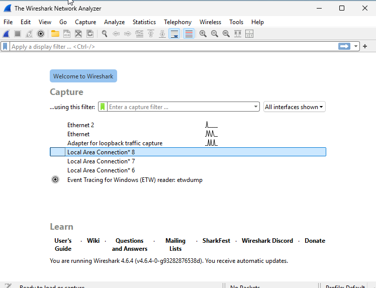
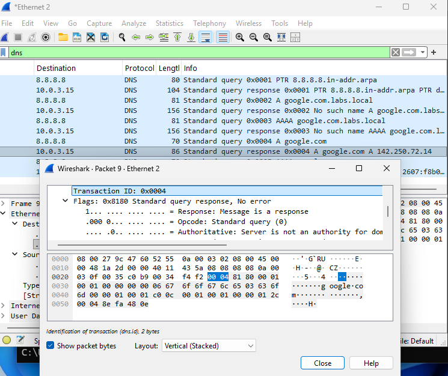
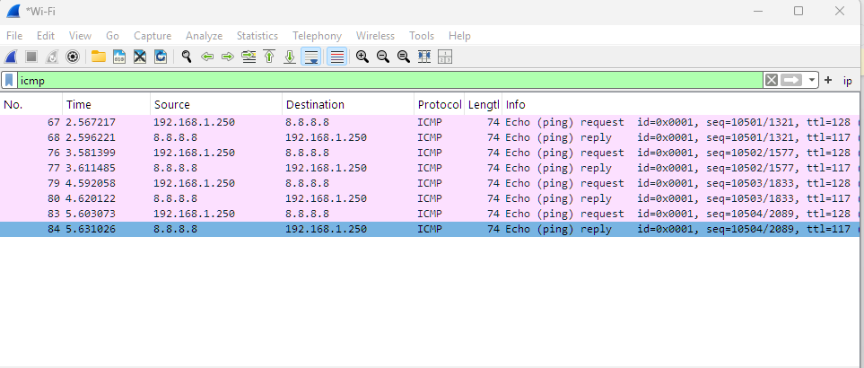
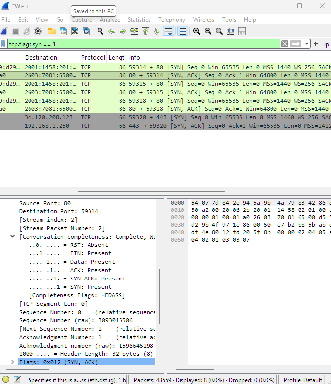
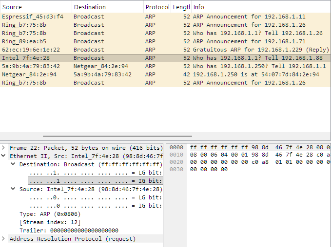

# Activity 3 — Wireshark Packet Capture & Protocol Analysis

## Overview

Understanding what traffic looks like on the wire is what separates a technician who can follow a troubleshooting guide from one who can diagnose an unfamiliar problem. This lab uses Wireshark to capture and analyze four protocols that appear constantly in real-world network troubleshooting — DNS, ICMP, TCP, and ARP — examining each at the field level and connecting the packet behavior to practical diagnostic applications.

---

## Objectives

- Capture and analyze DNS query and response packets, identifying the question and answer sections and understanding how name resolution traffic looks on the wire
- Capture ICMP echo request and reply packets, correlating sequence numbers and TTL values to CLI output
- Isolate and examine a complete TCP three-way handshake in a capture, demonstrating understanding of connection establishment at the packet level
- Capture ARP request and reply traffic, identifying broadcast behavior and MAC-to-IP resolution

---

## Environment

- **Platform:** Windows 11 Enterprise (domain-joined to Labs.local)
- **Tool:** Wireshark (latest stable release)
- **Protocols Analyzed:** DNS, ICMP, TCP, ARP
- **Traffic Generation:** nslookup, ping, browser, built-in Windows tools

---

## Protocol Reference

| Protocol | Layer | Purpose | Troubleshooting Application |
|---|---|---|---|
| DNS | L7 Application | Resolves hostnames to IP addresses | Missing responses indicate DNS server unreachable; NXDOMAIN means the record doesn't exist |
| ICMP | L3 Network | Echo request/reply for connectivity testing | Missing replies indicate firewall block or routing failure; TTL reveals hop count |
| TCP | L4 Transport | Reliable connection establishment via three-way handshake | RST packets indicate refused connections; retransmissions indicate packet loss |
| ARP | L2 Data Link | Resolves IP addresses to MAC addresses on the local network | Duplicate replies reveal IP conflicts; missing replies indicate L2 connectivity failure |

---

## Lab Walkthrough

### Phase 1 — Setup & Interface Baseline

Wireshark was installed on the Windows 11 VM with the Npcap driver, which is required for live capture on Windows. After launch the active network interface was identified by its live traffic sparkline and a test capture was run to confirm packets were being captured correctly before beginning the protocol analysis phases.

---

### Phase 2 — DNS Capture

DNS runs on UDP port 53 and is involved in virtually every network connectivity issue. `nslookup google.com` was run to generate a DNS query and response pair. The capture was filtered with `dns` to isolate DNS traffic.

**Key findings:**

- The query packet contained a **Transaction ID** that matched the corresponding response packet — this is how the client correlates responses to requests when multiple queries are in flight simultaneously
- Query flags: `0x0100` (recursion desired). Response flags: `0x8180` (recursion available, no error)
- The Answers section of the response contained the resolved IP address and a **TTL value** controlling how long the client should cache the result before querying again

**Troubleshooting application:** If DNS queries appear in a capture but no responses come back, the DNS server is unreachable. If the response shows NXDOMAIN, the hostname doesn't exist in DNS. Either finding narrows the problem immediately without touching the application or the website.

---

### Phase 3 — ICMP Capture

ICMP is the protocol behind `ping`. `ping 8.8.8.8 -n 4` was run to generate exactly 4 echo request and reply pairs. The capture was filtered with `icmp`.

**Key findings:**

- Type 8 = Echo Request (outbound), Type 0 = Echo Reply (inbound)
- Sequence numbers increment with each ping and are mirrored exactly in the reply — this is how ping detects dropped or out-of-order packets
- TTL in the reply IP header was lower than 128 (Windows default), reflecting the number of router hops between the VM and 8.8.8.8
- 8 total packets — 4 requests and 4 replies — alternating in the packet list

**Troubleshooting application:** If only Echo Requests appear with no replies, ICMP is being blocked by a firewall — a common finding when testing connectivity to a server that is actually online but has ICMP disabled.

---

### Phase 4 — TCP Three-Way Handshake

Every TCP connection begins with a three-way handshake. A browser request to `http://example.com` was used to generate TCP traffic. The filter `tcp.flags.syn == 1` was used to isolate handshake packets.

**The handshake sequence:**

| Step | Direction | Flags | Purpose |
|---|---|---|---|
| SYN | Client → Server | SYN | Client initiates connection, proposes Initial Sequence Number |
| SYN-ACK | Server → Client | SYN, ACK | Server acknowledges client ISN, proposes its own |
| ACK | Client → Server | ACK | Client acknowledges server ISN — connection established |

**Key findings:**

- SYN flag (`0x002`) is set only in the first two packets
- ACK flag (`0x010`) is set in the SYN-ACK, the final ACK, and every subsequent data packet
- The client used a high ephemeral source port; the server answered on port 80
- Acknowledgment number in the ACK = server's ISN + 1, confirming the sequence number math

**Troubleshooting application:** RST packets mid-stream point to a firewall rule, load balancer timeout, or application crash. Retransmissions after the SYN indicate the server is not responding — likely a firewall drop rather than a routing issue.

---

### Phase 5 — ARP Capture

ARP resolves IP addresses to MAC addresses on the local network. The ARP cache was cleared with `arp -d *` to force a fresh exchange, then `ping 8.8.8.8 -n 1` was run to trigger ARP resolution for the default gateway. The capture was filtered with `arp`.

**Key findings:**

- The ARP Request was sent to `ff:ff:ff:ff:ff:ff` (broadcast) — every device on the subnet receives it
- The Target MAC in the request was `00:00:00:00:00:00` — the sender doesn't know the MAC yet, which is the point of the request
- The ARP Reply was unicast directly back to the requester's MAC — no broadcast needed for the answer
- This behavior directly connects to Activity 1: ARP cannot cross a router, so each VLAN is its own ARP broadcast domain — a device in VLAN 10 cannot ARP for a device in VLAN 20

**Troubleshooting application:** Duplicate ARP replies from unexpected MAC addresses reveal IP conflicts on the network. Wireshark flags these automatically with a "duplicate use of IP address" warning in the packet list.

---

## Wireshark Filter Reference

| Filter | Purpose |
|---|---|
| `dns` | Show only DNS traffic |
| `icmp` | Show only ICMP traffic |
| `arp` | Show only ARP traffic |
| `tcp.flags.syn == 1` | Show TCP SYN packets (handshake starts) |
| `tcp.flags.reset == 1` | Show TCP RST packets (abrupt closes) |
| `ip.addr == 8.8.8.8` | Show all traffic to/from a specific IP |
| `tcp.port == 80` | Show all HTTP traffic |
| `dns.qry.name == "google.com"` | Show DNS queries for a specific hostname |
| `!arp` | Exclude ARP to reduce noise in busy captures |

---

## Reflection

**What was captured**

Four separate Wireshark captures on a Windows 11 VM examining DNS, ICMP, TCP, and ARP. Each capture was filtered, analyzed at the field level, and correlated to its real-world troubleshooting application.

**Why Wireshark matters**

CLI tools like ping and nslookup tell you whether something is working. Wireshark tells you why it isn't. When a DNS issue causes a browser failure, a capture shows immediately whether the query is leaving the machine, whether a response is coming back, and what that response contains — faster and more definitively than any other tool. That diagnostic clarity is what makes packet analysis a foundational skill across helpdesk, sysadmin, NOC, and security roles.

**What I'd do differently in production**

- Use **capture filters** (not just display filters) when working on high-traffic interfaces — capturing everything on a busy network produces enormous files that are difficult to analyze
- Save captures as `.pcap` files for documentation and post-incident review
- Use **Follow TCP Stream** when analyzing application-layer issues — it reconstructs the full conversation in readable form
- On encrypted traffic (HTTPS), focus on handshake metadata and certificate details rather than payload content since the data itself is not readable

---

## Net+ Exam Topics Reinforced

- OSI model — matching each protocol to its correct layer (L2 ARP, L3 ICMP, L4 TCP, L7 DNS)
- DNS resolution process and packet structure (N10-009 objective 1.4)
- ICMP echo request/reply, Type and Code values
- TCP three-way handshake flags and sequence numbers (N10-009 objective 1.4)
- ARP broadcast behavior and MAC resolution
- Wireshark as a protocol analyzer (N10-009 objective 5.2)
- Practical packet analysis as a troubleshooting methodology (N10-009 objective 5.3)

---

[← Back to Networking Labs](https://nhugo1.github.io/IT-Labs/Networking-Labs/)