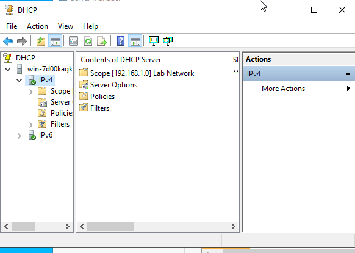
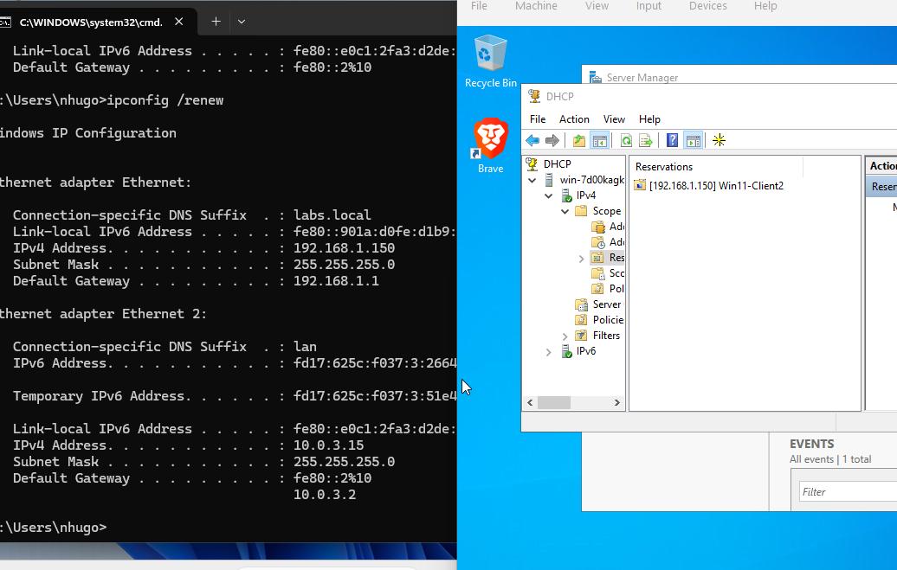
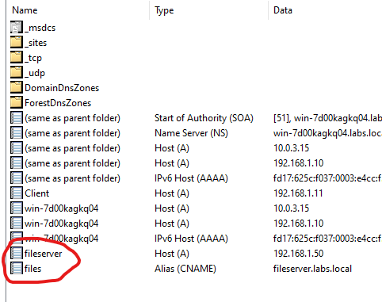
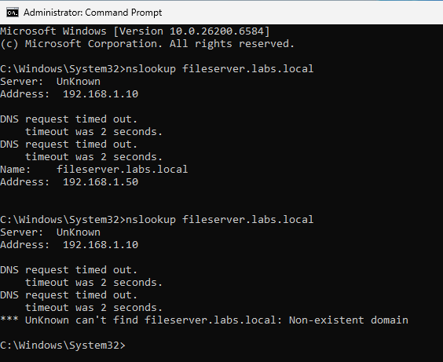
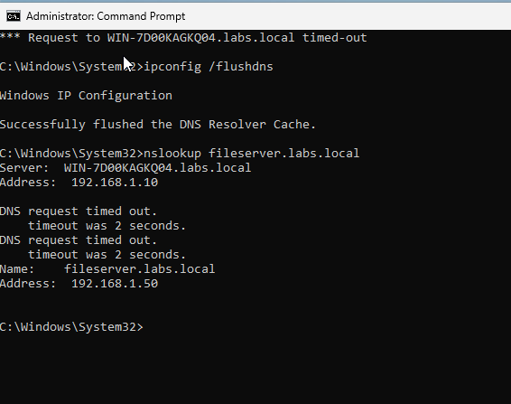
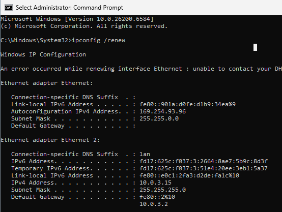
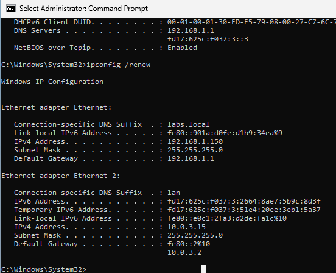
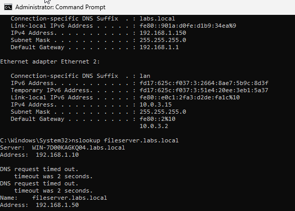

# Activity 4 — DNS & DHCP Configuration & Troubleshooting

## Overview

DNS and DHCP are foundational network services that everything else depends on. When either one breaks, users can't find servers, devices can't get IP addresses, and the helpdesk phone starts ringing. This lab covers both services end-to-end — installation, configuration, and hands-on troubleshooting using standard CLI tools — across two Network+ exam domains.

---

## Objectives

- Install and configure the DHCP Server role and create a scope for automatic IP assignment
- Configure a DHCP reservation for a specific client by MAC address
- Create DNS forward and reverse lookup zones and add A, PTR, and CNAME records
- Simulate and resolve a DNS resolution failure using nslookup, flushdns, and DNS Manager
- Simulate and resolve a DHCP lease failure and identify APIPA addressing as the failure indicator

---

## Environment

- **DNS / DHCP Server:** Windows Server 2022 (Domain Controller)
- **Client:** Windows 11 Enterprise (domain-joined)
- **Domain:** labs.local
- **Virtualization:** VirtualBox (Internal Network adapter)

---

## Network Design

| Setting | Value |
|---|---|
| DHCP Scope | 192.168.1.100 – 192.168.1.200 |
| Subnet Mask | 255.255.255.0 |
| Default Gateway | 192.168.1.1 |
| DNS Server | 192.168.1.10 (DC) |
| DHCP Reservation | Win11-Client MAC → 192.168.1.150 |
| DNS Forward Zone | labs.local |
| DNS Reverse Zone | 192.168.1.0/24 |
| DNS Records | A (fileserver), PTR (192.168.1.50), CNAME (files → fileserver) |

---

## Lab Walkthrough

### Phase 1 — DHCP Configuration

#### Step 1 — Install and Authorize the DHCP Role

The DHCP Server role was installed via **Server Manager → Add Roles and Features**. After installation the DHCP server was authorized in Active Directory — a required step before the server can hand out leases in a domain environment. Unauthorized DHCP servers are blocked by AD to prevent rogue DHCP servers from assigning incorrect addressing on the network.

#### Step 2 — Create a DHCP Scope

A scope named **Lab Network** was created covering 192.168.1.100–192.168.1.200 with the following options configured:

- **Subnet mask:** 255.255.255.0
- **Default gateway:** 192.168.1.1
- **DNS server:** 192.168.1.10
- **Lease duration:** 8 days

The scope was activated immediately after creation.

---

#### Step 3 — Create a DHCP Reservation

A reservation was created to ensure the Windows 11 client always receives the same IP address based on its MAC address — without requiring a static IP to be configured on the client itself. This is the correct approach for devices that need a consistent address (printers, workstations, lab VMs) in environments where DHCP is the standard.

- **Reservation name:** Win11-Client
- **Reserved IP:** 192.168.1.150
- **MAC address:** obtained via `ipconfig /all` on the client

After creating the reservation `ipconfig /release` and `ipconfig /renew` were run on the Windows 11 client to force a new lease request. The client received 192.168.1.150 as expected.

---

### Phase 2 — DNS Configuration

#### Step 4 — Create a Reverse Lookup Zone

A reverse lookup zone was created for the 192.168.1.0/24 network, stored in Active Directory and configured for dynamic updates. Reverse lookup zones allow DNS to resolve an IP address back to a hostname — used by logging systems, network monitoring tools, and some applications for verification purposes.

#### Step 5 — Add DNS Records

Three record types were added to the labs.local forward lookup zone:

| Record Type | Name | Value |
|---|---|---|
| A | fileserver | 192.168.1.50 |
| PTR | 192.168.1.50 | fileserver.labs.local |
| CNAME | files | fileserver.labs.local |

The A record was created with **Create associated PTR record** checked, which automatically populated the reverse lookup zone. The CNAME record creates an alias so `files.labs.local` resolves to the same IP as `fileserver.labs.local` — useful for giving servers friendly names or maintaining continuity during server migrations.

---

### Phase 3 — Troubleshooting Scenarios

#### Scenario A — DNS Resolution Failure

**Setup:** `nslookup fileserver.labs.local` was run on the Windows 11 client to confirm successful resolution. The A record was then deleted from DNS Manager to simulate a missing record.

**Failure:** Running `nslookup fileserver.labs.local` again returned a Non-existent domain error, confirming the client could no longer resolve the hostname.

**Resolution:** `ipconfig /flushdns` was run to clear the local DNS resolver cache, ensuring no stale cached record was masking the failure. The A record was recreated in DNS Manager and nslookup was run again — resolution was restored successfully.

---

#### Scenario B — DHCP Lease Failure

**Setup:** The DHCP scope was deactivated in the DHCP console to simulate a DHCP server outage. `ipconfig /release` and `ipconfig /renew` were run on the Windows 11 client.

**Failure:** The client failed to obtain a lease and fell back to an **APIPA address (169.254.x.x)**. APIPA (Automatic Private IP Addressing) is the Windows fallback mechanism when no DHCP server is reachable — it self-assigns an address in the 169.254.0.0/16 range. An APIPA address on a client is the primary indicator of a DHCP failure.

**Resolution:** The scope was reactivated in the DHCP console. `ipconfig /renew` was run on the client and it received a valid address from the 192.168.1.100–200 range.

---

### Phase 4 — Verification

All DNS record types were verified via nslookup from the Windows 11 client:

- Forward lookup: `nslookup fileserver.labs.local` → 192.168.1.50
- CNAME resolution: `nslookup files.labs.local` → resolves to fileserver.labs.local → 192.168.1.50
- Reverse lookup: `nslookup 192.168.1.50` → fileserver.labs.local

---

## CLI Reference

| Command | Purpose |
|---|---|
| `ipconfig /all` | View full IP configuration including MAC, DNS server, DHCP server, lease info |
| `ipconfig /release` | Release current DHCP lease |
| `ipconfig /renew` | Request a new DHCP lease |
| `ipconfig /flushdns` | Clear the local DNS resolver cache |
| `ipconfig /displaydns` | View currently cached DNS records |
| `nslookup <hostname>` | Forward DNS lookup |
| `nslookup <ip>` | Reverse DNS lookup |

---

## Reflection

**What was configured**

The DHCP Server role was installed and authorized in Active Directory. A scope was created and activated. A MAC-based reservation was configured and verified. A reverse lookup zone was created and A, PTR, and CNAME records were added to the forward lookup zone. Two troubleshooting scenarios were simulated — a missing DNS record and a deactivated DHCP scope — and both were diagnosed and resolved using standard CLI tools.

**Why each decision was made**

- **DHCP authorized in AD** — unauthorized DHCP servers are blocked in domain environments; authorization is required before any leases can be issued
- **Reservation over static IP** — reservations give consistent addressing without requiring manual IP configuration on the client; easier to manage and change centrally
- **CNAME over second A record** — a CNAME alias means the friendly name automatically follows if the target A record IP ever changes; two separate A records would both need updating manually
- **flushdns before recreating record** — without flushing the cache, a stale cached entry could mask whether the fix actually worked; always flush before verifying DNS changes

**What I'd do differently in production**

- Configure **DHCP failover** with a secondary server so clients can still get leases if the primary goes down
- Enable **DNS scavenging** to automatically remove stale records that accumulate over time
- Use **DHCP audit logging** to track lease assignments and identify rogue devices
- Monitor **scope utilization** — a scope above 80% capacity needs to be expanded before addresses are exhausted

---

## Key Takeaways

DNS and DHCP failures are among the most disruptive issues on any network and among the most common things a junior admin or helpdesk tech will be asked to troubleshoot. Knowing that a 169.254.x.x address means DHCP failure, that `ipconfig /flushdns` must precede DNS verification, and how to use nslookup for both forward and reverse lookups are the practical skills that map directly to Network+ Domain 5.0 objectives and real-world support scenarios.

---

[← Back to Networking Labs](https://nhugo1.github.io/IT-Labs/Networking-Labs/)