# Activity 8 — Network Troubleshooting: OSI-Based Methodology

## Overview

Knowing how to configure a network is one thing. Knowing how to systematically
diagnose one that's broken is what separates people who can do the job from
people who just passed the exam. This lab simulates four realistic network
failure scenarios and documents a structured, OSI-layer-by-layer troubleshooting
approach for each — the same methodology covered in Network+ Domain 5.0 and
asked about in virtually every IT interview.

---

## Objectives

- Apply a structured OSI-layer troubleshooting methodology to isolate network failures
- Use standard Windows CLI tools to diagnose and resolve connectivity issues
- Simulate and resolve a physical/link-layer failure (Layer 1/2)
- Simulate and resolve a static IP misconfiguration (Layer 3)
- Simulate and resolve a missing default gateway (Layer 3)
- Simulate and resolve a DNS failure complicated by a stale client cache (Layer 7)
- Document findings in a format usable as a troubleshooting runbook

---

## Environment

- **Server:** Windows Server 2022 (Domain Controller — labs.local)
- **Client:** Windows 11 Enterprise (domain-joined)
- **Domain:** labs.local
- **Virtualization:** VirtualBox (Internal Network adapter)

---

## OSI Troubleshooting Framework

The methodology used throughout this lab is symptom-driven layer isolation —
start at the layer most consistent with the reported symptom, confirm or rule
it out, then move up or down accordingly.

| Reported Symptom | Start At |
|---|---|
| "No network at all" | Layer 1 — Physical |
| "Can ping IPs but can't reach hostnames" | Layer 7 — DNS |
| "Local works, internet doesn't" | Layer 3 — Missing gateway |
| "Everything worked yesterday, nothing changed" | Layer 1/2 — Check the link |

**Tools used in this lab:**

| Tool | OSI Layer | Purpose |
|---|---|---|
| `netsh interface show interface` | 1/2 | Check adapter state |
| `arp -a` | 2 | View IP-to-MAC mappings |
| `ipconfig /all` | 3 | Full IP configuration |
| `ping` | 3 | Test IP reachability |
| `tracert` | 3 | Trace packet path to destination |
| `ipconfig /flushdns` | 7 | Clear local DNS resolver cache |
| `ipconfig /displaydns` | 7 | View currently cached DNS records |
| `nslookup` | 7 | Query DNS for hostname resolution |

---

## Lab Walkthrough

### Scenario 1 — Layer 1/2: Disabled Network Adapter

**What this simulates:** A user reports no network connectivity. Before touching
anything else, verify the physical/link layer isn't the problem — the most
commonly skipped and most embarrassing oversight in a troubleshooting workflow.

#### Baseline

`netsh interface show interface` confirmed the adapter was Connected.
`ipconfig /all` showed a valid static IP on the 192.168.1.0/24 network.
Ping to the DC (192.168.1.10) succeeded.

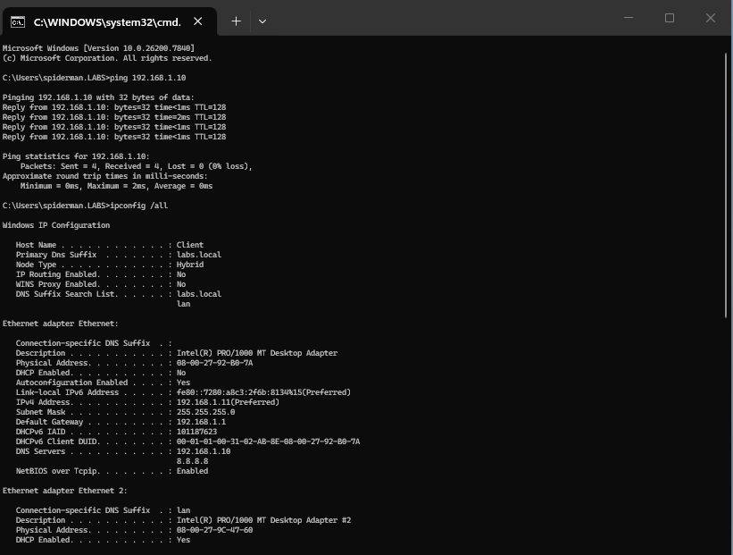

#### Break

The VirtualBox network adapter was set to **Not Attached** to simulate a
disconnected cable. On the client, `netsh interface show interface` showed the
adapter as **Disconnected** and ping to the DC failed immediately.

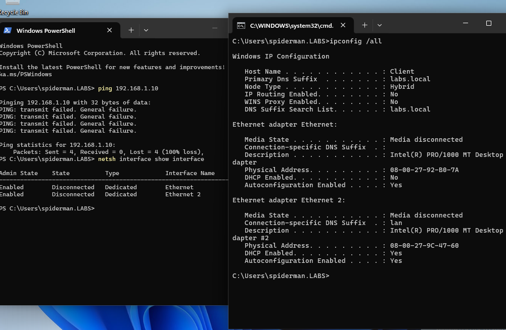

#### Diagnosis

- **Layer 1:** `netsh interface show interface` → Disconnected → failure isolated at Layer 1
- **Layer 2+:** Not applicable until Layer 1 is restored

No need to go further. Physical layer is the problem.

#### Resolution

The VirtualBox adapter was restored to **Internal Network**. The adapter
reconnected, the static IP persisted, and ping to the DC succeeded.

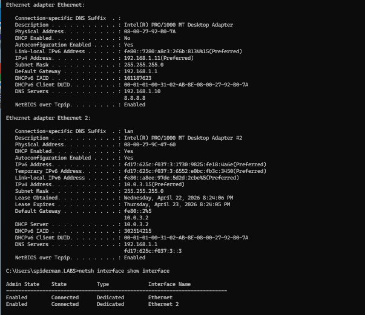

---

### Scenario 2 — Layer 3: Static IP Misconfiguration

**What this simulates:** A technician manually set a static IP on a workstation
and got it wrong — placing the client on the wrong subnet. The user can't reach
anything on the network.

#### Break

A static IP was manually configured with the following incorrect values:

| Setting | Value |
|---|---|
| IP Address | 192.168.2.50 |
| Subnet Mask | 255.255.0.0 |
| Default Gateway | 192.168.1.1 |
| DNS Server | 192.168.1.10 |

The client is now on 192.168.2.x while the DC and gateway are on 192.168.1.x.
Pings to both the DC and gateway failed despite the adapter showing Connected —
a Layer 1/2 check would not surface this problem.

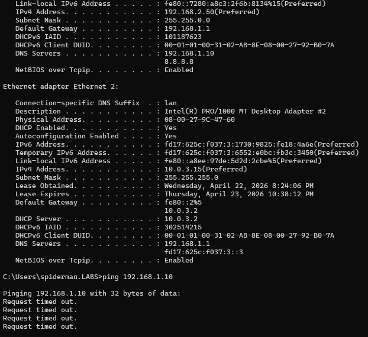

#### Diagnosis

- **Layer 1/2:** Adapter Connected ✓
- **Layer 3:** `ipconfig /all` → IP is 192.168.2.50, subnet 255.255.0.0 → client is on a different subnet than the DC and gateway → mismatch confirmed

The failure is isolated at Layer 3. The client cannot communicate with anything
on 192.168.1.x because it believes it is on a different network.

#### Resolution

The adapter was reconfigured with the correct static IP settings for the
192.168.1.0/24 network. Ping to the DC succeeded.

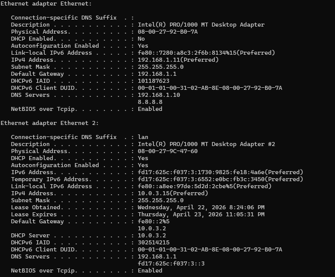

---

### Scenario 3 — Layer 3: Missing Default Gateway

**What this simulates:** A user can reach local machines fine but can't get to
anything outside the local network. The classic "internet is down but mapped
drives still work" complaint. Cause: no default gateway configured.

#### Break

A static IP valid on the local subnet was configured with the gateway field
intentionally left blank:

| Setting | Value |
|---|---|
| IP Address | 192.168.1.105 |
| Subnet Mask | 255.255.255.0 |
| Default Gateway | *(blank)* |
| DNS Server | 192.168.1.10 |

Ping to the DC (same subnet) succeeded. Ping to 8.8.8.8 (external) failed.
`tracert 8.8.8.8` showed one hop then all timeouts — packets reached the local
network and stopped.

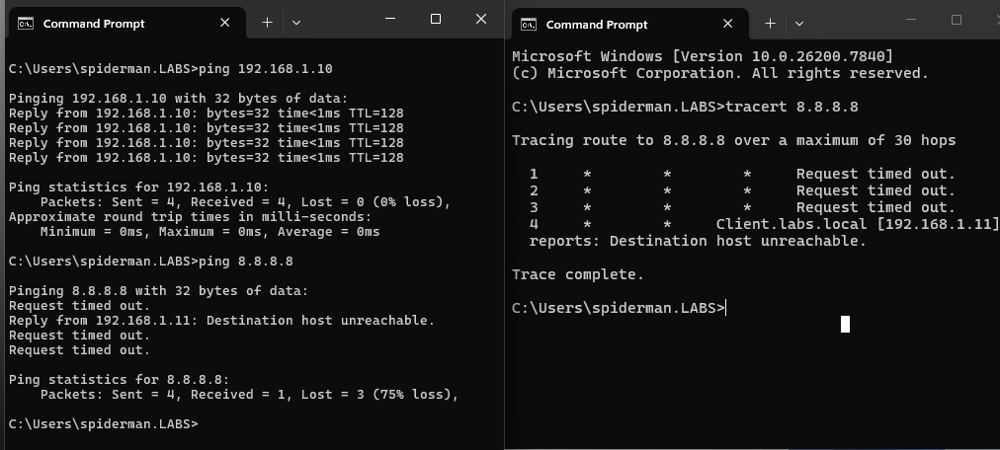

#### Diagnosis

- **Layer 1/2:** Adapter Connected ✓
- **Layer 3:** `ipconfig /all` → Default Gateway field is blank → no path off the local subnet
- **Confirmed by:** `tracert 8.8.8.8` → one hop, then timeouts — packets can't leave the local network

The failure is isolated at Layer 3. Without a gateway, the client has no way
to forward traffic destined for external networks.

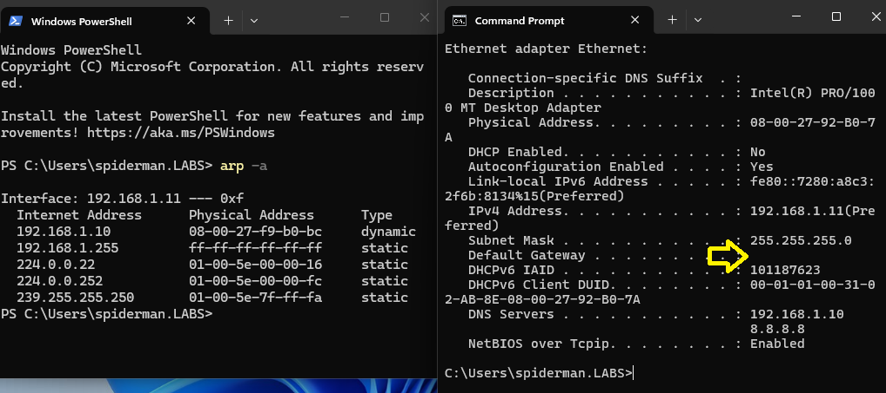

#### Resolution

The correct gateway (192.168.1.1) was added to the static IP configuration.
Ping to 8.8.8.8 succeeded and `tracert` showed multiple hops beyond the local
network.

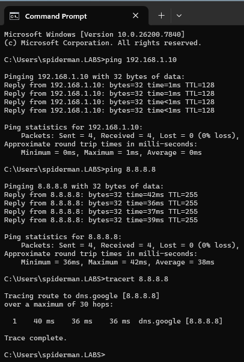

---

### Scenario 4 — Layer 7: DNS Failure with Cache Complication

**What this simulates:** A user reports that a specific server "doesn't work"
but everything else is fine. The problem is a misconfigured DNS record —
complicated by a stale client cache that initially masks the issue.

#### Baseline

`nslookup fileserver.labs.local` resolved correctly to 192.168.1.50.

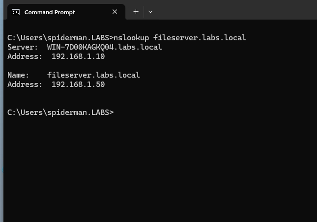

#### Break

The A record for fileserver in DNS Manager was changed from 192.168.1.50 to
192.168.1.99 to simulate an incorrectly updated DNS record. On the client,
`nslookup` appeared to still resolve correctly — because the old record was
still cached locally.

`ipconfig /displaydns` revealed the cache was serving the stale 192.168.1.50
entry while DNS Manager showed 192.168.1.99. A tech who doesn't check the
cache would close this ticket as "DNS looks fine" — incorrectly.

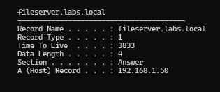

#### Diagnosis

- **Layer 1–3:** Physical, link, and IP all functional ✓
- **Layer 7:** `nslookup` resolves, but `ipconfig /displaydns` shows cached IP
  differs from DNS Manager → stale cache confirmed
- **Root cause:** Client cache is serving the old record. The DNS record itself
  is also incorrect. Both need to be addressed.

#### Resolution

`ipconfig /flushdns` was run to clear the stale cache. `nslookup` now returned
192.168.1.99 — confirming the cache had been masking the bad record. The A
record was corrected back to 192.168.1.50 in DNS Manager. After flushing again,
`nslookup` returned the correct IP.

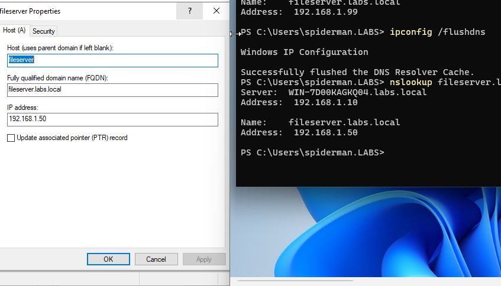

---

## CLI Reference

| Command | OSI Layer | Purpose |
|---|---|---|
| `netsh interface show interface` | 1/2 | Check adapter state (Connected/Disconnected) |
| `arp -a` | 2 | View IP-to-MAC mappings |
| `ipconfig /all` | 3 | Full IP config — IP, subnet, gateway, DNS |
| `ping <ip>` | 3 | Test IP reachability |
| `tracert <destination>` | 3 | Trace packet path; where it stops shows where failure is |
| `ipconfig /flushdns` | 7 | Clear local DNS resolver cache |
| `ipconfig /displaydns` | 7 | View currently cached DNS records |
| `nslookup <hostname>` | 7 | Query DNS for hostname resolution |

---

## Reflection

**What was built**

Four network failure scenarios were simulated and resolved using a structured
OSI-layer troubleshooting methodology. Scenarios covered a disconnected adapter
(Layer 1), a static IP subnet mismatch (Layer 3), a missing default gateway
(Layer 3), and a DNS failure complicated by a stale client-side cache (Layer 7).
Each scenario was diagnosed by isolating the failing layer before applying a fix.

**Why the methodology matters**

Random troubleshooting wastes time and can mask or worsen the root cause.
Narrowing the failure to a specific OSI layer based on the symptom means you're
never fixing the wrong thing. Scenario 3 is the clearest example: a tech who
jumps straight to DNS because "the internet is down" wastes time. Checking
Layer 3 first with `ipconfig /all` and `tracert` surfaces a missing gateway in
under a minute.

**The cache complication in Scenario 4**

The most important nuance in this lab: DNS appearing to work is not the same
as DNS being correct. `ipconfig /displaydns` exposes what the client is actually
using, and `flushdns` must be run before any DNS change can be verified.
Skipping that step leads to false positives on tickets.

**What I'd do differently in production**

- Set appropriate **DNS TTL values** — shorter TTLs reduce the window where
  stale cache causes problems after a record change
- Enable **DNS debug logging** on the server to track resolution failures
  proactively rather than waiting for user reports
- Use **network monitoring** (PRTG, Zabbix) to alert on adapter state changes
  and connectivity loss before users call in
- Maintain a **standard troubleshooting runbook** so any tech on the team works
  through these scenarios consistently

---

## Key Takeaways

Structured troubleshooting is the difference between a tech who fixes things
and a tech who understands why things broke. The OSI model isn't just an exam
topic — it's a mental framework for isolating where communication fails. Knowing
that a missing gateway explains why local works but external doesn't, that
`tracert` shows exactly where packets stop, and that DNS cache can mask a broken
record are the practical skills that map directly to real helpdesk and junior
sysadmin work.

---

[← Back to Networking Labs](https://nhugo1.github.io/IT-Labs/Networking-Labs/)

Nick Hugo | IT Portfolio maintained by [nhugo1](https://github.com/nhugo1)

Published with [GitHub Pages](https://pages.github.com)
