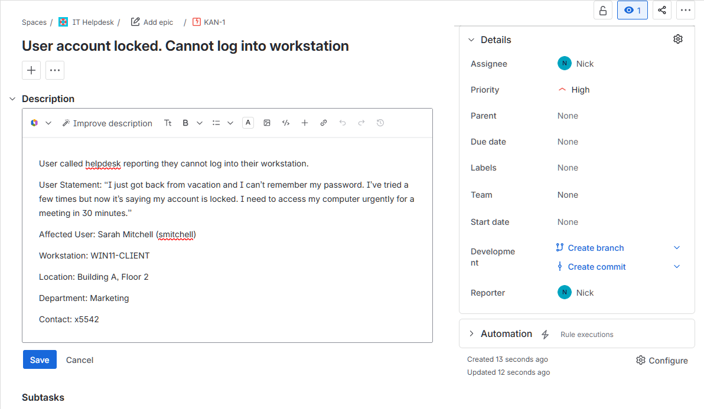
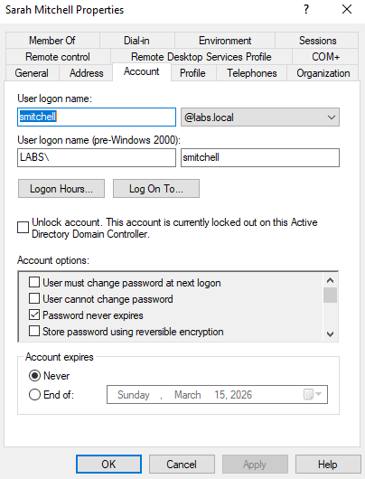
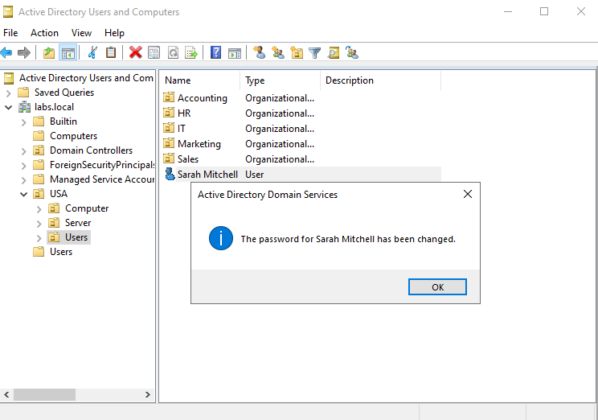
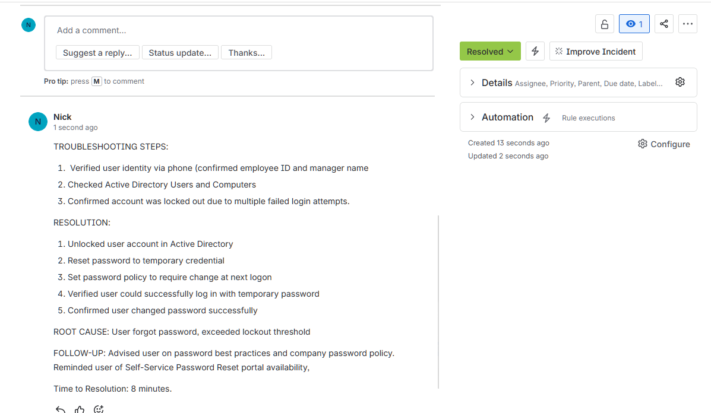

# Active Directory & Jira: Account Lockout Resolution Lab

This project demonstrates the end-to-end process of managing a high-priority technical support incident. It covers User Identity Verification, Active Directory (AD) Administration, and ITSM Lifecycle Management using Jira Service Management.

---

## Technical Environment

| Component | Specification |
| :--- | :--- |
| **Directory Services** | Windows Server 2022 (Active Directory) |
| **Endpoint** | Windows 11 Enterprise (Domain Joined) |
| **Ticketing System** | Jira Service Management (ITSM Template) |
| **Network** | Virtualized Lab (Internal Domain: Labs.local) |

---

## Scenario Overview

A user (Sarah Mitchell) reported being unable to access her workstation after returning from an extended absence. Following three failed login attempts, the account was locked out by the Domain Group Policy.

### Key Objectives:
1. **Incident Logging:** Document the issue within Jira with proper priority and categorization.
2. **Diagnostic Verification:** Confirm account status within Active Directory Users and Computers (ADUC).
3. **Remediation:** Unlock the account and perform a secure password reset with "Change at next logon" enforced.
4. **Validation & Closure:** Verify the user's ability to authenticate and document the resolution.

---

## Execution Steps

### 1. Incident Creation (Jira)
An incident ticket was generated to track the request. To maintain security, user identity was verified prior to processing the administrative reset.

**Documentation of Created Ticket:**

---

### 2. AD Diagnosis & Account Unlock
Navigated to the `Labs.local` domain controller to inspect the user attributes. The account was flagged as "Locked Out" due to the domain's security policy.

**Verified Account Lockout in ADUC:**

**Password Reset & Policy Enforcement:**

---

### 3. Endpoint Authentication Success
The user successfully authenticated on the Windows 11 workstation using the temporary credentials and was immediately prompted to set a new, secure password.

**Successful Domain Login:**

---

### 4. Documentation & Resolution
The ticket was updated with a full audit trail, including root cause analysis (RCA) and follow-up actions.

**Final Ticket Disposition:**

---

## Technical Interview Talking Points

* **Security Compliance:** Verified user identity via Employee ID/Manager confirmation before modifying AD attributes to prevent social engineering.
* **Policy Enforcement:** Ensured "User must change password at next logon" was enforced to maintain credential privacy and ownership.
* **Workflow Efficiency:** Maintained a low Time-to-Resolution (TTR) by utilizing standardized ADUC administrative tools and documented the process for future knowledge base (KB) use.
* **Root Cause Analysis:** Identified the lockout resulted from an extended absence, providing an opportunity for user education on company password policy and self-service options.

---

[Back to Main Portfolio](../README.md)
