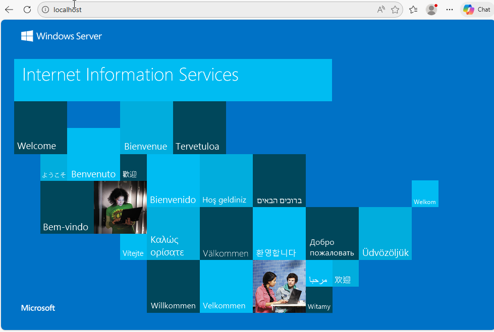
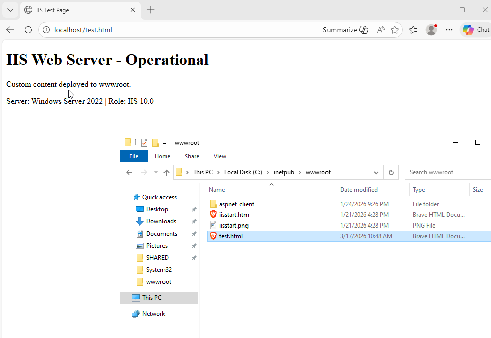
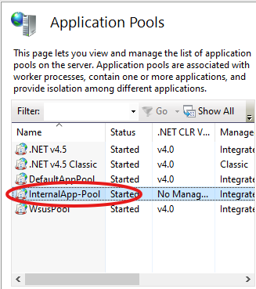
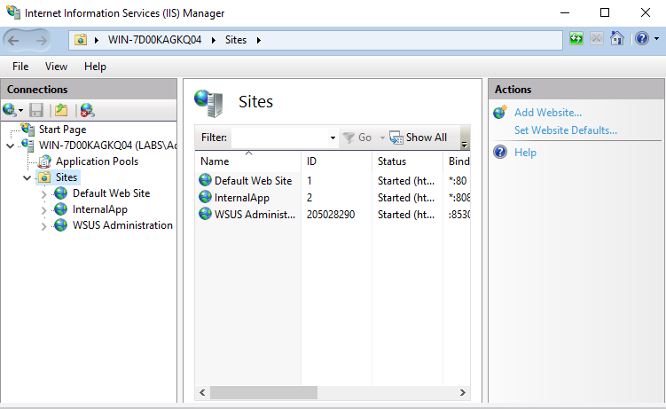
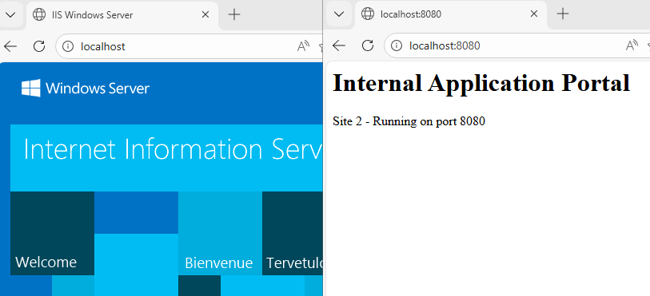
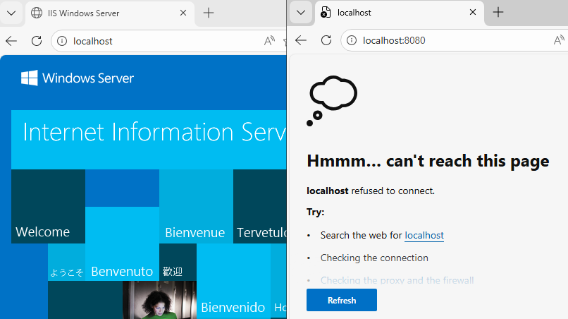

# Activity 1 — IIS Web Server Installation & Multi-Site Configuration

**Series:** Windows Server Administration  
**Platform:** Windows Server 2022 — IIS 10.0  
**Difficulty:** Beginner — Intermediate  
**Duration:** ~2 hours

---

## Overview

This lab covers the installation, configuration, and troubleshooting of Internet Information Services (IIS) on Windows Server 2022. IIS is Microsoft's built-in web server platform used in enterprise hosting environments to serve web applications and static content over HTTP/HTTPS.

The lab simulates real hosting team tasks: verifying a web server is operational, deploying content, hosting multiple isolated applications on a single server, and diagnosing errors through access log analysis.

---

## Lab Objectives

- **Technical Competency** — Install and configure IIS, deploy web content, and manage application pools on Windows Server 2022
- **Practical Tool Proficiency** — Navigate IIS Manager to configure site bindings, application pools, and interpret W3C access logs
- **Business Value** — Simulate a production pattern: hosting two isolated web applications on one server using port-based virtual hosting

---

## Lab Environment

| Resource | Role |
|---|---|
| Windows Server 2022 VM | IIS 10.0 host |
| IIS Manager (inetmgr) | Web server administration |
| File Explorer + Notepad | Content deployment |
| Microsoft Edge | Browser-based verification |

---

## Key Concepts

| Term | Definition |
|---|---|
| IIS | Internet Information Services — Microsoft's web server role for Windows Server |
| Site | A logical website hosted by IIS; one server can host multiple sites simultaneously |
| Binding | Protocol + IP + port combination that routes incoming requests to the correct site |
| Application Pool | Isolated worker process (w3wp.exe) that runs one or more sites independently |
| Physical Path | Folder on disk where a site's files live; default is `C:\inetpub\wwwroot` |
| wwwroot | Default web root for the Default Web Site |
| HTTP 200 | Request succeeded — server returned the resource |
| HTTP 404 | File not found — resource does not exist at the requested path |
| HTTP 503 | Service unavailable — typically means the application pool is stopped |
| Access Log | IIS request logs at `C:\inetpub\logs\LogFiles\` — used for troubleshooting and auditing |

---

## Activity 1 — Verifying IIS Installation & Default Page

**Scenario:** Confirm IIS is installed and operational before making configuration changes. In production, this is the baseline check for any web server availability ticket.

### Steps

1. Press the Windows key, type `inetmgr`, open IIS Manager
2. Expand the server node in the Connections pane → Sites → Default Web Site
3. Confirm status shows **Started**
4. In the Actions pane, click **Browse \*:80 (http)**
5. Confirm the IIS default welcome page loads in Edge at `http://localhost`

### Screenshot


*IIS Manager showing Default Web Site in Started state alongside the IIS 10 welcome page at http://localhost*

### Verification

The welcome page confirms: IIS is installed, the W3SVC service is running, the Default Web Site is bound to port 80, and `C:\inetpub\wwwroot` is accessible.

### Reflection

- IIS installs as a Windows Server Role via Server Manager → Add Roles and Features → Web Server (IIS)
- The Default Web Site is created automatically and bound to all IPs on port 80
- In production: leaving the IIS welcome page visible is a security finding — it should be replaced with a real application or a custom error page

---

## Activity 2 — Deploying Custom Web Content

**Scenario:** A support ticket requires verifying that a specific file is accessible via the web server. Simulates deploying a status page or internal tool landing page.

### Steps

1. Open File Explorer → navigate to `C:\inetpub\wwwroot`
2. Create `test.html` — ensure file extensions are visible (View → Show → File name extensions)
3. Open with Notepad and paste:

```html
<!DOCTYPE html>
<html>
<head><title>IIS Test Page</title></head>
<body>
  <h1>IIS Web Server - Operational</h1>
  <p>Custom content deployed to wwwroot.</p>
  <p>Server: Windows Server 2022 | Role: IIS 10.0</p>
</body>
</html>
```

4. Save and close Notepad
5. Browse to `http://localhost/test.html` — confirm content renders

### Screenshot


*Browser displaying http://localhost/test.html with custom content rendered, alongside File Explorer showing test.html in wwwroot*

### Verification

HTTP 200 response confirms the full request pipeline: IIS received the request → matched the Default Web Site binding → resolved the physical path → located and served `test.html`.

### Reflection

- Any file placed in `wwwroot` is immediately served — no restart required for static content
- IIS runs as the IUSR account by default; files locked to Administrator only will return 403 Forbidden
- In production: file deployment is typically automated via deployment pipelines rather than manual placement

---

## Activity 3 — Port-Based Virtual Hosting (Two Sites, One Server)

**Scenario:** A client needs two separate internal web applications hosted on a single server. Each application must be fully isolated — separate physical paths, separate application pools, separate ports.

### Step A — Create Directory and Content for Second Site

1. Create folder `C:\inetpub\internalapp`
2. Create `index.html` inside it:

```html
<html><body>
<h1>Internal Application Portal</h1>
<p>Site 2 — Running on port 8080</p>
</body></html>
```

### Step B — Create the Application Pool

3. In IIS Manager → Application Pools → Add Application Pool
4. Name: `InternalApp-Pool` | .NET CLR Version: No Managed Code
5. Click OK

### Screenshot


*IIS Manager Application Pools list showing DefaultAppPool and the newly created InternalApp-Pool*

### Step C — Create the New Website

6. Right-click Sites → Add Website
7. Configure:
   - Site name: `InternalApp`
   - Application pool: `InternalApp-Pool`
   - Physical path: `C:\inetpub\internalapp`
   - Binding: HTTP | All Unassigned | Port **8080**
8. Click OK

### Screenshot


*IIS Manager Sites node showing Default Web Site (port 80) and InternalApp (port 8080) both in Started state*

### Verification

Browse to `http://localhost` → Default Web Site responds  
Browse to `http://localhost:8080` → InternalApp responds  
Both return HTTP 200 — two isolated sites running on one server simultaneously

### Screenshot


*Two browser tabs showing both sites responding on their respective ports*

### Optional — Isolation Proof

9. Application Pools → right-click `InternalApp-Pool` → Stop
10. Refresh `http://localhost:8080` → returns **503 Service Unavailable**
11. Refresh `http://localhost` → Default Web Site continues responding normally
12. Start `InternalApp-Pool` to restore service

### Screenshot


*InternalApp-Pool stopped in IIS Manager — port 8080 returns 503 while port 80 continues serving normally, proving full process isolation*

### Reflection

- Application pool isolation ensures one app crashing does not affect co-hosted applications — critical in multi-tenant hosting environments
- Port-based virtual hosting is one of three IIS methods; the others are IP-based and host-header-based (most common in production)
- In production: use host-header bindings with real domain names, configure HTTPS with a certificate, and assign a dedicated service account to each app pool identity
---

*Part of the [IT Portfolio](https://nhugo1.github.io/IT-Labs/) by Nick Hugo*